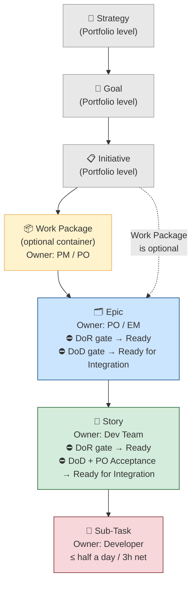
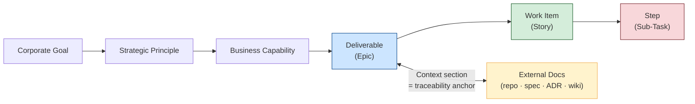

# Approach: Structured Issue Tracking with Jira

**Version:** 1.2.0
**Date:** 2026-03-30
**Status:** Active

---

## Purpose

Define how agents and contributors should think about and interact with Jira as a corporate issue-tracking tool. This approach establishes the mental models, vocabulary, and structural principles that govern how work is captured, decomposed, and linked in Jira — independent of any specific project or programme.

---

## Corporate Development Framework Alignment

This approach is grounded in the Regnology [Development Framework](https://confluence.regnology.net/spaces/PD/pages/24852036/Development+Framework) (Space: PD), which defines the canonical hierarchy, workflow gates, and quality standards for all Jira work across Regnology product development.

### Corporate Issue Hierarchy

The official corporate hierarchy is:



- **Strategy / Goal / Initiative** — managed at portfolio level (PORTFOLIO project). Not typically created by PS teams.
- **Work Package** — optional grouping container for Epics within an Initiative. Used by PM/PO to structure large Initiatives spanning multiple releases.
- **Epic** — an increment of work owned by PO/EM. Broken into Stories. Must pass the [Definition of Ready (DoR)](https://confluence.regnology.net/spaces/PD/pages/21571105/Issue+Type+Epic) before implementation begins and the [Definition of Done (DoD)](https://confluence.regnology.net/spaces/PD/pages/21571105/Issue+Type+Epic) before it is Ready for Integration.
- **Story** — a user-visible feature or behaviour, deliverable within one iteration. Must pass DoR and DoD, and receive PO Acceptance before it is Ready for Integration.
- **Sub-Task** — the smallest unit of work, scoped to **no longer than half a day (3 hours net)** per the corporate standard.

### Definition of Ready (DoR) — Mandatory Transition Gate

An Epic or Story cannot move from **New → Ready** (and thus cannot be pulled for implementation) until:

| Field | Requirement |
|---|---|
| Description | Must not be empty |
| Story Points | Must not be empty (except Expedite items) |
| Affects Version/s | Must not be empty (Stories: except Defects) |
| Priority | Must not be empty (Stories: except Defects) |

An Epic or Story without a filled Description is not DoR-compliant. This makes the **Context + Scope + Acceptance Criteria** sections of the templates below mandatory, not optional.

### Definition of Done (DoD) — Mandatory Transition Gate

An Epic or Story cannot move to **Ready for Integration** until:

| Requirement | Notes |
|---|---|
| All child Stories/Sub-Tasks are "Ready for Integration" / "Done" | |
| A linked **Release Note** Document issue exists and is at "In PO Review" status (at least) | Unless "No Documentation Required" is explicitly set |
| A linked **Test** / **Test Execution** with status "PASS" exists | Unless "No Test Required" is explicitly set |
| Fix Version/s is set | |
| PO Acceptance granted | Formal sign-off required |

### Work Item Type (Mandatory Field)

Every Epic and Story in Regnology Jira carries a mandatory **Work Item Type** classification. Agents generating ticket content must include or prompt for this field:

| Value | Meaning |
|---|---|
| **Net New Feature** | New customer-visible value; may become subject to future contracts |
| **Regulatory Update / Service** | Compliance with new or updated regulatory standards under existing contracts |
| **Keep Lights On — Implementation** | Development to satisfy existing contractual obligations |
| **Keep Lights On — Testing** | Test activity to satisfy existing contractual obligations |
| **Keep Lights On — Documentation** | Documentation activity to satisfy contractual obligations |
| **Defect** | Bug fix classified by PO or customer |
| **Invest to Improve** | Internal improvement with no immediate customer-facing value (refactoring, test automation, internal docs) |

---

## Core Principle

**Tickets Are Contracts, Not Notes**

A Jira ticket is not a scratchpad. It is a contract between the author and the reader — often a future team member, a stakeholder, or an AI agent — who must understand the work without a verbal briefing. Every ticket should answer three questions without ambiguity:

1. **Why does this work exist?** (Context — traceable to a goal or strategy)
2. **What is in and out of scope?** (Boundary — prevents drift and enables prioritisation)
3. **How do we know it is done?** (Acceptance — binary, observable, testable)

---

## Hierarchy Model

Jira projects use a multi-level hierarchy to group work from strategic intent down to implementation steps. The Regnology corporate hierarchy (see [Corporate Development Framework Alignment](#corporate-development-framework-alignment) above) uses specific canonical names. This section maps those names to the generic conceptual levels used in the templates:

| Generic Level | Canonical Regnology Name | Purpose |
|---|---|---|
| Programme Level | Work Package (optional) / Initiative | Strategic grouping — clusters Epics under a programme theme |
| Deliverable | Epic | A bounded increment of value, owned by PO/EM, broken into Stories |
| Work Item | Story | A user-visible capability, deliverable within one iteration |
| Step | Sub-Task | An implementation detail; no longer than half a day (3h net) |

**Principles for level assignment:**

- A **Programme Level** item answers: "What cluster of deliverables serves this strategic goal?"
- A **Deliverable (Epic)** answers: "What capability or product increment are we building?"
- A **Work Item (Story)** answers: "What can a user or operator observe once this is done?"
- A **Step (Sub-Task)** answers: "What concrete implementation action needs to happen?"

If you cannot answer the level's question for a ticket, it is at the wrong level.

The templates in `doctrine/templates/tickets/` use the generic level names to remain applicable across different project configurations, but always map to the canonical Regnology hierarchy in practice.

---

## Traceability Chain

Every ticket should be traceable forward and backward through the chain:



The **Context** section of a ticket is the traceability anchor. It must declare where this work sits in the chain. Without it, tickets become orphaned tasks with no visible connection to organisational intent.

---

## Evidence-Based Requirements

Requirements in tickets must be grounded in verifiable claims, not assumptions.

| Pattern | Weak (Avoid) | Strong (Prefer) |
|---|---|---|
| Problem statement | "It is manual" | "Consultant spends 4h/engagement on X — manual, no automation" |
| Acceptance criterion | "Works correctly" | "Given input Y, when action Z, then result R is observable" |
| Success metric | "Improved performance" | "Baseline: 40h. Target: 15h. Measured by: engagement timesheets" |

Acceptance criteria must be **binary**: a criterion either passes or it does not. Partial completion is not a state.

---

## Scope Discipline

Every Deliverable-level ticket must carry explicit **In Scope** and **Out of Scope** sections.

- **In Scope** lists what this ticket is responsible for delivering.
- **Out of Scope** lists what this ticket explicitly does not cover — and, where possible, names where that work lives instead (another ticket, another team, a future phase).

Explicit out-of-scope declarations prevent scope creep, enable parallel work, and make prioritisation visible.

---

## Linking Conventions

Jira issue links carry semantic meaning. Use them intentionally:

| Link Type | When to Use |
|---|---|
| **Blocks / Is blocked by** | Hard dependency — one ticket cannot proceed until another is resolved |
| **Relates to** | Soft relationship — useful context, no hard dependency |
| **Contains / Contained in** | Structural grouping when native hierarchy is not available |
| **Implements / Is implemented by** | Links a deliverable to a requirement or specification |

Avoid using **Cloners** links as a semantic relationship. Clone links record creation history, not intent. They should be treated as noise after creation.

---

## Remote Links

Tickets do not exist in isolation. They should link outward to the artefacts that give them context:

- Repository (source code, configuration)
- Documentation (specification, ADR, wiki page)
- Design artefacts (diagrams, wireframes)

**All links in ticket descriptions must be absolute URLs.** Tickets are read outside the repository — in browsers, email notifications, and board views. Relative paths will not resolve.

---

## Naming Consistency

Ticket names (Summary and Epic Name fields) must match the canonical names used in external documentation, repositories, and strategy documents. Name drift — where the same initiative is called different things in different places — erodes traceability and causes confusion during search, reporting, and handover.

**Rule:** Establish a canonical name for each deliverable. Use it everywhere. When a name must change, update all references simultaneously.

---

## Sub-task Type Prefixes

Sub-tasks benefit from a type prefix in the Summary field to signal intent at a glance on boards and in changelogs:

| Prefix | Meaning |
|---|---|
| `[DEV]` | Development / coding work |
| `[TEST]` | Test creation or execution |
| `[CONFIG]` | Configuration, infrastructure, environment |
| `[DESIGN]` | Design, wireframe, UX |
| `[REVIEW]` | Code review, QA review, sign-off |
| `[DOC]` | Documentation, runbook, user guide |
| `[SPIKE]` | Time-boxed investigation |
| `[ALIGN]` | Alignment, communication, coordination |

Spikes are a special case: they produce knowledge, not code. A spike must have a single question, a time box, and a findings format. Without a time box, spikes become open-ended research projects.

**Sub-task sizing:** Per the corporate Development Framework, sub-tasks should take no longer than **half a day (3 hours net)**. If a sub-task is consistently larger, it should be split or promoted to a Story.

---

## Markup and Formatting

Jira uses **Atlassian wiki markup**, not Markdown. Agents generating ticket content must use the correct syntax:

| Effect | Syntax |
|---|---|
| Heading 2 | `h2. Heading` |
| Bold | `*bold*` |
| Bulleted list | `* item` |
| Numbered list | `# item` |
| Table header row | `\|\|header\|\|header\|\|` |
| Table data row | `\|cell\|cell\|` |
| Link | `[display text\|https://url]` |
| Code block | `{code}...{code}` |
| Monospace inline | `{{text}}` |
| Panel | `{panel:title=Title}...{panel}` |

Markdown syntax (`**bold**`, `[text](url)`, `## heading`) will render as literal characters in Jira descriptions.

---

## API and Automation Constraints

When creating or updating Jira tickets programmatically, be aware of common constraints:

- **Custom hierarchy fields** (e.g. "Parent Link") are often not settable via the REST API due to screen configuration restrictions. Verify field accessibility before automating.
- **Transition IDs vary by issue type and current status.** Always query available transitions before executing a transition — never hard-code transition IDs across issue types.
- **Assignee fields accept usernames, not display names.** Using a display name will fail silently or with an unhelpful error.
- **Issue link creation** may require direct REST API calls if the MCP tooling does not expose the endpoint.

When automation cannot complete a step, produce a clear human-readable instruction for the manual action required.

---

## Project-Specific Overrides via `.doctrine-config/`

The principles, templates, and markup rules in this approach are intentionally generic. Projects and programmes will need to express conventions that are specific to their Jira instance, project key, label taxonomy, and link-base URLs. These belong in the repository's local doctrine override layer — **not** in the shared doctrine stack.

### What belongs in `.doctrine-config/`

Create `.doctrine-config/specific_guidelines.md` (or a dedicated file such as `.doctrine-config/jira-conventions.md`) to declare:

| Convention | Example |
|---|---|
| **Jira base URL** | `https://jira.example.net` |
| **Project key(s)** | `PROJECT`, `MIGRATION` |
| **Required labels** | `migrations`, `tooling`, `my-programme` |
| **Parent link field** | Custom field ID or name used for Epic → Work Package hierarchy |
| **Known issue type IDs** | Epic: `10000`, Story: `10100`, Sub-task: `5` |
| **Canonical base URLs** | Bitbucket, Confluence, repository browse URLs |
| **Programme hierarchy** | Work Package key → Epic keys mapping |
| **Status vocabulary** | Project-specific status names and workflow transitions |
| **Assignee username format** | `firstname.lastname`, `ce-firstname.lastname`, etc. |
| **Transition IDs** | Per issue-type transition maps (queried from the project) |

### Suggested file structure

```
.doctrine-config/
├── specific_guidelines.md        # General project overrides (required entry point)
└── jira-conventions.md           # Jira-specific conventions (recommended for projects with Jira usage)
```

### Example `.doctrine-config/jira-conventions.md`

```markdown
# Jira Conventions — {Project Name}

## Instance

- **URL:** https://jira.example.net
- **Project Key:** PROJECT

## Issue Hierarchy

Work Package → Epic → Story → Sub-task

Parent Link field: `customfield_10901` (not API-settable — requires manual UI action for Story → Epic).

## Required Labels

All tickets created under the {Programme Name} Work Package must carry:
- `project-label`
- `programme-label`

## Base URLs

| Resource | URL |
|---|---|
| Repository browse | `https://bitbucket.example.net/projects/KEY/repos/{repo}/browse/` |
| Confluence space | `https://confluence.example.net/spaces/SPACE/` |

## Status Vocabulary

| Status | Issue Types | Meaning |
|---|---|---|
| Not started | Epic | Scoped, not yet in progress |
| In Progress | Epic, Story | Active development |
| Validation & testing | Epic | Built, under validation |

## Known Transition IDs

Always query `GET /rest/api/2/issue/{key}/transitions` first.
Documented here for reference only — IDs may change.

| Issue Type | From | To | ID |
|---|---|---|---|
| Epic | In Progress | Validation & testing | 31 |
| Sub-task | To Do | In Progress | 11 |
```

### Override boundary rules

Local overrides (`.doctrine-config/`) extend the doctrine stack. They MUST NOT:
- Override `doctrine/guidelines/general_guidelines.md`
- Override `doctrine/guidelines/operational_guidelines.md`
- Contradict the structural principles in this approach (e.g. requiring tickets without acceptance criteria)

They MAY:
- Specify project-specific field names, IDs, and URLs
- Narrow the label vocabulary to a required set
- Define the canonical base URLs for link generation
- Document known API constraints specific to the project's Jira configuration

---

## Relationship to Other Doctrine

- **Directive 018 (Traceable Decisions):** The traceability chain pattern in this approach implements the bidirectional linking requirement from Directive 018.
- **Approach: Evidence-Based Requirements:** The acceptance criteria and success metrics patterns in this approach apply the evidence-based requirements discipline.
- **Directive 043 (Use Corporate Tooling):** This approach is the conceptual foundation for Directive 043, which governs when and how agents interact with Jira and other corporate tools.
- **Templates:** `doctrine/templates/tickets/` contains ready-to-use ticket templates (Markdown and Jira wiki markup) that implement this approach.
  - `EPIC_TEMPLATE.md` / `STORY_TEMPLATE.md` / `SUBTASK_TEMPLATE.md` — description content, used at ticket creation time.
  - `DOD_DOR_CHECKLIST.md` — transition-time checklists (DoR and DoD), intentionally separate from description templates. They are pasted as a Jira comment or used as a local pre-flight check at the moment of status transition — not embedded in the ticket body at creation.
- **Glossary:** The following terms from this approach are defined in [`doctrine/glossary/tooling/`](../glossary/tooling/README.md): Definition of Ready, Definition of Done, Jira Workflow Gate, Epic, Story, Sub-Task, Work Package, Work Item Type, PO Acceptance, Release Note Document, Sub-task Type Prefix, Ticket as Contract.

---

## Anti-Patterns

| Anti-Pattern | Why It Fails |
|---|---|
| Tickets with no Context section | No traceability — orphaned work with no visible strategic justification |
| Acceptance criteria like "works as expected" | Not binary, not testable — "as expected" is undefined |
| Relative paths in ticket description links | Will not resolve outside the repository |
| Cloner links used as semantic relationships | Records creation history, not intent — misleads readers |
| Name drift between ticket and documentation | Breaks search, reporting, and handover |
| Spikes without a time box | Become open-ended research; never close |
| Status used loosely (e.g. "In Progress" for not-yet-started) | Misleads stakeholders; erodes trust in board accuracy |
| Missing Description field | Blocks the DoR transition — ticket cannot be pulled for implementation |
| Missing Story Points | Blocks the DoR transition (except Expedite items) |
| Missing Release Note document link | Blocks the DoD transition — Story cannot reach "Ready for Integration" |
| Missing Work Item Type | Mandatory field on all Epics and Stories; omitting it creates reporting gaps |
| Sub-tasks larger than half a day | Violates corporate sub-task sizing guideline; should be split or promoted to a Story |
