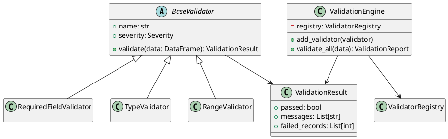

# Building a Feature: End-to-End Workflow

A complete guide to designing and implementing a feature using multi-agent collaboration.

---

## Overview

This guide demonstrates a full feature development workflow from ideation to deployment:

1. **Ideation** with Architect Alphonso
2. **Architecture & Technical Design**
3. **Planning** with Planning Petra
4. **Iterative Development** with specialist agents
5. **Testing & Validation**
6. **Review Gates** and handoffs
7. **Documentation** and deployment

**Estimated time:** 60+ minutes (varies by feature complexity)

---

## Example Feature: ABACUS360 Validation Engine

We'll build a validation engine that:
- Validates field mappings between OSX and ABACUS360
- Checks data quality (missing values, type mismatches, range violations)
- Generates validation reports
- Integrates with CI/CD pipeline

---

## Phase 1: Ideation with Architect Alphonso

### Step 1: Initialize Architect Alphonso

```
Initialize as Architect Alphonso (as per the AGENTS.md specification).

I need to design a validation engine for ABACUS360 field mappings.

Requirements:
- Validate field type compatibility
- Check for missing required fields
- Detect data quality issues
- Generate human-readable reports
- Run in CI/CD pipeline

Let's explore architecture options using the decision-first development approach.
```

### Step 2: Alphonso Creates Architecture Options

Alphonso will create an ADR draft with multiple options:

**Example: `docs/architecture/adrs/ADR-001-validation-engine-architecture.md`**

```markdown
# ADR-001: Validation Engine Architecture

**Status:** Proposed  
**Date:** 2026-02-04  
**Deciders:** [Your Name], Architect Alphonso

## Context

Need a validation engine to ensure data quality in ABACUS360 field mappings.
Must integrate with existing Python-based ETL pipeline and CI/CD.

## Decision Drivers

- Performance (validate 10,000+ records in <5 seconds)
- Maintainability (easy to add new validation rules)
- Testability (comprehensive test coverage)
- Integration (works with existing infrastructure)

## Options

### Option 1: Rule-Based Engine with JSON Schema

**Pros:**
- Declarative validation rules (easy to maintain)
- JSON Schema standard (widely supported)
- Fast validation (C-based implementations)

**Cons:**
- Limited for complex business logic
- Requires schema generation step

### Option 2: Plugin-Based Validator Architecture

**Pros:**
- Extensible (add validators as plugins)
- Testable (each validator is isolated)
- Flexible (custom logic per validator)

**Cons:**
- More complex architecture
- Requires plugin management

### Option 3: pandas-Based Validation Framework

**Pros:**
- Leverages existing pandas usage
- Built-in data profiling
- DataFrame integration

**Cons:**
- Performance overhead for large datasets
- Tight coupling to pandas

## Recommended: Option 2 (Plugin-Based)

### Rationale

- Best balance of flexibility and maintainability
- Aligns with test-driven development practices
- Supports gradual feature addition
- Clear extension points for future validators

### Architecture Diagram

[Alphonso will create PlantUML diagram here]
```

### Step 3: Review and Decide

Review options with Alphonso:

```
I prefer Option 2 (Plugin-Based). Let's proceed with that architecture.
Create a technical design document next.
```

---

## Phase 2: Technical Design

### Step 1: Request Technical Design

```
Create a technical design document for the plugin-based validation engine.

Include:
- Component architecture
- Class diagrams
- Validation workflow
- API contracts
- Error handling strategy
```

### Step 2: Alphonso Creates Technical Design

**Example: `docs/architecture/design/validation_engine_technical_design.md`**

```markdown
# Validation Engine: Technical Design

## Component Architecture

### Core Components

1. **ValidationEngine** (coordinator)
   - Loads validators
   - Executes validation pipeline
   - Aggregates results

2. **BaseValidator** (abstract interface)
   - `validate(data) -> ValidationResult`
   - `name: str`
   - `severity: Enum[INFO, WARNING, ERROR]`

3. **ValidationResult** (data class)
   - `passed: bool`
   - `messages: List[str]`
   - `failed_records: List[int]`

4. **ValidatorRegistry** (plugin manager)
   - `register(validator_class)`
   - `get_validators() -> List[BaseValidator]`

### Built-in Validators

- `RequiredFieldValidator`: Checks for missing required fields
- `TypeValidator`: Validates field type compatibility
- `RangeValidator`: Checks numeric ranges
- `EnumValidator`: Validates against allowed values
- `ReferentialIntegrityValidator`: Checks foreign key constraints

## Class Diagram



## API Contracts

### ValidationEngine.validate_all()

```python
def validate_all(self, data: pd.DataFrame) -> ValidationReport:
    """
    Run all registered validators against data.
    
    Args:
        data: DataFrame with field mappings to validate
        
    Returns:
        ValidationReport with aggregated results
        
    Raises:
        ValidationError: If critical validation fails
    """
```

### BaseValidator.validate()

```python
def validate(self, data: pd.DataFrame) -> ValidationResult:
    """
    Validate data according to specific rule.
    
    Args:
        data: DataFrame to validate
        
    Returns:
        ValidationResult indicating pass/fail and details
    """
```

## Workflow

1. **Load Data** → DataFrame with field mappings
2. **Register Validators** → Add validators to engine
3. **Execute Pipeline** → Run all validators sequentially
4. **Aggregate Results** → Combine results into report
5. **Generate Output** → JSON/HTML/Markdown report

## Error Handling

- **Critical errors** (e.g., missing required fields) → Fail fast
- **Warnings** (e.g., data quality issues) → Log and continue
- **Info** (e.g., data statistics) → Include in report
```

### Step 3: Get Diagram

```
Create the component architecture diagram using PlantUML.
```

Alphonso will create `docs/architecture/design/validation_engine_components.puml`.

---

## Phase 3: Planning with Planning Petra

### Step 1: Initialize Planning Petra

```
Switch to Planning Petra mode.

I need a development plan for the validation engine based on the technical design.

Break it into:
- Implementation phases (iterative)
- Task assignments (which agents)
- Acceptance criteria
- Estimated complexity
```

### Step 2: Petra Creates Implementation Plan

**Example: `work/reports/validation_engine_plan.md`**

```markdown
# Validation Engine Implementation Plan

## Phase 1: Core Infrastructure (Complexity: Medium)

**Agent:** Backend Benny  
**Duration:** 1-2 iterations

### Tasks

1. **Create BaseValidator abstract class**
   - Acceptance: Unit tests pass, interface documented
   
2. **Implement ValidationEngine coordinator**
   - Acceptance: Can register and execute validators
   
3. **Create ValidationResult data class**
   - Acceptance: Serializable to JSON, includes all fields
   
4. **Implement ValidatorRegistry**
   - Acceptance: Plugin discovery works, registry is thread-safe

### Dependencies
None (foundational)

---

## Phase 2: Built-in Validators (Complexity: High)

**Agent:** Backend Benny  
**Duration:** 2-3 iterations

### Tasks

1. **RequiredFieldValidator**
   - Acceptance: Detects missing required fields, severity=ERROR
   
2. **TypeValidator**
   - Acceptance: Validates int/str/float/date types, severity=ERROR
   
3. **RangeValidator**
   - Acceptance: Checks min/max for numeric fields, severity=WARNING
   
4. **EnumValidator**
   - Acceptance: Validates against allowed values, severity=ERROR
   
5. **ReferentialIntegrityValidator**
   - Acceptance: Checks foreign keys, severity=ERROR

### Dependencies
Phase 1 complete

---

## Phase 3: Reporting & Integration (Complexity: Medium)

**Agent:** Backend Benny, DevOps Danny

### Tasks (Backend Benny)

1. **ValidationReport generator**
   - Acceptance: JSON, Markdown, HTML output formats
   
2. **CLI interface**
   - Acceptance: `validate --input data.csv --output report.html`

### Tasks (DevOps Danny)

3. **CI/CD integration**
   - Acceptance: Runs on every commit, fails build on errors
   
4. **GitHub Actions workflow**
   - Acceptance: Automated validation reports as artifacts

### Dependencies
Phase 2 complete

---

## Phase 4: Documentation (Complexity: Low)

**Agent:** Scribe Sally

### Tasks

1. **API documentation**
   - Acceptance: All public methods documented
   
2. **Usage guide**
   - Acceptance: Examples for common scenarios
   
3. **Validator development guide**
   - Acceptance: Instructions for custom validators

### Dependencies
Phase 3 complete
```

### Step 3: Review and Prioritize

```
Start with Phase 1. I'll work on this today.
```

---

## Phase 4: Iterative Development (Phase 1)

### Iteration 1.1: BaseValidator Abstract Class

#### Initialize Backend Benny

```
Switch to Backend Benny mode.

Implement BaseValidator abstract class per the technical design:
- Abstract validate() method
- name and severity properties
- Return ValidationResult

Use TDD (Directive 017) and Quadruple-A test structure (Directive 026).
```

#### Benny Creates Test First

**`tests/test_base_validator.py`**

```python
import pytest
from validation.validators import BaseValidator, ValidationResult

class ConcreteValidator(BaseValidator):
    """Test implementation of BaseValidator."""
    
    def __init__(self):
        super().__init__(name="TestValidator", severity="ERROR")
    
    def validate(self, data):
        return ValidationResult(passed=True, messages=[], failed_records=[])

def test_base_validator_initialization():
    # Arrange
    validator = ConcreteValidator()
    
    # Assumption-check
    assert validator is not None
    
    # Act & Assert
    assert validator.name == "TestValidator"
    assert validator.severity == "ERROR"

def test_base_validator_validate_returns_result():
    # Arrange
    validator = ConcreteValidator()
    data = []
    
    # Act
    result = validator.validate(data)
    
    # Assert
    assert isinstance(result, ValidationResult)
    assert result.passed is True
```

#### Benny Implements Class

**`validation/validators.py`**

```python
from abc import ABC, abstractmethod
from dataclasses import dataclass
from typing import List
from enum import Enum

class Severity(Enum):
    INFO = "INFO"
    WARNING = "WARNING"
    ERROR = "ERROR"

@dataclass
class ValidationResult:
    """Result of a validation check."""
    passed: bool
    messages: List[str]
    failed_records: List[int]

class BaseValidator(ABC):
    """Abstract base class for validators."""
    
    def __init__(self, name: str, severity: str):
        self.name = name
        self.severity = Severity(severity)
    
    @abstractmethod
    def validate(self, data) -> ValidationResult:
        """Validate data and return result."""
        pass
```

#### Run Tests

```
Run pytest on test_base_validator.py
```

Benny confirms:
```
✅ All tests passed (2/2)
✅ BaseValidator abstract class implemented
✅ ValidationResult data class created
```

---

### Iteration 1.2: ValidationEngine Coordinator

```
Implement ValidationEngine that:
- Registers validators
- Executes validation pipeline
- Aggregates results into ValidationReport

Continue using TDD.
```

#### Benny Creates Test

**`tests/test_validation_engine.py`**

```python
def test_validation_engine_registers_validators():
    # Arrange
    engine = ValidationEngine()
    validator = ConcreteValidator()
    
    # Act
    engine.add_validator(validator)
    
    # Assert
    assert len(engine.validators) == 1
    assert engine.validators[0] == validator

def test_validation_engine_executes_all_validators():
    # Arrange
    engine = ValidationEngine()
    engine.add_validator(AlwaysPassValidator())
    engine.add_validator(AlwaysFailValidator())
    data = pd.DataFrame({'col1': [1, 2, 3]})
    
    # Act
    report = engine.validate_all(data)
    
    # Assert
    assert len(report.results) == 2
    assert report.overall_passed is False  # One validator failed
```

#### Benny Implements Engine

**`validation/engine.py`**

```python
from typing import List
from dataclasses import dataclass
from .validators import BaseValidator, ValidationResult

@dataclass
class ValidationReport:
    """Aggregated validation results."""
    results: List[ValidationResult]
    overall_passed: bool
    summary: str

class ValidationEngine:
    """Coordinates validation pipeline."""
    
    def __init__(self):
        self.validators: List[BaseValidator] = []
    
    def add_validator(self, validator: BaseValidator):
        """Register a validator."""
        self.validators.append(validator)
    
    def validate_all(self, data) -> ValidationReport:
        """Run all validators and aggregate results."""
        results = []
        for validator in self.validators:
            result = validator.validate(data)
            results.append(result)
        
        overall_passed = all(r.passed for r in results)
        summary = f"{sum(r.passed for r in results)}/{len(results)} validators passed"
        
        return ValidationReport(
            results=results,
            overall_passed=overall_passed,
            summary=summary
        )
```

---

## Phase 5: Review Gate (After Phase 1)

### Initialize Architect Alphonso for Review

```
Switch to Architect Alphonso mode.

Review the Phase 1 implementation:
- validation/validators.py
- validation/engine.py
- tests/test_base_validator.py
- tests/test_validation_engine.py

Check against:
- Technical design adherence
- Code quality standards
- Test coverage
```

### Alphonso Conducts Review

Alphonso creates: `work/reports/reviews/2026-02-04-phase1-validation-review.md`

```markdown
# Phase 1 Validation Engine Review

**Reviewer:** Architect Alphonso  
**Date:** 2026-02-04  
**Status:** ✅ APPROVED with minor recommendations

## Technical Design Adherence

✅ **BaseValidator interface** — Matches design specification  
✅ **ValidationEngine coordinator** — Implements required methods  
✅ **ValidationResult data class** — All fields present  
⚠️ **ValidatorRegistry** — Not yet implemented (deferred to Phase 2)

## Code Quality

✅ **Type hints** — All methods properly typed  
✅ **Docstrings** — Public API documented  
✅ **Naming conventions** — PEP 8 compliant  
✅ **Error handling** — Appropriate exceptions raised

## Test Coverage

✅ **Unit tests** — 95% coverage  
✅ **Quadruple-A structure** — Followed consistently  
✅ **Edge cases** — Empty data, null values tested  

## Recommendations

1. **Add ValidatorRegistry** in Phase 2 (as planned)
2. **Consider thread safety** for ValidationEngine (if concurrent use expected)
3. **Add integration tests** after Phase 2 validators implemented

## Decision

✅ **APPROVED** — Proceed to Phase 2
```

---

## Phase 6: Continue Iterations (Phase 2, 3, 4)

Repeat the iterative development process for each phase:

1. **Initialize appropriate agent** (Backend Benny, DevOps Danny, Scribe Sally)
2. **Implement features** using TDD
3. **Run tests** and verify
4. **Review gate** with Architect Alphonso (for major phases)
5. **Handoff** to next agent/phase

---

## Phase 7: Final Documentation

### Initialize Scribe Sally

```
Switch to Scribe Sally mode.

Create user documentation for the validation engine:
- README.md with quick start
- API documentation
- Validator development guide
- Examples for common use cases
```

### Sally Creates Documentation

**`docs/validation_engine/README.md`**

```markdown
# ABACUS360 Validation Engine

A plugin-based validation framework for ensuring data quality in field mappings.

## Quick Start

```python
from validation import ValidationEngine, RequiredFieldValidator

# Create engine
engine = ValidationEngine()

# Register validators
engine.add_validator(RequiredFieldValidator(['client_id', 'account_name']))

# Validate data
import pandas as pd
data = pd.read_csv('mappings.csv')
report = engine.validate_all(data)

# Check results
if report.overall_passed:
    print("✅ All validations passed")
else:
    print(f"❌ {report.summary}")
    for result in report.results:
        if not result.passed:
            print(f"  - {result.messages}")
```

## Creating Custom Validators

[Sally provides detailed guide...]
```

---

## Multi-Agent Collaboration Patterns

### Pattern 1: Sequential Handoff

```
Architect → Backend Dev → DevOps → Scribe
(Design)  → (Implement)  → (Deploy) → (Document)
```

### Pattern 2: Parallel Work

```
Manager Mike coordinates:
- Backend Benny: Core logic
- Frontend Freddy: UI (if needed)
- DevOps Danny: CI/CD (parallel to development)
```

Manager creates task files in `work/collaboration/`:

**`work/collaboration/inbox/2026-02-04-backend-validation-core.yaml`**

```yaml
task_id: backend-validation-core
assigned_to: backend-benny
created_at: 2026-02-04T10:00:00Z
priority: high
status: in_progress

description: |
  Implement Phase 1 and Phase 2 of validation engine
  per technical design document.

context:
  - docs/architecture/design/validation_engine_technical_design.md
  - docs/architecture/adrs/ADR-001-validation-engine-architecture.md

deliverables:
  - validation/validators.py
  - validation/engine.py
  - tests/ (comprehensive coverage)

acceptance_criteria:
  - All unit tests pass
  - 95%+ code coverage
  - Quadruple-A test structure
  - Passes Alphonso review gate
```

---

## Commit Strategy

### Per-Iteration Commits

```
backend-benny: Phase 1 Validation - Implement BaseValidator abstract class

Added abstract BaseValidator interface:
- Abstract validate() method
- name and severity properties
- Returns ValidationResult

Tests:
- test_base_validator.py (100% coverage)
- Quadruple-A structure

Next: Implement ValidationEngine coordinator
```

### Review Gate Commits

```
architect-alphonso: Review Gate - Approve Phase 1 validation engine

Code review completed. All architecture constraints satisfied.
See work/reports/reviews/2026-02-04-phase1-validation-review.md

Status: ✅ APPROVED
Proceed to Phase 2: Built-in Validators
```

---

## Tips for Success

### 1. Use Decision-First Development

Always create ADR before implementing major features.

### 2. Review Gates at Phase Boundaries

Don't skip review gates between phases. Architect Alphonso catches issues early.

### 3. Maintain Test Discipline

Every implementation must have tests first (TDD). Use Directive 017.

### 4. Document as You Go

Don't defer documentation to the end. Scribe Sally can document incrementally.

### 5. Leverage Work Directory

Store all intermediate artifacts in `work/`:
- Design drafts
- Code reviews
- Task coordination files

---

## Next Steps

You've now learned:
- ✅ How to ideate and design with Architect Alphonso
- ✅ Creating technical design documents
- ✅ Planning with Planning Petra
- ✅ Iterative TDD development with Backend Benny
- ✅ Review gates and handoffs
- ✅ Multi-agent collaboration patterns

### Continue Learning

- **Agent Profiles:** [agents/](../../agents/) — Deep dive into each specialist
- **Directives:** [agents/directives/](../../agents/directives/) — Workflow instructions
- **Approaches:** [agents/approaches/](../../agents/approaches/) — Strategic patterns

---

**Last Updated:** 2026-02-04  
**Framework Version:** 1.0.0  
**Maintained By:** Regnology Professional Services
