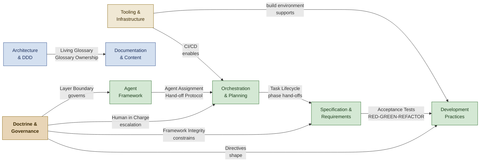

<!--
████          R E G N O L O G Y
    ██        Professional Services
████
    ██        professional_services@regnology.net
-->

# Doctrine Glossary

**Version:** 0.3.0
**Date:** 2026-03-30
**Status:** candidate — pending HiC review

---

## About This Glossary

This directory contains the structured domain glossary for the Regnology Professional Services Agent Framework. Terms from the legacy flat `doctrine/GLOSSARY.md` have been taxonomised into eight coherent domains, supplemented by 77 new candidate terms identified during Phase 1 of the glossary restructuring initiative (2026-03-05).

Each domain is maintained as a standalone `README.md` in its own subdirectory. Navigate to a domain file to browse or add terms. All new terms carry `status: candidate` and require Human-in-Charge review before promotion to `canonical`.

---

## Domain Index

| Domain Slug | Human Name | Term Count | Description |
|---|---|---|---|
| [`agent-framework`](./agent-framework/README.md) | Agent Framework | 59 | Everything pertaining to agents as first-class entities — their named roles, profiles, operational reasoning modes, agent capability definitions, autonomy governance, collaboration contracts, and specialization hierarchy. |
| [`architecture-ddd`](./architecture-ddd/README.md) | Architecture & Domain-Driven Design | 58 | Domain-Driven Design concepts, bounded contexts, ubiquitous language, linguistic architecture signals, context mapping patterns, living glossary practices, and organizational patterns that predict architectural structure. |
| [`development-practices`](./development-practices/README.md) | Development Practices | 98 | Software development methodologies and disciplines — TDD, BDD, ATDD, refactoring techniques, code review methodology, bug fixing, input validation, safe-to-fail practices, decision documentation, testing philosophy, and AppSec secure coding standards. |
| [`orchestration`](./orchestration/README.md) | Orchestration & Planning | 55 | Multi-agent task coordination, file-based collaboration, task lifecycle management, planning cycles, workflow execution, autonomous operation protocols, and cross-agent handoffs. |
| [`doctrine-governance`](./doctrine-governance/README.md) | Doctrine & Governance | 47 | The doctrine stack architecture itself — its layers, distribution model, framework maintenance patterns, directive system, version governance, and framework improvement loops. |
| [`specification`](./specification/README.md) | Specification & Requirements | 47 | Specification-driven development, requirements engineering, acceptance criteria, the six-phase spec-driven cycle, phase protocols, evidence-based requirements methodology, and functional specification patterns. |
| [`documentation`](./documentation/README.md) | Documentation & Content | 42 | Documentation quality, content curation, writing conventions, voice preservation, artifact management, style analysis, glossary operations, and the review/audit practices that maintain documentation integrity. |
| [`tooling`](./tooling/README.md) | Tooling & Infrastructure | 71 | Development environment setup, build automation, language-specific tooling (Python, Java, TypeScript), frontend/backend technology patterns, version control practices, repository structure artifacts, configuration path variables, AppSec toolchain (SonarQube, DependencyTrack, CycloneDX, Lucy), and corporate Jira workflow concepts (DoR, DoD, Work Item Type, Jira hierarchy). |

---

> Inter-domain relationships across the 8 doctrine glossary domains, with Doctrine & Governance as the cross-cutting authority layer.

---

## Navigation

- [Agent Framework](./agent-framework/README.md)
- [Architecture & Domain-Driven Design](./architecture-ddd/README.md)
- [Development Practices](./development-practices/README.md)
- [Orchestration & Planning](./orchestration/README.md)
- [Doctrine & Governance](./doctrine-governance/README.md)
- [Specification & Requirements](./specification/README.md)
- [Documentation & Content](./documentation/README.md)
- [Tooling & Infrastructure](./tooling/README.md)

---

## Historical Reference

The original flat glossary is preserved at [`../GLOSSARY.md`](../GLOSSARY.md) for historical reference. It should not be edited going forward — all new terminology is added to the appropriate domain file in this directory.

---

*All new terminology is marked `status: candidate` pending Human-in-Charge review.*
*For historical reference, see [`doctrine/GLOSSARY.md`](../GLOSSARY.md).*
