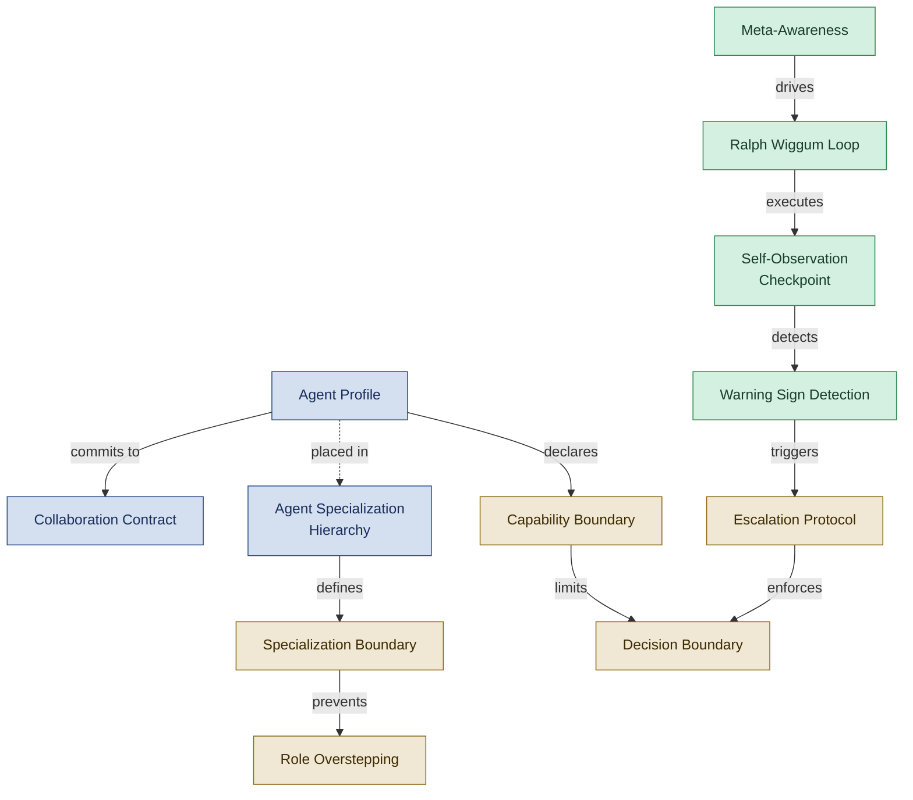

<!--
████          R E G N O L O G Y
    ██        Professional Services
████
    ██        professional_services@regnology.net
-->

# Agent Framework

**Domain:** `agent-framework`
**Version:** 0.1.0
**Status:** candidate — pending HiC review
**Term Count:** 59 (51 existing + 8 new candidates)
**Last Updated:** 2026-03-05

---

## Overview

Everything pertaining to agents as first-class entities — their named roles, profiles, operational reasoning modes, agent capability definitions, autonomy governance, collaboration contracts, and specialization hierarchy. This domain covers WHO the agents are and HOW they reason and relate to each other.

> How agent profiles, specialization hierarchy, and self-observation loops govern agent behaviour and authority boundaries.

---

## Terms

### Abacus Abe

The specialist agent profile for mapping external data sources (Excel, CSV, databases) to the ABACUS360 banking data model. Abacus Abe performs semantic field matching, domain validation, and ETL transformation logic generation with confidence-scored output.

**Context:** agent-framework
**Source:** `doctrine/agents/abacus_mapper.agent.md`
**Related:** Agent Profile, Semantic Field Matching, Agent Specialization Hierarchy, Collaboration Contract
**Status:** candidate

---

### Agent Declaration

Formal acknowledgment by an agent that it has loaded and accepted the Regnology Professional Services Context Framework, confirming operational authority within the doctrine stack

**Context:** Agent Behavior / Governance
**Source:** [Directive 007, Section 1](../../directives/007_agent_declaration.md#section-1-framework-declaration-internal)
**Related:** Self-Introduction, Agent Profile, Collaboration Contract, Context Layer, Version Governance
**Status:** canonical

---

### Agent Collaboration Flow

A flow state described in the traceable decisions approach in which an agent is actively engaged in back-and-forth interaction with the human — detecting signals such as 'should we...' questions or iterative refinement — and responds by proactively surfacing decision markers, templates, and ADR references in real time.

**Context:** agent-framework
**Source:** `doctrine/approaches/traceable-decisions-detailed-guide.md`
**Related:** Deep Creation Flow, Meta-Awareness, Decision Marker, Self-Observation Checkpoint
**Status:** candidate

---

### Agent Profile

A specialized configuration file (
`.agent.md`) that defines an agent's purpose, specialization, collaboration contract, mode defaults, and directive usage. Profiles extend the base AGENTS.md specification with role-specific competencies.

**Location:** agent profile files  
**Reference:** Directive 005

**Context:** 
**Source:** 
**Related:** Specialization, Collaboration Contract
**Status:** canonical

---

### Agent Specialization Hierarchy

Parent-child relationship where specialized agents refine their parent's scope to narrower contexts. Orchestrator prefers specialists when context matches, falls back to parent when specialist unavailable or overloaded.

**Context:** Agent Collaboration - Orchestration
**Source:** DDR-011, agent-specialization-hierarchy.md
**Related:** Specialization Context, Routing Priority, SELECT_APPROPRIATE_AGENT, Parent Agent, Child Agent
**Status:** canonical

---

### /analysis-mode

Reasoning mode focusing on systematic decomposition, structural analysis, and diagnostic evaluation; default mode for most agents

**Context:** Agent Modes - Reasoning
**Source:** All agent profiles
**Related:** /creative-mode, /meta-mode, Mode Protocol
**Status:** canonical

---

### Analyst Annie

Requirements and validation specialist agent focused on producing testable, data-backed specifications with validated acceptance criteria

**Context:** Agent Roles - Requirements Analysis
**Source:** analyst-annie.agent.md
**Related:** Requirements Specialist, Specification-Driven Development, Phase 1 (Analysis), Validation Script
**Status:** canonical

---

### Architect Alphonso

Architecture specialist agent who clarifies complex systems with contextual trade-offs, creates ADRs, and provides system decomposition with explicit decision rationale

**Context:** Agent Roles - Architecture
**Source:** architect.agent.md
**Related:** Architecture Specialist, ADR, System Decomposition, Phase 2 (Architecture), Trade-off Analysis
**Status:** canonical

---

### Architecture Specialist

Agent specialization focused on system decomposition, design interfaces, explicit decision records (ADRs), and trade-off analysis for complex systems

**Context:** Agent Specializations
**Source:** architect.agent.md
**Related:** Architect Alphonso, ADR, System Decomposition, Trade-off Analysis
**Status:** canonical

---

### Audience Persona Calibration

The act of adapting slide depth, tone, and vocabulary to a named audience persona before drafting presentation content. Slidedeck Stanislav applies this by loading persona definitions from `docs/audience/` and verifying the selected persona before content authoring begins. Cross-domain: primarily `agent-framework`, cross-reference `documentation`.

**Context:** agent-framework
**Source:** `doctrine/agents/slidedeck-stanislav.agent.md`, `doctrine/directives/022_audience_oriented_writing.md`
**Related:** Slidedeck Stanislav, Persona-Driven Writing, Target-Audience Fit
**Status:** candidate

---

### Backend Benny

Backend developer specialist agent focused on resilient service backends, integration surfaces, API design, and persistence strategy with traceable decisions

**Context:** Agent Roles - Backend Development
**Source:** backend-dev.agent.md
**Related:** Backend Developer Specialist, Service Design, API Contract, Persistence Strategy, Integration Surface
**Status:** canonical

---

### Backend Developer Specialist

Agent specialization focused on API/service design, persistence strategy, performance budgets, failure-mode mapping, and backend architecture

**Context:** Agent Specializations
**Source:** backend-dev.agent.md
**Related:** Backend Benny, Service Design, Persistence Strategy, Performance Budget
**Status:** canonical

---

### Bootstrap Bill

Repository scaffolding specialist agent who maps repository topology, generates structural artifacts (REPO_MAP, SURFACES, WORKFLOWS), and creates doctrine configuration for efficient multi-agent collaboration

**Context:** Agent Roles - Repository Initialization
**Source:** bootstrap-bill.agent.md
**Related:** Repository Scaffolding, Doctrine Configuration, REPO_MAP, Topology Mapping, Structural Artifact
**Status:** canonical

---

### Build Automation Specialist

Agent specialization focused on build graph modeling, CI/CD flow design, caching strategy, dependency integrity, and reproducible pipelines

**Context:** Agent Specializations
**Source:** build-automation.agent.md
**Related:** DevOps Danny, CI/CD Pipeline, Reproducible Build, Build Graph
**Status:** canonical

---

### Capability Boundary

Explicit definition of agent expertise boundaries - what they can and cannot do

**Context:** Agent specialization
**Source:** agent-profile-creation.tactic.md
**Related:** Agent Profile, Specialization
**Status:** canonical

---

### Child Agent

Agent that inherits parent's collaboration contract but operates in narrower specialization context (language, framework, domain, writing style). Declared via `specializes_from` metadata in agent profile frontmatter.

**Context:** Agent Specialization Hierarchy
**Source:** DDR-011
**Related:** Parent Agent, Specialization Context, Agent Specialization Hierarchy
**Status:** canonical

---

### Code Reviewer Cindy

Review specialist agent focused on code quality, standards compliance, and traceability validation without making direct code modifications

**Context:** Agent Roles - Code Review
**Source:** code-reviewer-cindy.agent.md
**Related:** Review Specialist, Code Quality, Standards Compliance, Traceability Check
**Status:** canonical

---

### Collaboration Contract

A section within each agent profile that specifies behavioral commitments, boundaries, escalation protocols, and interaction patterns with other agents and humans. Defines what the agent will and won't do.

**Context:** 
**Source:** 
**Related:** Agent Profile, Escalation
**Status:** canonical

---

### /creative-mode

Reasoning mode focusing on option generation, pattern shaping, alternative exploration, and narrative construction

**Context:** Agent Modes - Reasoning
**Source:** All agent profiles
**Related:** /analysis-mode, /meta-mode, Mode Protocol
**Status:** canonical

---

### Curator Claire

Structural and tonal consistency specialist agent who maintains cross-document integrity, enforces doctrine stack boundaries, and prevents drift through systematic audits

**Context:** Agent Roles - Content Curation
**Source:** curator.agent.md
**Related:** Curator, Structural Consistency, Tonal Integrity, Doctrine Stack, Discrepancy Report, Source vs Distribution
**Status:** canonical

---

### Decision Boundary

Classification of decision types as Minor (autonomous), Moderate (autonomous with note), or Critical (pause and escalate)

**Context:** Agent autonomy governance
**Source:** autonomous-operation-protocol.tactic.md
**Related:** AFK Mode, Escalation Protocol
**Status:** canonical

---

### DevOps Danny

Build automation specialist agent who designs reproducible build, test, and release pipelines with documented runbooks and traceable deployment flows

**Context:** Agent Roles - Build Automation
**Source:** build-automation.agent.md
**Related:** Build Automation Specialist, CI/CD Pipeline, Reproducible Build, Deployment Pipeline, Release Automation
**Status:** canonical

---

### Diagram Daisy

Diagramming specialist agent who transforms conceptual and architectural structures into semantically aligned diagram-as-code artifacts (Mermaid, PlantUML, Graphviz)

**Context:** Agent Roles - Visualization
**Source:** diagrammer.agent.md
**Related:** Diagramming Specialist, Diagram-as-Code, Semantic Fidelity, Visual Representation
**Status:** canonical

---

### Diagram-as-Code

Practice of creating diagrams using text-based formats (Mermaid, PlantUML, Graphviz) for version control, reproducibility, and semantic fidelity

**Context:** Agent Capabilities - Visualization
**Source:** diagrammer.agent.md
**Related:** Diagram Daisy, Semantic Fidelity, Mermaid, PlantUML
**Status:** canonical

---

### Editor Eddy

Writer and editor specialist agent who revises existing content for tone, clarity, and alignment while preserving factual integrity and authorial rhythm

**Context:** Agent Roles - Editorial
**Source:** writer-editor.agent.md
**Related:** Writer-Editor, Editorial Specialist, Paragraph-Level Refinement, Voice Alignment, Boy Scout Rule
**Status:** canonical

---

### Escalation Protocol

Procedure for pausing autonomous work and documenting critical decisions requiring human guidance

**Context:** Agent autonomy governance
**Source:** autonomous-operation-protocol.tactic.md
**Related:** Decision Boundary, AFK Mode
**Status:** canonical

---

### Fallback Agent

The agent designated to receive a task if the primary selected specialist is unavailable, over capacity, or produces an invalid selection result. In the SELECT_APPROPRIATE_AGENT tactic, the fallback is the specialist's parent agent, or Manager Mike if the selected agent is already a parent. Cross-domain: also relevant to `orchestration`.

**Context:** agent-framework
**Source:** `doctrine/tactics/SELECT_APPROPRIATE_AGENT.tactic.md`
**Related:** Parent Agent, Child Agent, Agent Specialization Hierarchy, Routing Priority, SELECT_APPROPRIATE_AGENT
**Status:** candidate

---

### Framework Guardian

Framework integrity specialist agent who audits framework installations against canonical manifests, detects drift, and guides safe upgrades while preserving local customizations

**Context:** Agent Roles - Framework Maintenance
**Source:** framework-guardian.agent.md
**Related:** Framework Integrity, Manifest Audit, Drift Detection, Upgrade Plan, Core/Local Boundary
**Status:** canonical

---

### Frontend Freddy

Front-end specialist agent integrating design, technical architecture, and usability reasoning for coherent UI systems with maintainable component patterns

**Context:** Agent Roles - Frontend Development
**Source:** frontend.agent.md
**Related:** Frontend Specialist, UI Architecture, Component Patterns, State Boundaries, Design System
**Status:** canonical

---

### Java Jenny

Java development specialist agent focused on code quality, style enforcement, and testing standards using Maven and Java ecosystem tooling

**Context:** Agent Roles - Java Development
**Source:** java-jenny.agent.md
**Related:** Java Specialist, Code Quality, Maven, JVM Ecosystem, Test-First Development
**Status:** canonical

---

### Lexical Larry

Lexical analyst specialist agent who evaluates writing style compliance (tone, rhythm, formatting) while preserving authorial voice through minimal, rule-grounded edits

**Context:** Agent Roles - Style Analysis
**Source:** lexical.agent.md
**Related:** Lexical Analyst, Style Compliance, Tone Fidelity, Authorial Voice, LEX_REPORT
**Status:** canonical

---

### Local Override Specialist

A specialist agent defined in `.doctrine-config/custom-agents/` that shadows or supplements framework-provided specialists for repository-specific needs. Local override specialists automatically receive a +20 routing priority boost over framework equivalents during agent selection. Cross-domain: also relevant to `doctrine-governance`.

**Context:** agent-framework
**Source:** `doctrine/tactics/SELECT_APPROPRIATE_AGENT.tactic.md`
**Related:** Routing Priority, Agent Specialization Hierarchy, Local Customization, Core/Local Boundary
**Status:** candidate

---

### Manager Mike

Coordination specialist agent who routes tasks to appropriate agents, maintains workflow status maps, and prevents conflicting edits through file-based orchestration

**Context:** Agent Roles - Orchestration
**Source:** manager.agent.md
**Related:** Coordinator, Task Router, Workflow Status, Hand-off Tracking, AGENT_STATUS
**Status:** canonical

---

### Medium Detection

Process of identifying which writing medium (Pattern, Podcast, LinkedIn, Essay) applies to content based on style patterns and tone markers

**Context:** Agent Capabilities - Style Analysis
**Source:** lexical.agent.md
**Related:** Lexical Larry, LEX_TONE_MAP, Tone Fidelity
**Status:** canonical

---

### Meta-Awareness

Agent capability to observe and reason about its own execution state, recognize problematic patterns, and make course corrections before completing tasks

**Context:** Agent Behavior / Self-Observation
**Source:** ralph-wiggum-loop.md
**Related:** Ralph Wiggum Loop, Meta-Mode
**Status:** canonical

---

### /meta-mode

Reasoning mode focusing on process reflection, alignment validation, governance review, and methodology evaluation

**Context:** Agent Modes - Reasoning
**Source:** All agent profiles
**Related:** /analysis-mode, /creative-mode, Mode Protocol
**Status:** canonical

---

### Orchestration Cycle

The full repeating span of a specification-to-integration workflow, encompassing Phase 1 (Specification) through Phase 6 (Integration), coordinated by Manager Mike with specialist agents executing each phase. The term distinguishes the macro-level recurring pattern from a single batch or phase.

**Context:** agent-framework
**Source:** `doctrine/agents/manager.agent.md`
**Related:** Six-Phase Cycle, Phase Checkpoint Protocol, Hand-off, Batch Planning, Manager Mike
**Status:** candidate

---

### Parent Agent

Generalist agent whose collaboration contract and capabilities are inherited and refined by specialist child agents. Serves as fallback when no specialist matches task context or specialists are overloaded.

**Context:** Agent Specialization Hierarchy
**Source:** DDR-011
**Related:** Child Agent, Specialization Boundary, Agent Specialization Hierarchy
**Status:** canonical

---

### Planning Petra

Project planning specialist agent who translates strategic intent into executable, assumption-aware plans with milestone definitions and dependency mapping

**Context:** Agent Roles - Project Planning
**Source:** project-planner.agent.md
**Related:** Planning Specialist, Milestone Definition, Dependency Mapping, Batch Planning, PLAN_OVERVIEW
**Status:** canonical

---

### Python Pedro

Python development specialist agent applying ATDD + TDD with type safety, idiomatic Python 3.9+ patterns, and comprehensive testing using pytest ecosystem

**Context:** Agent Roles - Python Development
**Source:** python-pedro.agent.md
**Related:** Python Specialist, Type Hints, pytest, Coverage Threshold, Self-Review Protocol
**Status:** canonical

---

### Ralph Wiggum Loop

Self-aware observation pattern where agents periodically monitor their own execution state, detect problematic patterns (drift, confusion, misalignment), and self-correct mid-task

**Context:** Agent Behavior / Self-Observation
**Source:** ralph-wiggum-loop.md
**Related:** Self-Observation Checkpoint, Meta-Awareness, Course Correction
**Status:** canonical

---

### Repository Scaffolding

Process of mapping repository topology and generating structural artifacts (REPO_MAP, SURFACES, WORKFLOWS) to enable multi-agent collaboration

**Context:** Agent Specializations
**Source:** bootstrap-bill.agent.md
**Related:** Bootstrap Bill, REPO_MAP, Topology Mapping, Structural Artifact
**Status:** canonical

---

### Requirements Specialist

Agent specialization focused on requirements elicitation, specification authoring, data validation, and production-data alignment to reduce ambiguity

**Context:** Agent Specializations
**Source:** analyst-annie.agent.md
**Related:** Analyst Annie, Specification, Validation Script, Data Quality
**Status:** canonical

---

### Researcher Ralph

Research and corroboration specialist agent who gathers, synthesizes, and contextualizes information with source-grounded summaries for systemic reasoning

**Context:** Agent Roles - Research
**Source:** researcher.agent.md
**Related:** Research Specialist, Literature Synthesis, Comparative Analysis, Source Grounding, Verifiable Knowledge
**Status:** canonical

---

### Reviewer

Quality assurance specialist agent conducting systematic multi-dimensional reviews (structural, editorial, technical, standards compliance) without making direct changes

**Context:** Agent Roles - Quality Assurance
**Source:** reviewer.agent.md
**Related:** Quality Assurance, Review Dimensions, Finding Summary, Review Report, Validation Checklist
**Status:** canonical

---

### Role Overstepping

Violation where an agent performs work outside their designated authority level (PRIMARY, CONSULT, or NO)

**Context:** Agent authority boundaries
**Source:** phase-checkpoint-protocol.md
**Related:** Phase Skipping, Role Boundaries Table
**Status:** canonical

---

### Scribe Sally

Documentation and transcription specialist agent who maintains traceable, neutral documentation integrity through structured summaries and meeting notes

**Context:** Agent Roles - Documentation
**Source:** scribe.agent.md
**Related:** Documentation Specialist, Meeting Notes, Structured Summary, Neutral Tone, Timestamp
**Status:** canonical

---

### Self-Introduction

User-facing act at session start where an agent states its persona name, role, and task relevance — anchoring in-character behavior and making the active agent identity visible to the human

**Context:** Agent Behavior / Communication
**Source:** [Directive 007, Section 2](../../directives/007_agent_declaration.md#section-2-user-facing-self-introduction-external)
**Related:** Agent Profile, Collaboration Contract, Initialization Declaration, Agent Declaration
**Status:** canonical

---

### Self-Observation Checkpoint

Structured protocol executed at trigger points (time elapsed, warning signs) where agent switches to meta-mode to assess execution state and decide continue/adjust/escalate

**Context:** Agent Behavior / Self-Observation
**Source:** ralph-wiggum-loop.md
**Related:** Ralph Wiggum Loop, Meta-Mode, Warning Sign Detection
**Status:** canonical

---

### Semantic Fidelity

Quality measure of how accurately a diagram or visualization represents the underlying conceptual, architectural, or organizational relationships

**Context:** Agent Capabilities - Visualization
**Source:** diagrammer.agent.md
**Related:** Diagram Daisy, Diagram-as-Code, Visual Representation
**Status:** canonical

---

### Semantic Field Matching

An agent capability of Abacus Abe that identifies the business meaning of external data columns and matches them to ABACUS360 fields through name-based, type-based, value-based, and context-based comparison — going beyond simple string matching to understand semantic intent.

**Context:** agent-framework
**Source:** `doctrine/agents/abacus_mapper.agent.md`
**Related:** Abacus Abe, Confidence Threshold, Domain Validation
**Status:** candidate

---

### Slidedeck Stanislav

The specialist agent profile responsible for transforming raw ideas, briefs, or structured notes into complete, audience-calibrated, branded Reveal.js slide decks. Stanislav owns narrative architecture, content authoring, and the `slides.md` output artifact while delegating diagram work to Diagram Daisy.

**Context:** agent-framework
**Source:** `doctrine/agents/slidedeck-stanislav.agent.md`
**Related:** Agent Profile, Narrative Architecture, Diagram Daisy, Editor Eddy, Audience Persona Calibration
**Status:** candidate

---

### Specialization Boundary

Explicit limits on agent capabilities defining what each agent will and won't do to prevent scope creep and role confusion

**Context:** Agent Collaboration - Role Definition
**Source:** All agent profiles
**Related:** Collaboration Contract, Hand-off Protocol, Escalation
**Status:** canonical

---

### Specialization Context

Declarative conditions in agent profile defining when specialist preferred over parent: language, frameworks, file patterns, domain keywords, writing style, complexity preference.

**Context:** Agent Collaboration - Routing
**Source:** DDR-011
**Related:** Agent Specialization Hierarchy, Child Agent, Routing Priority
**Status:** canonical

---

### Synthesizer Sam

Multi-agent integration specialist who merges insights from multiple agents into coherent narratives and conceptual models while preserving source integrity

**Context:** Agent Roles - Integration
**Source:** synthesizer.agent.md
**Related:** Integration Specialist, Pattern Synthesis, Coherence Articulation, Cross-Agent Integration
**Status:** canonical

---

### Topology Mapping

Process of scanning and documenting repository structure, identifying directory roles, key files, configuration locations, and navigation paths

**Context:** Agent Capabilities - Repository Analysis
**Source:** bootstrap-bill.agent.md
**Related:** Bootstrap Bill, REPO_MAP, Repository Scaffolding
**Status:** canonical

---

### Translator Tanya

Contextual interpreter specialist agent who preserves authorial tone and rhythm during accurate cross-language translation using voice fidelity techniques

**Context:** Agent Roles - Translation
**Source:** translator.agent.md
**Related:** Translation Specialist, Voice Fidelity, Tone Preservation, Contextual Pass, VOICE_DIFF
**Status:** canonical

---

### Voice Fidelity

Quality measure of how well translated or edited content preserves the original author's distinctive tone, rhythm, and cadence

**Context:** Agent Capabilities - Translation/Editing
**Source:** translator.agent.md, writer-editor.agent.md
**Related:** Translator Tanya, Editor Eddy, Authorial Voice, Tone Preservation
**Status:** canonical

---

### Warning Sign Detection

Agent's ability to recognize internal signals indicating problems (repetitive patterns, lost goal, speculation, verbose output, scope creep, directive violation)

**Context:** Agent Behavior / Self-Observation
**Source:** ralph-wiggum-loop.md
**Related:** Ralph Wiggum Loop, Self-Observation Checkpoint
**Status:** canonical

---

## Cross-Domain References

- **Agent Assignment** → [`orchestration`](../orchestration/README.md): Orchestration process that selects agents
- **AFK Mode** → [`orchestration`](../orchestration/README.md): Autonomous operation involves both agent behavior and workflow protocol
- **Escalation** → [`doctrine-governance`](../doctrine-governance/README.md): Flagging process spans governance, workflow, and agent behavior
- **Phase Authority** → [`specification`](../specification/README.md): Spec-driven phase ownership is also an agent collaboration contract
- **Ralph Wiggum Loop** → [`orchestration`](../orchestration/README.md): Agent behavior pattern applied during task execution

---

*All terms marked `status: candidate` are proposed terminology pending Human-in-Charge review.*
*Part of [`doctrine/glossary/`](../README.md) — Regnology Professional Services Agent Framework*
