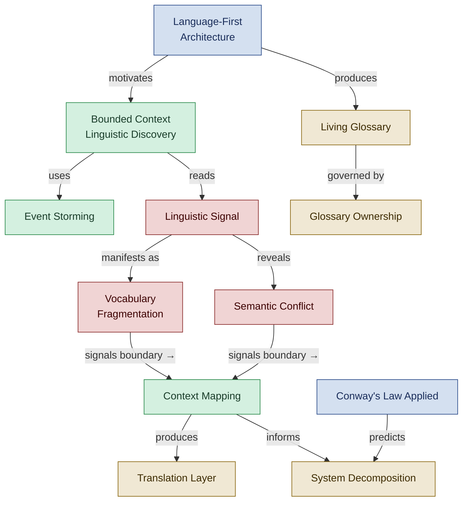

<!--
████          R E G N O L O G Y
    ██        Professional Services
████
    ██        professional_services@regnology.net
-->

# Architecture & Domain-Driven Design

**Domain:** `architecture-ddd`
**Version:** 0.1.0
**Status:** candidate — pending HiC review
**Term Count:** 58 (54 existing + 4 new candidates)
**Last Updated:** 2026-03-05

---

## Overview

Domain-Driven Design concepts, bounded contexts, ubiquitous language, linguistic architecture signals, context mapping patterns, living glossary practices, and organizational patterns that predict architectural structure. Includes the Meta-Pattern cluster of technology-driven practice shifts primarily sourced from DDD practice documents.

> How language-first discovery techniques reveal bounded context boundaries, drive system decomposition, and feed living glossary governance.

---

## Terms

### Adoption Rate

Percentage of domain terms in code/docs that use glossary terminology; target >80% for effective ubiquitous language

**Context:** Architecture - DDD / Metrics
**Source:** living-glossary-practice.md
**Related:** Living Glossary, Ubiquitous Language
**Status:** canonical

---

### Agentic Enablement

Capability shift where AI agents make previously labor-intensive practices tractable (continuous capture, multi-source pattern detection, incremental maintenance)

**Context:** Meta-Pattern / Technology Impact
**Source:** language-first-architecture.md, living-glossary-practice.md
**Related:** Feasibility Shift, Continuous Capture
**Status:** canonical

---

### Annual Governance Retrospective

A half-day per-year session in the living glossary maintenance rhythm for reviewing governance policies, organizational alignment of terminology practices, and strategic adjustments to enforcement tier thresholds and context ownership boundaries.

**Context:** architecture-ddd
**Source:** `doctrine/approaches/living-glossary-practice.md`
**Related:** Quarterly Health Check, Weekly Triage, Living Glossary, Context Owner, Vocabulary Ownership
**Status:** candidate

---

### Boundary Signal

Indicator of context boundaries: event clusters that separate naturally, different actors, vocabulary divergence, or team responsibility shifts

**Context:** Context boundary detection
**Source:** event-storming-discovery.tactic.md
**Related:** Event Cluster, Context Boundary
**Status:** canonical

---

### Bounded Context Linguistic Discovery

Technique for identifying hidden context boundaries by analyzing terminology patterns, communication structures, and semantic conflicts in existing systems

**Context:** Architecture - DDD
**Source:** bounded-context-linguistic-discovery.md
**Related:** Bounded Context, Semantic Conflict, Conway's Law Applied
**Status:** canonical

---

### C4 Model

Lightweight hierarchical technique for structuring software architecture diagrams: Context (system+users), Container (deployable units), Component (internal modules), Code (implementation)

**Context:** Architecture / Diagramming
**Source:** design_diagramming-incremental_detail.md
**Related:** Incremental Detail Design, Progressive Disclosure
**Status:** canonical

---

### Co-occurrence Analysis

Technique for clustering terminology by analyzing which terms appear together in the same files or contexts

**Context:** Linguistic analysis
**Source:** code-documentation-analysis.tactic.md
**Related:** Semantic Clustering, Terminology Extraction
**Status:** canonical

---

### Cognitive Complexity Budget

Implicit constraint that humans can internalize ~50-100 precise domain terms effectively; bounded contexts manage this complexity

**Context:** Architecture - DDD / Cognitive Science
**Source:** bounded-context-linguistic-discovery.md
**Related:** Bounded Context, Vocabulary Fragmentation
**Status:** canonical

---

### Communication Frequency

Classification of team interaction cadence: Daily, Weekly, Monthly, or Rarely

**Context:** Organizational patterns
**Source:** team-interaction-mapping.tactic.md
**Related:** Team Interaction Mapping, Shared Artifact
**Status:** canonical

---

### Confidence Threshold

Minimum confidence level required before acting on automated detection results to balance automation benefits against false positive risks

**Context:** Quality Assurance / Automation
**Source:** living-glossary-practice.md
**Related:** False Positives, Human Review Loop
**Status:** canonical

---

### Conflict Lead Time

Time from linguistic conflict detection to architectural issue manifestation; target <2 weeks (50% improvement over baseline)

**Context:** Architecture - DDD / Metrics
**Source:** language-first-architecture.md
**Related:** Linguistic Signal, Semantic Conflict
**Status:** canonical

---

### Conflict Resolution Time

Metric measuring days from semantic conflict detection to resolution; target <7 days to prevent architectural drift

**Context:** Architecture - DDD / Metrics
**Source:** language-first-architecture.md
**Related:** Semantic Conflict, Linguistic Signal
**Status:** canonical

---

### Context Boundary Inference

Systematic detection of bounded context boundaries from team structure and terminology conflicts using Conway's Law principles

**Context:** DDD architectural analysis
**Source:** context-boundary-inference.tactic.md
**Related:** Conway's Law, Vocabulary Ownership, Semantic Boundary
**Status:** canonical

---

### Context Mapping

Practice of defining relationships between bounded contexts (Upstream/Downstream, Shared Kernel, Published Language, Conformist) with explicit terminology translation rules

**Context:** Architecture - DDD
**Source:** bounded-context-linguistic-discovery.md
**Related:** Bounded Context, Translation Layer
**Status:** canonical

---

### Continuous Capture

Automated observation and recording of terminology, decisions, or patterns in real-time as work happens, replacing big-bang manual efforts

**Context:** Meta-Pattern / Practice
**Source:** living-glossary-practice.md
**Related:** Agentic Enablement, Incremental Maintenance
**Status:** canonical

---

### Contribution Rate

Percentage of glossary entries initiated by team members (not automation); target >50% indicating healthy ownership and engagement

**Context:** Architecture - DDD / Metrics
**Source:** living-glossary-practice.md
**Related:** Glossary Ownership, Living Glossary
**Status:** canonical

---

### Conway's Law Applied

Application of Conway's Law to semantics—organizational communication structure predicts vocabulary structure; teams with infrequent communication develop different vocabularies

**Context:** Architecture - DDD / Organizational
**Source:** bounded-context-linguistic-discovery.md
**Related:** Bounded Context, Vocabulary Fragmentation
**Status:** canonical

---

### Conway's Law Prediction

Hypothesis that semantic boundaries align with low-frequency communication boundaries between teams

**Context:** Organizational architecture
**Source:** context-boundary-inference.tactic.md
**Related:** Context Boundary, Team Communication Matrix
**Status:** canonical

---

### Decision Debt Ratio

A metric defined in the Traceable Decisions approach calculated as `(markers_added - markers_promoted) / markers_added`, representing the proportion of in-file decision markers that have not yet been formalized as ADRs. A ratio above 20% warrants attention; above 40% triggers a recommendation for a synthesis session.

**Context:** architecture-ddd
**Source:** `doctrine/approaches/traceable-decisions-detailed-guide.md`
**Related:** Decision Debt, Decision Marker, ADR Drafting Workflow, Meta-Analysis
**Status:** candidate

---

### Definition Conflict Detection

Analysis process identifying same terms with different meanings across codebases or contexts

**Context:** Linguistic analysis
**Source:** code-documentation-analysis.tactic.md
**Related:** Semantic Conflict, Context Boundary
**Status:** canonical

---

### Dictionary DDD

Anti-pattern where teams create glossary document, consider DDD "done," never update it; glossary becomes stale immediately with no ownership

**Context:** Architecture - DDD / Anti-Pattern
**Source:** living-glossary-practice.md
**Related:** Living Glossary, Glossary Ownership
**Status:** canonical

---

### Domain Event

Business-significant state change named in past tense (e.g., OrderPlaced, PaymentReceived, ShipmentCompleted)

**Context:** Event-driven design
**Source:** event-storming-discovery.tactic.md
**Related:** Event Storming, Event Cluster
**Status:** canonical

---

### Economic Feasibility

Analysis of whether practice is economically viable given current costs (labor, tooling, time) versus benefits delivered

**Context:** Meta-Pattern / Decision Framework
**Source:** living-glossary-practice.md
**Related:** Feasibility Shift, ROI Threshold
**Status:** canonical

---

### Enforcement Tier

Graduated enforcement levels for glossary terms: Advisory (suggest), Acknowledgment Required (warn), Hard Failure (block), chosen per term based on criticality

**Context:** Architecture - DDD / Governance
**Source:** living-glossary-practice.md
**Related:** Living Glossary, Glossary Ownership
**Status:** canonical

---

### Event Cluster

Natural grouping of related domain events indicating potential bounded context boundaries

**Context:** DDD discovery
**Source:** event-storming-discovery.tactic.md
**Related:** Domain Event, Event Storming
**Status:** canonical

---

### Event Storming

Collaborative workshop technique using sticky notes to discover domain events, processes, and bounded context boundaries

**Context:** DDD discovery methodology
**Source:** event-storming-discovery.tactic.md
**Related:** Domain Event, Event Cluster, Boundary Signal
**Status:** canonical

---

### Event Storming Sticky Colors

Color-coding system: Orange=events, Blue=actors, Purple=policies, Light Blue=commands

**Context:** Workshop visualization
**Source:** event-storming-discovery.tactic.md
**Related:** Event Storming
**Status:** canonical

---

### False Boundaries

Context boundaries that cut across natural process flows due to organizational politics or technical convenience rather than semantic divisions

**Context:** Architecture - DDD / Failure Mode
**Source:** bounded-context-linguistic-discovery.md
**Related:** Bounded Context, Event Storming Validation
**Status:** canonical

---

### False Positives

Failure mode where automated detection produces low-quality outputs (overaggressive, poor context awareness), damaging trust in tooling

**Context:** Quality Assurance / Failure Mode
**Source:** living-glossary-practice.md, language-first-architecture.md
**Related:** Confidence Threshold, Human Review Loop
**Status:** canonical

---

### Feasibility Shift

Transformation where previously infeasible practice becomes operationally viable due to technological change (e.g., agentic systems enabling continuous linguistic monitoring)

**Context:** Meta-Pattern / Technology Impact
**Source:** language-first-architecture.md, living-glossary-practice.md
**Related:** Economic Feasibility, Agentic Enablement
**Status:** canonical

---

### Glossary as Executable Artifact

Mental model treating glossary not as documentation but as living infrastructure with continuous updates, clear ownership, workflow integration, and tiered enforcement

**Context:** Architecture - DDD / Mental Model
**Source:** living-glossary-practice.md
**Related:** Living Glossary, Enforcement Tier, Glossary Ownership
**Status:** canonical

---

### Glossary as Power Tool

Failure mode where centralized control over terminology becomes organizational power lever rather than tool for shared understanding

**Context:** Organizational / Failure Mode
**Source:** living-glossary-practice.md
**Related:** Linguistic Policing, Weaponized Standards
**Status:** canonical

---

### Glossary Ownership

Assignment of responsibility for terminology decisions to specific context owners (team leads, domain experts, architects) per bounded context

**Context:** Architecture - DDD / Governance
**Source:** living-glossary-practice.md
**Related:** Living Glossary, Bounded Context, Human in Charge
**Status:** canonical

---

### Hidden Coupling

An implicit dependency between system components that is not visible in interfaces or contracts but creates real runtime or maintenance constraints — identified by Architect Alphonso as a success criterion: 'architectural clarity reduces hidden coupling.' Related to architecture blind spots and context boundary detection.

**Context:** architecture-ddd
**Source:** `doctrine/agents/architect.agent.md`
**Related:** Architecture Blind Spot, Blast Radius, Context Boundary Inference, System Decomposition
**Status:** candidate

---

### Incremental Detail Design

C4 model approach using hierarchical abstraction layers (Context, Container, Component, Code) for progressive disclosure of technical detail

**Context:** Architecture / Diagramming
**Source:** design_diagramming-incremental_detail.md
**Related:** C4 Model, Progressive Disclosure, Abstraction Layer
**Status:** canonical

---

### Incremental Maintenance

Practice of making small, frequent updates to living artifacts (glossaries, ADRs, specs) rather than periodic big-bang efforts

**Context:** Meta-Pattern / Practice
**Source:** living-glossary-practice.md
**Related:** Continuous Capture, Living Glossary
**Status:** canonical

---

### Language-First Architecture

Architectural approach treating language drift as an early signal of deeper architectural problems, recognizing that linguistic fragmentation predicts system issues

**Context:** Architecture - DDD / Ubiquitous Language
**Source:** language-first-architecture.md
**Related:** Linguistic Signal, Bounded Context, Ubiquitous Language
**Status:** canonical

---

### Linguistic Policing

Failure mode where glossary enforcement becomes compliance regime instead of shared understanding, often due to punitive enforcement or centralized authority

**Context:** Architecture - DDD / Failure Mode
**Source:** living-glossary-practice.md, language-first-architecture.md
**Related:** Enforcement Tier, Glossary as Power Tool
**Status:** canonical

---

### Linguistic Signal

Observable pattern in terminology usage that indicates potential architectural problems before they manifest in code or process failures

**Context:** Architecture - DDD
**Source:** language-first-architecture.md
**Related:** Language-First Architecture, Vocabulary Fragmentation, Semantic Conflict
**Status:** canonical

---

### Living Glossary

Continuously updated, executable glossary treated as infrastructure rather than static documentation, evolving with code and domain understanding

**Context:** Architecture - DDD / Documentation Practice
**Source:** living-glossary-practice.md
**Related:** Ubiquitous Language, Bounded Context, Glossary as Executable Artifact
**Status:** canonical

---

### Over-Decomposition

Failure mode of creating too many tiny bounded contexts, resulting in excessive translation overhead without cognitive load benefits

**Context:** Architecture - DDD / Failure Mode
**Source:** bounded-context-linguistic-discovery.md
**Related:** Bounded Context, Translation Layer
**Status:** canonical

---

### Progressive Disclosure

Principle of revealing system complexity gradually through hierarchical views, allowing stakeholders to consume exactly the abstraction level they need

**Context:** Architecture / Communication
**Source:** design_diagramming-incremental_detail.md
**Related:** Incremental Detail Design, C4 Model, Audience Alignment
**Status:** canonical

---

### Register Variation Awareness

Understanding that same concept may have different names in different registers (technical vs. user-facing, internal vs. external) without indicating semantic conflict

**Context:** Architecture - DDD / Nuance
**Source:** living-glossary-practice.md
**Related:** Semantic Conflict, False Positives
**Status:** canonical

---

### Semantic Clustering

Grouping of related domain terms based on co-occurrence patterns and semantic similarity

**Context:** Linguistic analysis
**Source:** code-documentation-analysis.tactic.md
**Related:** Co-occurrence Analysis, Vocabulary Domain
**Status:** canonical

---

### Semantic Conflict

Situation where the same term has different meanings in different contexts, indicating a hidden bounded context boundary requiring explicit management

**Context:** Architecture - DDD
**Source:** language-first-architecture.md, bounded-context-linguistic-discovery.md
**Related:** Linguistic Signal, Bounded Context Boundary, Translation Layer
**Status:** canonical

---

### Shared Artifact

Resources multiple teams contribute to: repositories, documentation, meetings

**Context:** Collaboration indicator
**Source:** team-interaction-mapping.tactic.md
**Related:** Team Interaction Mapping, Communication Frequency
**Status:** canonical

---

### Socio-Technical System

A system composed of both technical components and social/organizational structures whose interactions and constraints shape feasible architectures. Architect Alphonso is described as specializing in clarifying and decomposing socio-technical systems, including the cultural, political, and process constraints that limit architectural choices.

**Context:** architecture-ddd
**Source:** `doctrine/agents/architect.agent.md`
**Related:** Conway's Law Applied, Context Mapping, Architecture Blind Spot, System Decomposition
**Status:** candidate

---

### Staleness Rate

Percentage of glossary definitions that are outdated; target <10% to maintain glossary value as living reference

**Context:** Architecture - DDD / Metrics
**Source:** living-glossary-practice.md
**Related:** Living Glossary, Incremental Maintenance
**Status:** canonical

---

### Suppression Pattern

Metric tracking how often developers override glossary checks; >10% indicates enforcement too strict or checks producing false positives

**Context:** Quality Assurance / Metrics
**Source:** living-glossary-practice.md
**Related:** Enforcement Tier, False Positives
**Status:** canonical

---

### System Decomposition

Architectural artifact that breaks down complex systems into components, interfaces, and relationships with explicit trade-offs and decision rationale

**Context:** Artifacts - Architecture
**Source:** architect.agent.md
**Related:** Architect Alphonso, ADR, Component Diagram, Interface Design
**Status:** canonical

---

### Team Communication Matrix

Documentation of communication frequency and artifact sharing patterns between organizational teams

**Context:** Organizational analysis
**Source:** context-boundary-inference.tactic.md
**Related:** Conway's Law, Team Interaction Mapping
**Status:** canonical

---

### Team Interaction Mapping

Documentation of organizational communication patterns to identify vocabulary clusters and predict semantic boundaries

**Context:** Organizational analysis
**Source:** team-interaction-mapping.tactic.md
**Related:** Communication Frequency, Vocabulary Cluster, Conway's Law
**Status:** canonical

---

### Trade-off Analysis

Architectural reasoning process that explicitly documents alternatives considered, evaluation criteria, and rationale for chosen approach

**Context:** Architecture - Decision Making
**Source:** architect.agent.md
**Related:** Architect Alphonso, ADR, Phase 2 (Architecture), System Decomposition
**Status:** canonical

---

### Translation Layer

Explicit mapping mechanism protecting downstream contexts from upstream changes by transforming terminology at bounded context boundaries (Anti-Corruption Layer pattern)

**Context:** Architecture - DDD
**Source:** bounded-context-linguistic-discovery.md
**Related:** Anti-Corruption Layer, Bounded Context, Semantic Conflict
**Status:** canonical

---

### Translation Rule

Explicit mapping defining how terminology changes when crossing bounded context boundaries

**Context:** Context integration
**Source:** context-boundary-inference.tactic.md
**Related:** Anti-Corruption Layer, Context Boundary
**Status:** canonical

---

### Vocabulary Cluster

Set of domain terms consistently used by a specific team, indicating ownership and expertise

**Context:** Linguistic patterns
**Source:** team-interaction-mapping.tactic.md
**Related:** Vocabulary Ownership, Team Interaction Mapping
**Status:** canonical

---

### Vocabulary Fragmentation

Condition where different parts of a system or organization use inconsistent or conflicting terminology for domain concepts, signaling hidden architectural boundaries

**Context:** Architecture - DDD
**Source:** language-first-architecture.md, bounded-context-linguistic-discovery.md
**Related:** Linguistic Signal, Bounded Context
**Status:** canonical

---

### Vocabulary Ownership

Assignment of terminology domains to specific teams based on code authorship and documentation patterns

**Context:** Linguistic governance
**Source:** context-boundary-inference.tactic.md
**Related:** Context Boundary, Semantic Clustering
**Status:** canonical

---

## Cross-Domain References

- **Glossary Ownership** → [`documentation`](../documentation/README.md): DDD governance concept with documentation implications
- **Human Review Loop** → [`doctrine-governance`](../doctrine-governance/README.md): Sourced from DDD practice but governs automation oversight
- **Living Glossary** → [`documentation`](../documentation/README.md): DDD infrastructure concept maintained as documentation
- **Trade-off Analysis** → [`specification`](../specification/README.md): Architectural reasoning used in Phase 2 spec-driven workflow
- **Vocabulary Ownership** → [`documentation`](../documentation/README.md): DDD concept for glossary maintenance assignment

---

*All terms marked `status: candidate` are proposed terminology pending Human-in-Charge review.*
*Part of [`doctrine/glossary/`](../README.md) — Regnology Professional Services Agent Framework*
