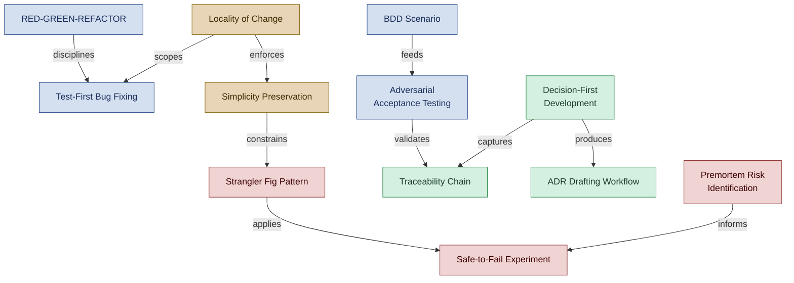

<!--
████          R E G N O L O G Y
    ██        Professional Services
████
    ██        professional_services@regnology.net
-->

# Development Practices

**Domain:** `development-practices`
**Version:** 0.1.0
**Status:** candidate — pending HiC review
**Term Count:** 98 (84 existing + 14 new AppSec candidates)
**Last Updated:** 2026-03-30

---

## Overview

Software development methodologies and disciplines — TDD, BDD, ATDD, refactoring techniques, code review methodology, bug fixing, input validation, safe-to-fail practices, decision documentation, and testing philosophy. The largest domain; covers hands-on engineering practice.

> The two interlocking tracks of development discipline: the TDD/testing cycle and the decision/risk management track, unified by locality and simplicity principles.

---

## Terms

### Acceptance Criteria

Explicit, testable conditions that must be satisfied for a feature or requirement to be considered complete and acceptable

**Context:** Testing - Requirements
**Source:** analyst-annie.agent.md, python-pedro.agent.md
**Related:** ATDD, Phase 1 (Analysis), Executable Test, Specification
**Status:** canonical

---

### Accuracy Score

Quantitative metric (percentage) measuring how accurately tests document system across three dimensions: Behavioral (WHAT), Architectural (WHY), Operational (HOW runs)

**Context:** Quality Validation / Metrics
**Source:** reverse-speccing.md
**Related:** Reverse Speccing, Behavioral Accuracy, Architectural Accuracy
**Status:** canonical

---

### ADR Drafting Workflow

Systematic process for creating Architecture Decision Records with trade-off analysis and risk assessment

**Context:** Decision documentation
**Source:** adr-drafting-workflow.tactic.md
**Related:** Trade-off Analysis, Option Impact Matrix
**Status:** canonical

---

### Adversarial Acceptance Testing

ATDD practice of deliberately exploring failure scenarios to define acceptance boundaries for misuse, edge cases, and unsafe defaults

**Context:** Testing methodology
**Source:** ATDD_adversarial-acceptance.tactic.md
**Related:** Acceptance Boundary, Adversarial Testing, Contract Decision
**Status:** canonical

---

### Adversarial Testing

Stress-testing technique that deliberately attempts to make a proposal, design, or decision fail to surface weaknesses and blind spots

**Context:** Decision validation
**Source:** adversarial-testing.tactic.md
**Related:** Failure Scenario, Premortem Risk Identification
**Status:** canonical

---

### AMMERSE Analysis

Decision-making framework evaluating practices across seven dimensions: Agile, Minimal, Maintainable, Environmental, Reachable, Solvable, Extensible

**Context:** Trade-off analysis
**Source:** ammerse-analysis.tactic.md
**Related:** Trade-off Analysis, Contextual Fit
**Status:** canonical

---

### AMMERSE Dimensions

Seven evaluation criteria for practices: Agile, Minimal, Maintainable, Environmental, Reachable, Solvable, Extensible

**Context:** Decision framework
**Source:** ammerse-analysis.tactic.md
**Related:** AMMERSE Analysis
**Status:** canonical

---

### Baseline Option

"Do nothing" alternative that must be evaluated in trade-off analysis; current state may be acceptable, or organic emergence may solve issue naturally

**Context:** Development Methodology / Decision Framework
**Source:** locality-of-change.md
**Related:** Problem Assessment Protocol, Organic Emergence
**Status:** canonical

---

### BDD Scenario

Behavior specification in Given/When/Then format describing observable outcomes in business-relevant language

**Context:** Behavior-driven development
**Source:** development-bdd.tactic.md
**Related:** Given-When-Then, Executable Specification
**Status:** canonical

---

### Bidirectional Linking

Practice of maintaining links both forward (requirements → tests → code) and backward (code → tests → requirements) to enable navigation in both directions

**Context:** Development Methodology / Documentation
**Source:** traceability-chain-pattern.md
**Related:** Traceability Chain, Forward Link, Backward Link
**Status:** canonical

---

### Blast Radius

Scope of potential impact from experiment failure, deliberately contained through boundaries

**Context:** Risk containment
**Source:** safe-to-fail-experiment-design.tactic.md
**Related:** Experiment Boundary, Safe-to-Fail Experiment
**Status:** canonical

---

### Boy Scout Cleanup

A commit created as part of the Boy Scout Rule containing only code-quality improvements (formatting, linting, stale docstrings, typos) discovered during the Pre-Task Spot Check. Must be committed separately from feature work, using the prefix `chore: Boy Scout cleanup in <area>`.

**Context:** development-practices
**Source:** `doctrine/directives/036_boy_scout_rule.md`
**Related:** Boy Scout Rule, Pre-Task Spot Check, Commit Protocol, Locality of Change
**Status:** candidate

---

### Boy Scout Rule

The mandatory pre-task discipline defined in Directive 036: before starting any task, the agent performs a quick spot check (2–5 minutes) of the working area and fixes discovered code quality issues — formatting, stale docstrings, unused imports, missing type hints — in a separate commit before the feature work begins. Named after Robert C. Martin's 'Leave the campground cleaner than you found it.'

**Context:** development-practices
**Source:** `doctrine/directives/036_boy_scout_rule.md`
**Related:** Pre-Task Spot Check, Locality of Change, Minimal Patch, Gold Plating
**Status:** candidate

---

### Breaking Conditions

A named practice for defining explicit, measurable stopping thresholds before starting a commitment or initiative — specifying success criteria, warning signals, hard limits (financial, time, physical, moral, social), and trigger declarations ('When X, then I will stop'). Prevents sunk-cost continuation and over-investment in failing efforts.

**Context:** development-practices
**Source:** `doctrine/tactics/stopping-conditions.tactic.md`
**Related:** Stopping Condition, Safe-to-Fail Experiment, Sunk-Cost Fallacy Override, Hard Limit
**Status:** candidate

---

### Commit Protocol

The standardized commit message format and workflow defined in Directive 026, specifying that all commits use an `<agent-slug>: task description - specifics` format, are small and atomic, and are committed immediately after each discrete change. Session-level overrides require explicit Human in Charge authorization.

**Context:** development-practices
**Source:** `doctrine/directives/026_commit_protocol.md`
**Related:** Agent Slug, Trunk-Based Development, Push by Exception, Regnology Commit Practices
**Status:** candidate

---

### Complexity Creep

Cumulative effect where each small addition seems reasonable in isolation but together degrades system simplicity, making it harder to understand and maintain

**Context:** Development Methodology / Anti-Pattern
**Source:** locality-of-change.md
**Related:** Gold Plating, Premature Abstraction, Simplicity Preservation
**Status:** canonical

---

### Concept Extraction

Refactoring that makes implicit or duplicated logic explicit by extracting it into a named abstraction

**Context:** Code improvement
**Source:** refactoring-extract-first-order-concept.tactic.md
**Related:** First-Order Concept, Rule of Three
**Status:** canonical

---

### Contextual Fit

Degree to which a solution aligns with organizational culture, constraints, and environmental factors

**Context:** Decision analysis
**Source:** ammerse-analysis.tactic.md
**Related:** AMMERSE Analysis, Environmental Dimension
**Status:** canonical

---

### Coverage Threshold

Minimum percentage of code covered by tests required before code can be accepted; typically ≥80% for production code

**Context:** Quality Gates - Testing
**Source:** python-pedro.agent.md, java-jenny.agent.md
**Related:** Self-Review Protocol, Test Coverage, pytest, Quality Gate
**Status:** canonical

---

### Decision Debt

Ratio of decision markers not yet promoted to formal ADRs; acceptable <20%, requires action >40%

**Context:** Development Methodology / Metrics
**Source:** decision-first-development.md
**Related:** Decision Marker, ADR Promotion
**Status:** canonical

---

### Decision Marker

Structured inline annotation in code or documentation capturing architectural decision (what was decided, rationale, alternatives, consequences) with ADR reference

**Context:** Development Methodology / Documentation
**Source:** decision-first-development.md
**Related:** Decision-First Development, Traceable Decisions
**Status:** canonical

---

### Decision Rule

Pre-defined interpretation logic for experiment results determining proceed, pivot, or abandon actions

**Context:** Experiment analysis
**Source:** safe-to-fail-experiment-design.tactic.md
**Related:** Success Criteria, Failure Criteria
**Status:** canonical

---

### Decision-First Development

Development workflow where architectural decisions are captured systematically throughout the lifecycle, integrating decision rationale with artifacts to preserve "why" knowledge

**Context:** Development Methodology / Documentation
**Source:** decision-first-development.md
**Related:** Decision Marker, Decision Debt, Traceable Decisions
**Status:** canonical

---

### Deep Creation Flow

Uninterrupted focus state with high cognitive load from problem-solving where agents stay passive and defer decision capture to session-end

**Context:** Development Methodology / Human-Agent Interaction
**Source:** decision-first-development.md
**Related:** Flow State Awareness, Decision Marker
**Status:** canonical

---

### Executable Test

Automated test that validates acceptance criteria through code execution, providing verifiable evidence of requirement satisfaction

**Context:** Testing - Automation
**Source:** python-pedro.agent.md, backend-dev.agent.md
**Related:** ATDD, Acceptance Criteria, Phase 4 (Acceptance Tests)
**Status:** canonical

---

### Experiment Boundary

Explicit scope, duration, resource, and audience limits containing risk of experimentation

**Context:** Experiment design
**Source:** safe-to-fail-experiment-design.tactic.md
**Related:** Safe-to-Fail Experiment, Blast Radius
**Status:** canonical

---

### Expert Review (Testing)

Second phase of reverse speccing where Agent B validates reconstruction against ground truth with full context access

**Context:** Test validation procedure
**Source:** test-to-system-reconstruction.tactic.md
**Related:** Naive Reconstruction, Accuracy Assessment
**Status:** canonical

---

### Extract Before Interpret

Analysis discipline that separates observable fact extraction from meaning assignment to prevent premature interpretation bias

**Context:** Analysis methodology
**Source:** analysis-extract-before-interpret.tactic.md
**Related:** Extraction Phase, Interpretation Phase
**Status:** canonical

---

### Extraction Phase

First step of analysis where observable elements are extracted verbatim without judgment or conclusions

**Context:** Analysis procedure
**Source:** analysis-extract-before-interpret.tactic.md
**Related:** Extract Before Interpret, Interpretation Phase
**Status:** canonical

---

### Fail-Fast Validation

Input validation strategy halting at first failure rather than continuing through all checks

**Context:** Error handling pattern
**Source:** input-validation-fail-fast.tactic.md
**Related:** Validation Sequence, Dual-Level Error Feedback
**Status:** canonical

---

### Failure Scenario

Concrete description of how a feature could fail, including trigger, manifestation, and likely cause

**Context:** Risk analysis
**Source:** ATDD_adversarial-acceptance.tactic.md
**Related:** Adversarial Testing, Premortem Analysis
**Status:** canonical

---

### First-Order Concept

Extracted abstraction representing a clear domain or technical concept with single, well-defined responsibility

**Context:** Refactoring pattern
**Source:** refactoring-extract-first-order-concept.tactic.md
**Related:** Concept Extraction, Single Responsibility
**Status:** canonical

---

### Flow State Awareness

Practice of adapting decision capture behavior to human productivity rhythms: Deep Creation (defer), Agent Collaboration (real-time), Reflection/Synthesis (batch)

**Context:** Development Methodology / Human-Agent Interaction
**Source:** decision-first-development.md
**Related:** Decision-First Development, Deep Creation Flow
**Status:** canonical

---

### Gold Plating

Anti-pattern of adding features, abstractions, or optimizations "just in case" or "for completeness" without evidence of actual need

Also written as 'Gold-plating'. Anti-pattern of opportunistic improvements beyond stated goal (while-I'm-here syndrome)

**Context:** Development Methodology / Anti-Pattern
**Source:** locality-of-change.md, change-apply-smallest-viable-diff.tactic.md
**Related:** Complexity Creep, Locality of Change, Premature Abstraction, Scope Creep, Smallest Viable Diff
**Status:** canonical

---

### GREEN Phase

TDD/ATDD workflow state where tests pass after implementation, validating correct behavior

**Context:** Test-driven development
**Source:** 6-phase-spec-driven-implementation-flow.md
**Related:** RED Phase, Implementation Phase
**Status:** canonical

---

### High-Value Feedback

Review feedback that is specific, categorized by severity, and respectful of author context

**Context:** Review quality
**Source:** review-intent-and-risk-first.tactic.md
**Related:** Intent-First Review, Low-Noise Feedback
**Status:** canonical

---

### Impact Analysis

Process of identifying affected artifacts (tests, code, documentation) when requirements change, enabled by traceability chain links

**Context:** Development Methodology / Change Management
**Source:** traceability-chain-pattern.md
**Related:** Traceability Chain, Bidirectional Linking
**Status:** canonical

---

### Incremental Review

Code review practice examining changes without expanding scope or rewriting implementation

**Context:** Review discipline
**Source:** code-review-incremental.tactic.md
**Related:** Review Boundary, Locality of Change
**Status:** canonical

---

### Inside Boundary (Testing)

Components directly responsible for feature logic that should NOT be mocked in tests

**Context:** Unit testing scope
**Source:** test-boundaries-by-responsibility.tactic.md
**Related:** Outside Boundary, Test Boundary
**Status:** canonical

---

### Intent-First Review

Review discipline summarizing apparent intent before identifying risks or suggesting changes

**Context:** Code review methodology
**Source:** review-intent-and-risk-first.tactic.md
**Related:** Risk Categorization, High-Value Feedback
**Status:** canonical

---

### Interpretation Phase

Second step of analysis where meaning is assigned to previously extracted facts as a separate, explicit activity

**Context:** Analysis procedure
**Source:** analysis-extract-before-interpret.tactic.md
**Related:** Extraction Phase, Extract Before Interpret
**Status:** canonical

---

### Locality of Change

A design principle emphasizing that changes should be measured against actual problems, not hypothetical concerns. Agents must verify problem existence, quantify severity, and prefer simple solutions over architectural enhancements. Discourages gold plating, premature abstraction, and complexity creep.

**Reference:** Directive 020, `approaches/locality-of-change.md`

**Context:** 
**Source:** 
**Related:** Risk, Escalation, Alignment
**Status:** canonical

---

### Minimal Patch

Smallest possible code or configuration change required to resolve an issue, upgrade conflict, or implement a fix without unnecessary modifications

**Context:** Development - Change Management
**Source:** framework-guardian.agent.md, python-pedro.agent.md
**Related:** Framework Guardian, Locality of Change, Upgrade Plan
**Status:** canonical

---

### Mitigation Strategy

Concrete plan defining prevention actions, detection signals, and response procedures for a failure scenario

**Context:** Risk management
**Source:** premortem-risk-identification.tactic.md
**Related:** Premortem Risk Identification, Failure Scenario
**Status:** canonical

---

### Naive Reconstruction

Phase where analyst with NO external context reads only tests to infer system behavior, data structures, workflows, and edge cases

**Context:** Quality Validation / Testing
**Source:** reverse-speccing.md
**Related:** Reverse Speccing, Test-as-Documentation
**Status:** canonical

---

### Observable Behavior

System outcomes verifiable without knowledge of implementation details

**Context:** Testing principle
**Source:** development-bdd.tactic.md
**Related:** BDD Scenario, Behavioral Contract
**Status:** canonical

---

### Option Impact Matrix

Qualitative scoring of alternatives against impact areas (performance, maintainability, etc.)

**Context:** Decision analysis
**Source:** adr-drafting-workflow.tactic.md
**Related:** ADR Drafting Workflow, Trade-off Analysis
**Status:** canonical

---

### Organic Emergence

Principle of letting patterns emerge naturally from observed practice before codifying them, rather than prescribing patterns prematurely

**Context:** Meta-Pattern / Design Principle
**Source:** agent-profile-handoff-patterns.md, locality-of-change.md
**Related:** Pattern Before Prescription, Premature Abstraction
**Status:** canonical

---

### Orphaned Artifact

Code, test, or documentation with no traceable link to requirements, specifications, or architectural decisions, making purpose and validity unclear

**Context:** Development Methodology / Anti-Pattern
**Source:** traceability-chain-pattern.md
**Related:** Traceability Chain, Documentation Debt
**Status:** canonical

---

### Outside Boundary (Testing)

Supporting infrastructure and external dependencies that SHOULD be mocked/stubbed in tests

**Context:** Unit testing scope
**Source:** test-boundaries-by-responsibility.tactic.md
**Related:** Inside Boundary, Test Boundary
**Status:** canonical

---

### Pattern Before Prescription

Discipline requiring pattern analysis across multiple instances before standardizing, ensuring patterns based on real usage not anticipated usage

**Context:** Meta-Pattern / Design Principle
**Source:** locality-of-change.md, agent-profile-handoff-patterns.md
**Related:** Organic Emergence, Evidence-Based Requirements
**Status:** canonical

---

### Pre-Task Spot Check

The 2–5 minute scan of the working area (files to be touched and immediate neighbors) that opens every task per Directive 036 (Boy Scout Rule). The check identifies quick wins — formatting issues, stale comments, unused imports — that are fixed immediately in a separate commit before main task work begins.

**Context:** development-practices
**Source:** `doctrine/directives/036_boy_scout_rule.md`
**Related:** Boy Scout Rule, Locality of Change, Technical Debt
**Status:** candidate

---

### Premature Abstraction

Anti-pattern of creating frameworks, lookup tables, or automation before patterns stabilize or use cases mature, adding maintenance burden without proportional value

**Context:** Development Methodology / Anti-Pattern
**Source:** locality-of-change.md
**Related:** Gold Plating, Complexity Creep
**Status:** canonical

---

### Premortem Risk Identification

Proactive failure analysis that assumes a proposal has already failed and identifies critical failure modes before execution

**Context:** Risk management
**Source:** premortem-risk-identification.tactic.md
**Related:** Failure Scenario, Mitigation Strategy, Risk Matrix
**Status:** canonical

---

### Problem Assessment Protocol

Four-step analysis (Evidence Collection, Severity Measurement, Baseline Option, Simple Alternatives First) required before proposing solutions to verify problem exists and justify complexity

**Context:** Development Methodology / Decision Framework
**Source:** locality-of-change.md
**Related:** Locality of Change, Evidence-Based Requirements
**Status:** canonical

---

### Quad-A Structure

A test structure pattern in which each test is organized into four labeled sections: Arrange, Act, Assert (and optionally Annotate or a fourth A variant). Boy Scout cleanups include adding missing Quad-A structure labels to existing tests.

**Context:** development-practices
**Source:** `doctrine/directives/036_boy_scout_rule.md`
**Related:** RED-GREEN-REFACTOR, Test-as-Documentation, Observable Behavior
**Status:** candidate

---

### RED Phase

ATDD workflow state where acceptance tests have been written but fail, proving tests work before implementation

**Context:** Test-driven development
**Source:** 6-phase-spec-driven-implementation-flow.md
**Related:** GREEN Phase, Acceptance Test Implementation
**Status:** canonical

---

### RED-GREEN-REFACTOR

TDD cycle where tests are written first and fail (RED), minimal code makes them pass (GREEN), then code is improved while keeping tests green (REFACTOR)

**Context:** Development Practices - TDD
**Source:** python-pedro.agent.md, backend-dev.agent.md, java-jenny.agent.md
**Related:** TDD, Test-First Development, Directive 017
**Status:** canonical

---

### Regression Prevention

Benefit of test-first bug fixing where failing-then-passing test becomes permanent guard preventing bug from returning unnoticed

**Context:** Development Methodology / Testing
**Source:** test-first-bug-fixing.md
**Related:** Test-First Bug Fixing, Test Validates Fix
**Status:** canonical

---

### Rejection Rationale

One-sentence explanation for each alternative not selected, documenting why it was rejected

**Context:** Decision transparency
**Source:** adr-drafting-workflow.tactic.md
**Related:** ADR Drafting Workflow, Alternatives Considered
**Status:** canonical

---

### Representative Data

Real-world or production-like data samples used during requirements analysis to capture actual patterns, edge cases, and validation scenarios

**Context:** Testing - Data Quality
**Source:** analyst-annie.agent.md
**Related:** Analyst Annie, Validation Script, Data Validation
**Status:** canonical

---

### Rerouting

Incremental process of shifting calls from old to new implementation one call site or module at a time

**Context:** Strangler fig execution
**Source:** refactoring-strangler-fig.tactic.md
**Related:** Strangler Fig Pattern, Coexistence Period
**Status:** canonical

---

### Reverse Speccing

Dual-agent validation technique reconstructing system understanding purely from test code to measure how effectively tests serve as executable specifications

**Context:** Quality Validation / Testing
**Source:** reverse-speccing.md
**Related:** Test-as-Documentation, Naive Reconstruction, Architecture Blind Spot
**Status:** canonical

---

### Reversibility Mechanism

Pre-implemented rollback capability using version control, feature flags, or parallel deployment

**Context:** Risk mitigation
**Source:** safe-to-fail-experiment-design.tactic.md
**Related:** Safe-to-Fail Experiment, Feature Flag
**Status:** canonical

---

### Risk Categorization

Classification of review concerns by type: Correctness, Maintainability, Impact, Misuse

**Context:** Review analysis
**Source:** review-intent-and-risk-first.tactic.md
**Related:** Intent-First Review, Impact Assessment
**Status:** canonical

---

### Risk Matrix

2x2 grid plotting failure scenarios by impact (vertical) and likelihood (horizontal) for prioritization

**Context:** Risk prioritization
**Source:** premortem-risk-identification.tactic.md
**Related:** Premortem Risk Identification, Impact Rating
**Status:** canonical

---

### Rule of Three

Heuristic to consider extraction when duplication appears in three locations, not two, to avoid premature abstraction

**Context:** Refactoring timing
**Source:** refactoring-extract-first-order-concept.tactic.md
**Related:** Concept Extraction, Premature Abstraction
**Status:** canonical

---

### Safe-to-Fail Experiment

Bounded exploration with reversibility mechanisms, explicit success/failure criteria, and acceptable loss limits

**Context:** Innovation practice
**Source:** safe-to-fail-experiment-design.tactic.md
**Related:** Experiment Boundary, Reversibility Mechanism, Blast Radius
**Status:** canonical

---

### Self-Review Protocol

Systematic quality checklist executed by development agents before marking work complete, including test execution, type checking, linting, coverage validation, and ADR compliance

**Context:** Quality Gates - Development
**Source:** python-pedro.agent.md
**Related:** Coverage Threshold, Type Checking, Lint Results, ADR Compliance
**Status:** canonical

---

### Severity Classification

A three-level scale used by Analyst Annie when documenting specification validation findings: `INFO` (acceptable, no action required), `WARNING` (requires review before proceeding), and `ERROR` (requires investigation and resolution before implementation). Enables triage and prioritization of discovered data quality issues.

**Context:** development-practices
**Source:** `doctrine/agents/analyst-annie.agent.md`
**Related:** Evidence-Based Requirements, Validation Checklist, Acceptance Criteria, Testability Assessment
**Status:** candidate

---

### Shadow Mode

Safety mechanism running old and new implementations in parallel to compare outputs before full rerouting

**Context:** Migration validation
**Source:** refactoring-strangler-fig.tactic.md
**Related:** Strangler Fig Pattern, Feature Flag
**Status:** canonical

---

### Simplicity Preservation

Active practice of maintaining architectural simplicity over time by resisting complexity creep, validating problem severity before adding solutions, and favoring 80/20 approaches

**Context:** Development Methodology / Design Principle
**Source:** locality-of-change.md
**Related:** Locality of Change, Complexity Creep
**Status:** canonical

---

### Smallest Viable Diff

Principle of introducing changes using minimal modification that achieves stated goal, avoiding unintended side effects

**Context:** Change discipline
**Source:** change-apply-smallest-viable-diff.tactic.md
**Related:** Surgical Modification, Gold-plating, Locality of Change
**Status:** canonical

---

### Strangler Fig Pattern

Incremental refactoring pattern introducing new implementation alongside old, gradually rerouting behavior, then removing old code

**Context:** Large-scale refactoring
**Source:** refactoring-strangler-fig.tactic.md
**Related:** Rerouting, Coexistence Period, Shadow Mode
**Status:** canonical

---

### Surgical Modification

Precise, minimal code changes targeting only files and sections necessary to achieve goal

**Context:** Refactoring practice
**Source:** change-apply-smallest-viable-diff.tactic.md
**Related:** Smallest Viable Diff, Reviewable Change
**Status:** canonical

---

### Technical Debt Marker

A code comment (`TODO`, `FIXME`, `HACK`, or similar) embedded in source files to flag known issues, shortcuts, or deferred improvements. The Boy Scout Rule Pre-Task Spot Check explicitly searches for these markers; unresolved markers discovered during the check are either fixed immediately or converted to planning tasks.

**Context:** development-practices
**Source:** `doctrine/directives/036_boy_scout_rule.md`
**Related:** Boy Scout Rule, Pre-Task Spot Check, Decision Debt
**Status:** candidate

---

### Test Boundary

Scope of components included in a test based on functional responsibility rather than structural layers

**Context:** Unit testing strategy
**Source:** test-boundaries-by-responsibility.tactic.md
**Related:** Inside Boundary, Outside Boundary, Functional Responsibility
**Status:** canonical

---

### Test Validates Fix

Verification step ensuring test fails for the RIGHT reason (reproduces bug) by temporarily inverting assertion to expect wrong behavior, confirming test accuracy

**Context:** Development Methodology / Testing
**Source:** test-first-bug-fixing.md
**Related:** Test-First Bug Fixing, Regression Prevention
**Status:** canonical

---

### Test-as-Documentation

Principle that well-written tests should comprehensively document system behavior so reading tests alone enables understanding "what" and "how" without external docs

**Context:** Quality Validation / Testing Philosophy
**Source:** reverse-speccing.md, test-readability-clarity-check.md
**Related:** Reverse Speccing, Living Specification
**Status:** canonical

---

### Test-First Bug Fixing

Disciplined debugging approach requiring a failing test that reproduces the bug BEFORE modifying production code, transforming trial-and-error into systematic verification

**Context:** Development Methodology / Testing
**Source:** test-first-bug-fixing.md
**Related:** Red-Green-Refactor, Regression Prevention, Test Validates Fix
**Status:** canonical

---

### Traceability Chain

Bidirectional link pattern connecting artifacts throughout development lifecycle (Strategic Goal → Specification → Tests → ADRs → Implementation → Work Logs)

**Context:** Development Methodology / Quality Assurance
**Source:** traceability-chain-pattern.md
**Related:** Bidirectional Linking, Impact Analysis, Orphaned Artifact
**Status:** canonical

---

### Validation Category

Classification of validation types: Presence, Format, Range, Logical Consistency, Uniqueness, Referential Integrity

**Context:** Input validation
**Source:** input-validation-fail-fast.tactic.md
**Related:** Validation Sequence
**Status:** canonical

---

### Validation Sequence

Ordered validation checks: Presence → Format → Range → Logical Consistency → Uniqueness

**Context:** Input processing
**Source:** input-validation-fail-fast.tactic.md
**Related:** Fail-Fast Validation, Validation Category
**Status:** canonical

---

### AppSec Compliance

The set of mandatory application security controls required for all Regnology software products and PS deliverables, governed by the Regnology AppSec team. Covers SAST (SonarQube, Fortify), SCA (DependencyTrack), license compliance (Lucy), SBOM generation (CycloneDX), secure coding standards (Five Golden Rules, OWASP Top 10), and secure design (9 principles). Compliance is verified at Security Gates before release.

**Context:** development-practices — AppSec
**Source:** Confluence CAS/AppSec — [Processes & Compliance](https://confluence.regnology.net/spaces/CAS/pages/59083006); [Requirements for External Contractors](https://confluence.regnology.net/spaces/CAS/pages/221276347)
**Related:** Security Gate, SAST, SCA, SBOM, Five Golden Rules, OWASP Top 10, Secure Design Principles
**Status:** candidate

---

### CIA Triad

The three foundational information security properties that all Regnology applications must protect: **Confidentiality** (information not disclosed to unauthorized parties), **Integrity** (data accuracy and completeness protected over its lifecycle), and **Availability** (information accessible when needed; resilience against DoS). Mandatory security requirements for all applications.

**Context:** development-practices — AppSec / Security Requirements
**Source:** Confluence CAS/AppSec — [Standard Security Requirements for Applications](https://confluence.regnology.net/spaces/CAS/pages/72741821)
**Related:** AppSec Compliance, Secure Design Principles, Encryption by Default
**Status:** candidate

---

### CVE (Common Vulnerabilities and Exposures)

Publicly disclosed security vulnerabilities in software components, identified by a CVE ID and assigned a CVSS severity score. Regnology's DependencyTrack policy requires zero Critical, High, or Medium CVEs in delivered software. Low and Info CVEs must also be fixed, though with lower urgency.

**Context:** development-practices — AppSec / Third Party Security
**Source:** Confluence CAS/AppSec — [Requirements for External Contractors](https://confluence.regnology.net/spaces/CAS/pages/221276347)
**Related:** DependencyTrack, SCA, SBOM, Security Gate, AppSec Compliance
**Status:** candidate

---

### DAST (Dynamic Application Security Testing)

Security testing approach that analyses a running application from the outside, simulating attacker behaviour without access to source code. At Regnology, DAST is performed using Acunetix. Complements SAST (which analyses source code statically).

**Context:** development-practices — AppSec
**Source:** Confluence CAS/AppSec — [Application Security & License Compliance](https://confluence.regnology.net/spaces/CAS/pages/221261711)
**Related:** SAST, Acunetix, AppSec Compliance, Security Gate
**Status:** candidate

---

### Defense in Depth

Secure design principle requiring layered authorization and multiple independent security barriers, so that bypassing one layer does not grant full access. An attacker must overcome each layer independently. One of the nine Regnology mandatory Secure Design Principles.

**Context:** development-practices — AppSec / Secure Design
**Source:** Confluence CAS/AppSec — [Secure Design Principles](https://confluence.regnology.net/spaces/CAS/pages/62794591)
**Related:** Secure Design Principles, Least Privilege, Fail-Safe Defaults, AppSec Compliance
**Status:** candidate

---

### Encryption by Default

Regnology AppSec requirement that encryption is enabled as the default configuration for all applications handling confidential or restricted data — not an opt-in feature. Applies to data in transit (HTTPS) and at rest (TDE, password vaults). Eliminating performance gaps is a development-phase concern, not a testing-phase concern. See also: Agile Crypto.

**Context:** development-practices — AppSec / Secure Coding
**Source:** Confluence CAS/AppSec — [Standard Security Requirements](https://confluence.regnology.net/spaces/CAS/pages/72741821); [Five Golden Rules](https://confluence.regnology.net/spaces/CAS/pages/59083381)
**Related:** CIA Triad, Agile Crypto, Secure Design Principles, AppSec Compliance
**Status:** candidate

---

### Fail-Safe Defaults

Secure design principle requiring that access to resources is denied by default and only granted when explicitly permitted. Users have no access until it is granted. Prevents unauthorized access through omission. One of the nine Regnology mandatory Secure Design Principles.

**Context:** development-practices — AppSec / Secure Design
**Source:** Confluence CAS/AppSec — [Secure Design Principles](https://confluence.regnology.net/spaces/CAS/pages/62794591)
**Related:** Secure Design Principles, Least Privilege, Defense in Depth, AppSec Compliance
**Status:** candidate

---

### Five Golden Rules

Regnology's mandatory secure programming standard, derived from OWASP principles: (1) Cleanse untrusted input and encode output; (2) Never rely on client-side validation alone — always validate server-side; (3) Use encryption by default (Agile Crypto); (4) Use trusted frameworks — do not reinvent security mechanisms; (5) Do it right from the beginning — secure configuration, design, and code from day one.

**Context:** development-practices — AppSec / Secure Coding
**Source:** Confluence CAS/AppSec — [Secure Programming: Five Golden Rules](https://confluence.regnology.net/spaces/CAS/pages/59083381)
**Related:** OWASP Top 10, Encryption by Default, Agile Crypto, Secure Design Principles, AppSec Compliance
**Status:** candidate

---

### Least Privilege

Secure design principle requiring that users and processes are granted the minimum access rights necessary to perform their function, and that access rights are time-bound to the duration of the task. Reduces the blast radius of accidental or malicious misuse. One of the nine Regnology mandatory Secure Design Principles.

**Context:** development-practices — AppSec / Secure Design
**Source:** Confluence CAS/AppSec — [Secure Design Principles](https://confluence.regnology.net/spaces/CAS/pages/62794591)
**Related:** Secure Design Principles, Fail-Safe Defaults, Defense in Depth, AppSec Compliance
**Status:** candidate

---

### OWASP Top 10

The Open Web Application Security Project's ranked list of the ten most critical web application security risks, updated periodically (current: 2021 edition). Used as the primary vulnerability taxonomy in Regnology's SAST tooling (SonarQube, Fortify). Compliance with OWASP Top 10 is a mandatory non-functional requirement for all Regnology applications.

**Context:** development-practices — AppSec
**Source:** Confluence CAS/AppSec — [Standard Security Requirements](https://confluence.regnology.net/spaces/CAS/pages/72741821)
**Related:** SAST, SonarQube, Fortify, CWE Top 25, Five Golden Rules, AppSec Compliance
**Status:** candidate

---

### SAST (Static Application Security Testing)

Security analysis of source code or compiled bytecode without executing the application, to detect vulnerabilities such as injection flaws, insecure cryptography, and path traversal. At Regnology, SAST is performed by SonarQube (primary, integrated in CI) and Fortify (deeper analysis, run by AppSec team). SAST is a mandatory Build-phase control in the Secure SDLC.

**Context:** development-practices — AppSec
**Source:** Confluence CAS/AppSec — [Secure Software Development Life Cycle](https://confluence.regnology.net/spaces/CAS/pages/72742353)
**Related:** SonarQube, Fortify, FindSecBugs, SpotBugs, OWASP Top 10, Security Gate, AppSec Compliance
**Status:** candidate

---

### Secure Design Principles

Nine foundational principles that architects must apply when designing systems with security requirements, mandated by Regnology AppSec: Least Privilege, Fail-Safe Defaults, Economy of Mechanism, Complete Mediation, Open Design, Separation of Privilege, Least Common Mechanism, Psychological Acceptability, and Defense in Depth. Not all nine apply to every system, but the applicable subset must be considered.

**Context:** development-practices — AppSec / Architecture
**Source:** Confluence CAS/AppSec — [Secure Design Principles](https://confluence.regnology.net/spaces/CAS/pages/62794591)
**Related:** Least Privilege, Fail-Safe Defaults, Defense in Depth, Five Golden Rules, AppSec Compliance
**Status:** candidate

---

### Secure SDLC

The Regnology Secure Software Development Life Cycle — the integration of security controls at every phase of software development: Requirements (security requirements), Design (threat modeling, secure design principles), Coding (Five Golden Rules, IDE plugins), Build (SAST, SCA, SBOM), Test (security issues review, security gates), and Deployment/Maintenance (secure configuration, hotfixes). Governed by the Regnology AppSec team.

**Context:** development-practices — AppSec
**Source:** Confluence CAS/AppSec — [Secure Software Development Life Cycle](https://confluence.regnology.net/spaces/CAS/pages/72742353)
**Related:** AppSec Compliance, Security Gate, SAST, SCA, Five Golden Rules, Secure Design Principles
**Status:** candidate

---

### Security Exemption

A formal override of a failed Security Gate, issued by the Product Owner (or higher authority), that allows a release to proceed despite unresolved security issues. Requires documented justification (e.g., server-side mitigation, network protection, higher risk of not delivering). Exemptions are tracked for IKS (internal control system) compliance. Not a substitute for fixing issues — it is a time-bounded risk acceptance.

**Context:** development-practices — AppSec / Governance
**Source:** Confluence CAS/AppSec — [Security Gate and Issue Severity](https://confluence.regnology.net/spaces/CAS/pages/29789349)
**Related:** Security Gate, AppSec Compliance, Human-in-Charge Escalation
**Status:** candidate

---

### Security Gate

A mandatory quality checkpoint that prevents software with unresolved security issues above a defined severity threshold from being released. At Regnology, the SonarQube Security Gate fails when: Blocker Issues > 0 OR Critical Issues > 0 OR any Vulnerability > 0. DependencyTrack enforces zero Critical/High/Medium CVEs. Results must be documented for IKS compliance. A failed gate can only be bypassed via a formal Security Exemption.

**Context:** development-practices — AppSec
**Source:** Confluence CAS/AppSec — [Security Gate and Issue Severity](https://confluence.regnology.net/spaces/CAS/pages/29789349)
**Related:** SonarQube, DependencyTrack, Security Exemption, AppSec Compliance, Secure SDLC
**Status:** candidate

---

### Third Party Software Policy (TPS Policy)

Regnology's firm-wide policy governing the use of third-party software components (open source and commercial) in products and services. Prohibits strong copyleft licenses (e.g., GPL) without explicit approval. Requires license compliance scanning (Lucy, Fossology) and inclusion of an OSS list in product deliveries. Applies to all developers, including external contractors.

**Context:** development-practices — AppSec / License Compliance
**Source:** Confluence CAS/AppSec — [Requirements for External Contractors](https://confluence.regnology.net/spaces/CAS/pages/221276347)
**Related:** Lucy, Fossology, SCA, SBOM, AppSec Compliance
**Status:** candidate

---

## Cross-Domain References

- **Evidence-Based Requirements** → [`specification`](../specification/README.md): Requirements methodology used in testing practices
- **Traceability Chain** → [`specification`](../specification/README.md): Development methodology with strong specification dependency
- **AppSec Toolchain** → [`tooling`](../tooling/README.md): SonarQube, Fortify, DependencyTrack, CycloneDX, Lucy, SpotBugs, FindSecBugs
- **Agile Crypto** → [`tooling`](../tooling/README.md): Cryptographic adapter pattern (cross-listed)

---

*All terms marked `status: candidate` are proposed terminology pending Human-in-Charge review.*
*Part of [`doctrine/glossary/`](../README.md) — Regnology Professional Services Agent Framework*
