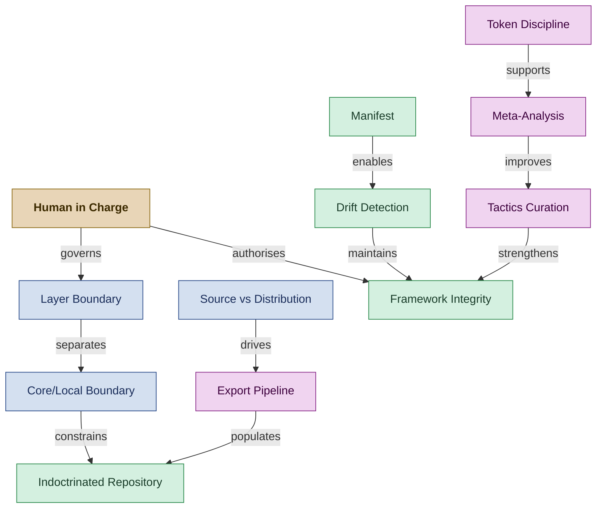

<!--
████          R E G N O L O G Y
    ██        Professional Services
████
    ██        professional_services@regnology.net
-->

# Doctrine & Governance

**Domain:** `doctrine-governance`
**Version:** 0.1.0
**Status:** candidate — pending HiC review
**Term Count:** 47 (33 existing + 14 new candidates)
**Last Updated:** 2026-03-05

---

## Overview

The doctrine stack architecture itself — its layers, distribution model, framework maintenance patterns, directive system, version governance, and framework improvement loops. Also covers human-in-charge governance principles, token discipline, and context management infrastructure.

> The doctrine stack architecture — how layers, distribution, and integrity mechanisms uphold framework health, with Human in Charge as the ultimate authority.

---

## Terms

### `.framework_meta.yml`

A metadata file placed at the root of a repository consuming the Regnology PS framework, recording the installed framework version and installation date. The Framework Guardian uses this to detect version mismatches during audits.

**Context:** doctrine-governance
**Source:** `doctrine/agents/framework-guardian.agent.md`, `doctrine/directives/025_framework_guardian.md`
**Related:** MANIFEST.yml, Framework Integrity, Framework Guardian, Drift Classification
**Status:** candidate

---

### Agent Slug

A short, lowercase, hyphenated identifier used as the prefix in agent commit messages (e.g., `curator`, `bootstrap-bill`, `writer-editor`). Defined in Directive 026 (Commit Protocol) to ensure commit history is traceable to the agent role that produced each change.

**Context:** doctrine-governance
**Source:** `doctrine/directives/026_commit_protocol.md`
**Related:** Commit Checkpoint, Trunk-Based Development, Regnology Commit Practices
**Status:** candidate

---

### Anti-Pattern Identification

Systematic extraction of behaviors to actively discourage, common traps, or misapplications of guidance from operational logs

**Context:** Framework Improvement / Quality Assurance
**Source:** meta-analysis.md
**Related:** Meta-Analysis, Pattern Detection
**Status:** canonical

---

### Arena

The category of task type used to match LLM model selection in Directive 042 (Model Discipline). Arenas include text, code, vision, search, text-to-image, and text-to-video/image-to-video. Different models rank differently per arena, and task-to-arena mapping is the first step in model discipline selection.

**Context:** doctrine-governance
**Source:** `doctrine/directives/042_model_discipline.md`, `doctrine/tactics/model-discipline-selection.tactic.md`
**Related:** Cost Tier, Toolguide, Token Discipline, Model Discipline
**Status:** candidate

---

### Audit Report

Structured document produced by Framework Guardian comparing installed framework state against canonical manifest, classifying files as MISSING, UNCHANGED, DIVERGED, or CUSTOM

**Context:** Artifacts - Framework Maintenance
**Source:** framework-guardian.agent.md
**Related:** Framework Guardian, Manifest, Drift Detection, Framework Integrity
**Status:** canonical

---

### Blanket Premium

An anti-pattern in which all tasks in an orchestration cycle are assigned the premium model tier without regard to task complexity or arena. Directive 042 explicitly forbids this: a typical six-phase cycle should have ~70–80% mid-tier tasks with only 1–2 premium tasks reserved for complex reasoning or architectural review.

**Context:** doctrine-governance
**Source:** `doctrine/agents/manager.agent.md`, `doctrine/directives/042_model_discipline.md`
**Related:** Cost Tier, Arena, Model Discipline, Token Discipline
**Status:** candidate

---

### Bypass Check

Pre-execution verification that checks for LOCAL_ENV.md file containing environment-specific constraints or instructions before proceeding with standard directives

**Context:** Framework - Environment Configuration
**Source:** Directive 001 (CLI and Shell Tooling)
**Related:** LOCAL_ENV.md, Remediation Technique
**Status:** canonical

---

### Conflict Classification

Process of categorizing upgrade conflicts as auto-merge candidates, local customizations to preserve, or breaking changes requiring manual review

**Context:** Agent Capabilities - Framework Maintenance
**Source:** framework-guardian.agent.md
**Related:** Framework Guardian, Upgrade Plan, Core/Local Boundary
**Status:** canonical

---

### Core/Local Boundary

Architectural separation between framework core files (managed by framework) and local customizations (managed by repository owner) to prevent silent overwrites

**Context:** Framework Architecture
**Source:** framework-guardian.agent.md
**Related:** Framework Guardian, Conflict Classification, Local Customization
**Status:** canonical

---

### Cost Tier

A classification of LLM models into three economic bands — `economy` (high-volume, low-stakes), `mid` (routine work, high ROI), and `premium` (complex reasoning, high-stakes) — used by Directive 042 to match model selection to task risk and complexity. The default for most agent execution is `mid`.

**Context:** doctrine-governance
**Source:** `doctrine/directives/042_model_discipline.md`, `doctrine/tactics/model-discipline-selection.tactic.md`
**Related:** Arena, Toolguide, Token Discipline, Blanket Premium
**Status:** candidate

---

### Directive Adherence Lapse

Skipping required procedures because documentation feels like overhead

**Context:** Process violation
**Source:** phase-checkpoint-protocol.md
**Related:** Phase Checkpoint Protocol
**Status:** canonical

---

### Doctrine Configuration

YAML configuration file (.doctrine/config.yaml) that defines path variables (workspace_root, doc_root, spec_root, output_root) and repository metadata for doctrine framework integration

**Context:** Artifacts - Repository Configuration
**Source:** bootstrap-bill.agent.md
**Related:** Bootstrap Bill, Path Variable, workspace_root, doc_root, spec_root
**Status:** canonical

---

### Doctrine Decision Record (DDR)

A framework-level architectural decision record stored in `doctrine/decisions/` that documents patterns and choices intended to apply universally across all repositories adopting the Regnology PS Agent Framework. Distinct from repository-specific ADRs, which reside in `${DOC_ROOT}/architecture/adrs/`.

**Context:** doctrine-governance
**Source:** `doctrine/approaches/decision-reference-types.md`
**Related:** ADR Drafting Workflow, Traceable Decisions, Core/Local Boundary, Primer Execution Matrix
**Status:** candidate

---

### DOCTRINE_UPSTREAM

A configuration variable or concept referring to the shared Regnology PS doctrine repository from which a consuming repository receives doctrine updates via git subtree. Referenced in the Bootstrap Bill agent profile when configuring Cursor IDE integration with symlinked hooks that stay synchronized with the upstream.

**Context:** doctrine-governance
**Source:** `doctrine/agents/bootstrap-bill.agent.md`
**Related:** Core/Local Boundary, Framework Guardian, Local Customization, Source vs Distribution
**Status:** candidate

---

### Drift Classification

The four-category classification system used by the Framework Guardian when auditing files against `META/MANIFEST.yml`: `UNCHANGED` (checksum matches), `DIVERGED` (checksum differs), `MISSING` (file not present), and `CUSTOM` (file not in manifest — potential local addition or orphan).

**Context:** doctrine-governance
**Source:** `doctrine/directives/025_framework_guardian.md`, `doctrine/agents/framework-guardian.agent.md`
**Related:** MANIFEST.yml, Framework Guardian, Framework Integrity, Audit Report
**Status:** candidate

---

### Drift Detection

Process of identifying divergence between installed framework files and canonical manifest through checksum comparison and file classification

**Context:** Agent Capabilities - Framework Maintenance
**Source:** framework-guardian.agent.md
**Related:** Framework Guardian, Manifest, Audit Report, Framework Integrity
**Status:** canonical

---

### Escalation

The process of flagging issues, uncertainties, or conflicts that require human intervention or inter-agent coordination. Escalation uses integrity markers (❗️, ⚠️) and follows protocols defined in Directive 011.

**Reference:** Directive 011

**Context:** 
**Source:** 
**Related:** Integrity Symbol, Risk
**Status:** canonical

---

### Export Pipeline

Automated process (npm run export:all, npm run deploy:all) that transforms doctrine/ source content into tool-specific distribution formats with semantic preservation

**Context:** Doctrine Stack - Distribution
**Source:** curator.agent.md
**Related:** Source vs Distribution, Format Transformation, Semantic Preservation
**Status:** canonical

---

### External Memory

Storage location (work/notes/external_memory/) for offloaded task-specific details, allowing agents to swap context in/out while maintaining core behavioral norms

**Context:** Framework - Context Management
**Source:** Directive 002 (Context Notes), Directive 003 (Repository Structure)
**Related:** Token Discipline, Context Layer
**Status:** canonical

---

### Framework Integrity

State where installed framework files match canonical manifest specifications without unauthorized modifications or drift

**Context:** Framework Maintenance - Quality
**Source:** framework-guardian.agent.md
**Related:** Framework Guardian, Manifest, Drift Detection, Audit Report
**Status:** canonical

---

### Human in Charge

A governance principle emphasizing that humans retain ultimate responsibility, authority, and decision-making power in agent-augmented workflows. Distinct from "human in the loop" (which focuses on oversight/approval), "human in charge" explicitly centers human accountability and intervention rights. The human in charge bears responsibility for work outcomes and maintains authority to override, redirect, or halt agentic operations at any point.

**Key distinctions from "human in the loop":**
- **Responsibility:** Human bears accountability for outcomes, not just oversight
- **Authority:** Power to make significant decisions and interventions
- **Control:** Ability to halt, redirect, or override agent operations
- **Ownership:** Ultimate arbiter of quality, direction, and delivery

**Practical implications:**
- Agents request permission for high-impact changes
- Humans retain approval authority over critical decisions
- Agents escalate uncertainty or risk immediately
- Human judgment overrides agent recommendations when conflicting

**Reference:** Directive 026 (Commit Protocol), Directive 011 (Risk & Escalation)

**Context:** 
**Source:** 
**Related:** Escalation, Alignment, Collaboration Contract
**Status:** canonical

---

### Human Review Loop

Process where automated detection surfaces candidates but humans make final decisions, maintaining accountability and avoiding automation bias

**Context:** Quality Assurance / Governance
**Source:** living-glossary-practice.md
**Related:** Human in Charge, Confidence Threshold
**Status:** canonical

---

### Indoctrinated Repository

A repository that participates in the doctrine governance framework. Identified by the presence of `doctrine/` (symlink or subtree) and/or `.doctrine-config/` directory. Indoctrinated repositories receive shared agent profiles, directives, and Cursor IDE configuration from the upstream doctrine source.

**Context:** Framework distribution
**Source:** DDR-014, doctrine/cursor/README.md
**Related:** Doctrine Configuration, Framework Integrity, Bootstrap Bill
**Status:** canonical

---

### Knowledge Encoding

Documentation of lessons in discoverable locations (tactics, directives, templates, guidelines)

**Context:** Organizational learning
**Source:** reflection-post-action-learning-loop.tactic.md
**Related:** Lesson Extraction, Post-Action Learning Loop
**Status:** canonical

---

### Layer Boundary

Separation between doctrine stack layers (Guidelines, Approaches, Directives, Tactics, Templates) that must be respected to prevent content type mixing

**Context:** Doctrine Stack - Architecture
**Source:** curator.agent.md
**Related:** Doctrine Stack, Curator Claire, Guideline, Approach, Directive, Tactic
**Status:** canonical

---

### Lesson Extraction

Identification of 1-3 concrete, actionable insights from completed work

**Context:** Learning practice
**Source:** reflection-post-action-learning-loop.tactic.md
**Related:** Post-Action Learning Loop, Knowledge Encoding
**Status:** canonical

---

### Local Customization

Repository-specific modifications to framework files or addition of custom files that must be preserved during framework upgrades

**Context:** Framework Maintenance - Customization
**Source:** framework-guardian.agent.md
**Related:** Framework Guardian, Core/Local Boundary, Conflict Classification
**Status:** canonical

---

### Manifest

Canonical list of framework files with checksums and metadata defining expected installation state for drift detection

**Context:** Framework Maintenance - Source of Truth
**Source:** framework-guardian.agent.md
**Related:** Framework Guardian, Framework Integrity, Drift Detection
**Status:** canonical

---

### MANIFEST.yml

The canonical manifest file at `META/MANIFEST.yml` that defines the authoritative list and checksums of all files belonging to the Regnology PS Agent Framework distribution. The Framework Guardian agent uses this as its source of truth when auditing framework integrity.

**Context:** doctrine-governance
**Source:** `doctrine/agents/framework-guardian.agent.md`, `doctrine/directives/025_framework_guardian.md`
**Related:** Drift Classification, Framework Integrity, Framework Guardian, Upgrade Plan
**Status:** candidate

---

### Meta-Analysis

Periodic analysis of work logs, prompt assessments, and operational patterns to surface systemic framework improvements and identify recurring issues

**Context:** Framework Improvement / Operational Practice
**Source:** meta-analysis.md
**Related:** Pattern Detection, Anti-Pattern Identification, Framework Evolution
**Status:** canonical

---

### Metadata Header

Structured front matter in tactic files: Invoked By, Related Tactics, Complements

**Context:** Tactic documentation
**Source:** tactics-curation.tactic.md
**Related:** Tactics Curation, Relationship Tracking
**Status:** canonical

---

### Offloading

The act of moving detailed context (notes, enumerations, specifics) from active agent memory into external files to conserve token budget while maintaining reference capability

**Context:** Framework - Context Management
**Source:** Directive 002 (Context Notes)
**Related:** Token Discipline, External Memory
**Status:** canonical

---

### Pattern Detection

Analysis technique identifying recurring themes, common mistakes, or successful approaches across multiple work logs to inform framework improvements

**Context:** Framework Improvement / Analysis
**Source:** meta-analysis.md
**Related:** Meta-Analysis, Anti-Pattern Identification
**Status:** canonical

---

### Post-Action Learning Loop

Reflection tactic capturing concrete lessons after task completion to inform future work

**Context:** Continuous improvement
**Source:** reflection-post-action-learning-loop.tactic.md
**Related:** Lesson Extraction, Knowledge Encoding
**Status:** canonical

---

### Primer Execution Matrix

A framework-level decision record (DDR-001) defining when and how agents must load style execution primers, which mode transitions are permitted, and how primer usage is logged per Directive 014. Referenced as a mandatory protocol in multiple agent profiles.

**Context:** doctrine-governance
**Source:** `doctrine/approaches/decision-reference-types.md`, multiple agent profiles
**Related:** Doctrine Decision Record, Style Execution Primer, Mode Protocol, Work Log
**Status:** candidate

---

### Push by Exception

An authorization model defined in Directive 026 (Commit Protocol) in which agents are permitted to push commits directly to remote only when the Human in Charge has explicitly granted per-session authorization. By default, agents commit locally and await human push decision.

**Context:** doctrine-governance
**Source:** `doctrine/directives/026_commit_protocol.md`
**Related:** Human in Charge, Commit Checkpoint, Agent Slug, AFK Mode
**Status:** candidate

---

### Regnology PS Branding Header

The mandatory HTML comment block containing the Regnology ASCII art logo and `professional_services@regnology.net` contact, required at the top of all Markdown files created or substantively edited by agents in Regnology PS repositories. Defined in Directive 041. Semantically related to but distinct from `Metadata Header` (which covers YAML front matter in tactic files).

**Context:** doctrine-governance
**Source:** `doctrine/directives/041_use_regnology_branding.md`
**Related:** Metadata Header, Template Compliance, Directive 041
**Status:** candidate

---

### Repository Initialization

Bootstrap procedure creating standard directory structure, configuration files, and initial documentation per Regnology Professional Services Agent Framework

**Context:** Project setup
**Source:** repository-initialization.tactic.md
**Related:** Directory Structure, Configuration Files
**Status:** canonical

---

### Source vs Distribution

Architectural distinction where doctrine/ contains canonical source content and tool-specific directories (.github/, .claude/, .opencode/) contain generated distribution artifacts

**Context:** Doctrine Stack - Architecture
**Source:** curator.agent.md
**Related:** Curator Claire, Export Pipeline, Doctrine Stack, Tool-Specific Distribution
**Status:** canonical

---

### Tactics Catalog

README.md in tactics directory listing all available tactics with intent and invocation context

**Context:** Doctrine navigation
**Source:** tactics-curation.tactic.md
**Related:** Tactics Curation, Discoverability
**Status:** canonical

---

### Tactics Curation

Meta-tactic maintaining structural, tonal, and metadata integrity across the tactics layer

**Context:** Doctrine maintenance
**Source:** tactics-curation.tactic.md
**Related:** Metadata Header, Tactics Catalog, Template Compliance
**Status:** canonical

---

### Template Compliance

Validation that tactics follow standardized structure from doctrine/templates/tactic.md

**Context:** Quality assurance
**Source:** tactics-curation.tactic.md
**Related:** Tactics Curation, Structural Consistency
**Status:** canonical

---

### Token Discipline

Practice of maintaining essential governance layers in active memory while offloading task-specific details to external files, optimizing context window usage without losing behavioral guardrails

**Context:** Framework - Context Management
**Source:** Directive 002 (Context Notes)
**Related:** External Memory, Context Layer, Offloading
**Status:** canonical

---

### Tool-Specific Distribution

Generated content formatted for specific development tools (GitHub Copilot, Claude Desktop, OpenCode, Cursor) deployed to tool-specific directories

**Context:** Doctrine Stack - Distribution
**Source:** curator.agent.md
**Related:** Source vs Distribution, Export Pipeline, .github/, .claude/, .opencode/
**Status:** canonical

---

### Toolguide

The file `doctrine/toolguides/agentic_model_leaderboard.yaml` — the single parseable reference for LLM model rankings by arena and cost tier, maintained with a `metadata.last_updated` field. Agents consult the toolguide during model discipline selection rather than hardcoding model names. Cross-domain: primarily `doctrine-governance`, relevant to `tooling`.

**Context:** doctrine-governance
**Source:** `doctrine/directives/042_model_discipline.md`, `doctrine/tactics/model-discipline-selection.tactic.md`
**Related:** Arena, Cost Tier, Model Discipline
**Status:** candidate

---

### Upgrade Plan

Detailed document produced by Framework Guardian classifying upgrade conflicts and proposing minimal patches while preserving local customizations

**Context:** Artifacts - Framework Maintenance
**Source:** framework-guardian.agent.md
**Related:** Framework Guardian, Conflict Classification, Core/Local Boundary, Minimal Patch
**Status:** canonical

---

### Upgrade Plan

A structured artifact generated by the Framework Guardian at `validation/FRAMEWORK_UPGRADE_PLAN.md` that classifies all upgrade conflicts by category (auto-merge candidate, local customization preserved, breaking change), provides per-file diff highlights, and proposes minimal actionable patches — without executing any file modifications.

**Context:** doctrine-governance
**Source:** `doctrine/agents/framework-guardian.agent.md`, `doctrine/directives/025_framework_guardian.md`
**Related:** Framework Guardian, MANIFEST.yml, Drift Classification, Minimal Patch, Framework Integrity
**Status:** candidate

---

## Cross-Domain References

- **Escalation** → [`orchestration`](../orchestration/README.md): Flagging process spans governance, workflow, and agent behavior
- **Escalation** → [`agent-framework`](../agent-framework/README.md): Flagging process spans governance, workflow, and agent behavior
- **Human in Charge** → [`orchestration`](../orchestration/README.md): Governance principle applied in workflow escalation decisions

---

*All terms marked `status: candidate` are proposed terminology pending Human-in-Charge review.*
*Part of [`doctrine/glossary/`](../README.md) — Regnology Professional Services Agent Framework*
