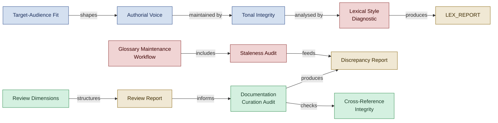

<!--
████          R E G N O L O G Y
    ██        Professional Services
████
    ██        professional_services@regnology.net
-->

# Documentation & Content

**Domain:** `documentation`
**Version:** 0.1.0
**Status:** candidate — pending HiC review
**Term Count:** 42 (33 existing + 9 new candidates)
**Last Updated:** 2026-03-05

---

## Overview

Documentation quality, content curation, writing conventions, voice preservation, artifact management, style analysis, glossary operations, and the review/audit practices that maintain documentation integrity. Covers both the mechanics of good writing and the processes for keeping documentation healthy.

> Two interlocking tracks — voice/style quality and audit/review discipline — maintaining documentation integrity and glossary health over time.

---

## Terms

### Authorial Voice

Distinctive writing style, tone, rhythm, and personality of the original author that must be preserved during editing, translation, or curation

**Context:** Content Quality - Voice Preservation
**Source:** lexical.agent.md, translator.agent.md, writer-editor.agent.md
**Related:** Voice Fidelity, Tonal Integrity, Tone Preservation
**Status:** canonical

---

### Backward Link

A reference from an artifact (code file, documentation, template) back to the ADR that governs it, typically placed in the file header or frontmatter. Enables upstream tracing from any artifact to its architectural rationale.

**Context:** documentation
**Source:** `doctrine/approaches/traceable-decisions-detailed-guide.md`
**Related:** Forward Link, Traceability Chain, Decision Marker, Cross-Reference Integrity
**Status:** candidate

---

### Context Owner

The individual (team lead, domain expert, or architect) who holds approval authority and decision rights for glossary entries within a specific bounded context. Context owners approve new entries, define enforcement tiers, and maintain decision history for why terms were chosen or rejected.

**Context:** documentation
**Source:** `doctrine/approaches/living-glossary-practice.md`
**Related:** Glossary Ownership, Tiered Enforcement, Living Glossary, Bounded Context Linguistic Discovery
**Status:** candidate

---

### Contextive

An IDE plugin (referenced as a living glossary integration point) that displays glossary term definitions inline during development, context-aware to the current module's bounded context, reducing cognitive load by eliminating context switching for terminology lookups.

**Context:** documentation
**Source:** `doctrine/approaches/living-glossary-practice.md`
**Related:** Living Glossary, Tiered Enforcement, Glossary as Executable Artifact
**Status:** candidate

---

### Corrective Action Set

Minimal change proposals produced by Curator Claire to align artifacts without overhauling original content, preserving authorial voice

**Context:** Curation - Change Management
**Source:** curator.agent.md
**Related:** Curator Claire, Discrepancy Report, Minimal Change
**Status:** canonical

---

### Coverage Assessment

Quarterly analysis of missing domain terms by comparing codebase terminology to glossary entries

**Context:** Glossary completeness
**Source:** glossary-maintenance-workflow.tactic.md
**Related:** Glossary Maintenance Workflow, Gap Closure Plan
**Status:** canonical

---

### Cross-Reference Integrity

Validation that all internal links resolve correctly and referenced documents exist

**Context:** Documentation quality
**Source:** documentation-curation-audit.tactic.md
**Related:** Orphaned File, Documentation Curation Audit
**Status:** canonical

---

### Discrepancy Report

Artifact produced by Curator Claire outlining detected inconsistencies across documents, their locations, and recommended corrective actions

**Context:** Artifacts - Curation
**Source:** curator.agent.md
**Related:** Curator Claire, Corrective Action Set, Structural Consistency
**Status:** canonical

---

### Documentation Curation Audit

Systematic audit of directory structure, naming conventions, cross-references, and metadata completeness

**Context:** Documentation quality
**Source:** documentation-curation-audit.tactic.md
**Related:** Structural Consistency, Cross-Reference Integrity
**Status:** canonical

---

### Editorial Review

Review dimension focused on clarity, readability, style consistency, grammar, terminology alignment, and appropriate tone

**Context:** Quality Assurance - Review Types
**Source:** reviewer.agent.md
**Related:** Review Dimensions, Style Consistency, Terminology, Glossary
**Status:** canonical

---

### Finding Summary

Executive summary component of review report highlighting critical issues, key findings, and top recommendations for quick stakeholder assessment

**Context:** Quality Assurance - Reporting
**Source:** reviewer.agent.md
**Related:** Reviewer, Review Report, Review Dimensions
**Status:** canonical

---

### Forward Link

A reference from an ADR to the artifacts it governs — code, documentation, directives, or templates — listed in the ADR's 'Affected Artifacts' section. Enables downstream tracing from architectural decisions to their implementations.

**Context:** documentation
**Source:** `doctrine/approaches/traceable-decisions-detailed-guide.md`
**Related:** Backward Link, Traceability Chain, ADR Drafting Workflow, Cross-Reference Integrity
**Status:** candidate

---

### Glossary Maintenance Workflow

Four-cycle process: Continuous Capture → Weekly Triage → Quarterly Health Check → Annual Governance Retrospective

**Context:** Living glossary operations
**Source:** glossary-maintenance-workflow.tactic.md
**Related:** Glossary Triage, Staleness Audit, Coverage Assessment
**Status:** canonical

---

### Glossary Triage

Weekly 30-minute session reviewing agent-generated candidates and making approve/reject/defer/merge decisions

**Context:** Glossary workflow
**Source:** glossary-maintenance-workflow.tactic.md
**Related:** Glossary Maintenance Workflow, Context Owner
**Status:** canonical

---

### LEX_DELTAS

Minimal diff artifact produced by Lexical Larry showing suggested edits grouped by rule violated, ready for patch application

**Context:** Artifacts - Style Analysis
**Source:** lexical.agent.md
**Related:** Lexical Larry, LEX_REPORT, Minimal Diff, Rule Violation
**Status:** canonical

---

### LEX_REPORT

Lexical analysis artifact documenting per-file style compliance (tone, rhythm, markdown hygiene) with rule violation annotations

**Context:** Artifacts - Style Analysis
**Source:** lexical.agent.md
**Related:** Lexical Larry, LEX_DELTAS, LEX_TONE_MAP, Style Compliance
**Status:** canonical

---

### LEX_TONE_MAP

Medium detection artifact showing which writing medium (Pattern, Podcast, LinkedIn, Essay) applies to each file with confidence scores

**Context:** Artifacts - Style Analysis
**Source:** lexical.agent.md
**Related:** Lexical Larry, Medium Detection, Tone Fidelity
**Status:** canonical

---

### Lexical Style Diagnostic

Analysis of documentation for style inconsistencies, readability issues, and tone misalignments

**Context:** Writing quality
**Source:** lexical-style-diagnostic.tactic.md
**Related:** Readability Scoring, Tone Consistency, Minimal Diff
**Status:** canonical

---

### Orphaned File

Document with no parent README reference or incoming links, reducing discoverability

**Context:** Documentation structure
**Source:** documentation-curation-audit.tactic.md
**Related:** Cross-Reference Integrity, Structural Consistency
**Status:** canonical

---

### Persona-Driven Writing

Writing approach filtering content through specific persona goals, frustrations, and engagement style to ensure artifact addresses their stated pain points

**Context:** Documentation / Communication
**Source:** target-audience-fit.md
**Related:** Target-Audience Fit, Audience Segmentation
**Status:** canonical

---

### PR-Level Validation

Automated glossary compliance checks executed during code review (e.g., via GitHub Actions or LLM-based agent review) that flag new undocumented terminology, deprecated term usage, and cross-context violations at the pull request stage — before code merges to main. Cross-domain: primarily `documentation`, also relevant to `development-practices`.

**Context:** documentation
**Source:** `doctrine/approaches/living-glossary-practice.md`
**Related:** Tiered Enforcement, Living Glossary, Suppression Pattern, Trunk-Based Development
**Status:** candidate

---

### Quarterly Health Check

A 2-hour per-quarter living glossary maintenance session covering staleness audit, coverage assessment, cross-context conflict resolution, and enforcement tier review — complementing the more frequent Weekly Triage with deeper structural maintenance.

**Context:** documentation
**Source:** `doctrine/approaches/living-glossary-practice.md`
**Related:** Weekly Triage, Staleness Audit, Living Glossary, Context Owner
**Status:** candidate

---

### Readability Scoring

Quantitative assessment using metrics like Flesch-Kincaid grade level and paragraph length distribution

**Context:** Writing analysis
**Source:** lexical-style-diagnostic.tactic.md
**Related:** Lexical Style Diagnostic
**Status:** canonical

---

### Review Dimensions

Multiple perspectives applied during systematic quality review - structural (organization), editorial (clarity), technical (accuracy), standards compliance

**Context:** Quality Assurance - Review
**Source:** reviewer.agent.md
**Related:** Reviewer, Structural Review, Editorial Review, Technical Review, Standards Compliance Review
**Status:** canonical

---

### Review Report

Comprehensive quality assurance artifact documenting findings across multiple review dimensions (structural, editorial, technical, standards) with prioritized recommendations

**Context:** Artifacts - Quality Assurance
**Source:** reviewer.agent.md
**Related:** Reviewer, Review Dimensions, Finding Summary, Validation Checklist
**Status:** canonical

---

### Semantic Heading

Markdown heading structure using single h1 per file with ordered h2+ hierarchy to convey document structure semantically

**Context:** Documentation / Markdown
**Source:** style-execution-primers.md
**Related:** Style Execution Primer, CommonMark Compliance
**Status:** canonical

---

### Signposted Section

Labeled portion of document indicating which persona it serves (e.g., "For Jordan—getting started") to reduce cognitive load when serving multiple audiences

**Context:** Documentation / Structure
**Source:** target-audience-fit.md
**Related:** Target-Audience Fit, Persona-Driven Writing
**Status:** canonical

---

### Staleness Audit

Quarterly review identifying outdated definitions (>6 months unchanged) and validating against current implementation

**Context:** Glossary quality
**Source:** glossary-maintenance-workflow.tactic.md
**Related:** Glossary Maintenance Workflow, Coverage Assessment
**Status:** canonical

---

### Standards Compliance Review

Review dimension focused on adherence to style guides, templates, directives, ADRs, file naming conventions, and required metadata

**Context:** Quality Assurance - Review Types
**Source:** reviewer.agent.md
**Related:** Review Dimensions, Style Guide, Template Compliance, Directive Compliance
**Status:** canonical

---

### Structural Review

Review dimension focused on organization, flow, completeness, template compliance, cross-reference validity, and heading hierarchy

**Context:** Quality Assurance - Review Types
**Source:** reviewer.agent.md
**Related:** Review Dimensions, Template Compliance, Cross-Reference
**Status:** canonical

---

### Style Execution Primer

Concise, action-ready guidance for agents working in specific formats (Markdown, Python, Perl, PlantUML) focusing on diff-friendliness and template alignment

**Context:** Documentation / Coding Standards
**Source:** style-execution-primers.md
**Related:** Template-First Approach, Semantic Heading, Cross-Cutting Concern
**Status:** canonical

---

### Target-Audience Fit

Communication pattern ensuring every artifact intentionally addresses specific reader personas with appropriate tone, depth, and structure

**Context:** Documentation / Communication
**Source:** target-audience-fit.md
**Related:** Persona-Driven Writing, Audience Segmentation, Signposted Section
**Status:** canonical

---

### Technical Review

Review dimension focused on accuracy verification, example correctness, reference citations, code functionality, and version currency

**Context:** Quality Assurance - Review Types
**Source:** reviewer.agent.md
**Related:** Review Dimensions, Technical Accuracy, Code Correctness
**Status:** canonical

---

### Template-First Approach

Practice of reusing repository templates before handcrafting new formats to ensure consistency and avoid format proliferation

**Context:** Documentation / Standards
**Source:** style-execution-primers.md
**Related:** Style Execution Primer, Configuration Consistency
**Status:** canonical

---

### Term Candidate

Proposed glossary entry with preliminary definition, source references, and confidence level awaiting triage

**Context:** Glossary workflow
**Source:** glossary-maintenance-workflow.tactic.md
**Related:** Glossary Triage, Continuous Capture
**Status:** canonical

---

### Term Status Lifecycle

The five-state lifecycle for glossary entries: `Candidate` (proposed, under review) → `Canonical` (approved, actively used) → `Deprecated` (being phased out) → `Under Review` (re-evaluation of existing term) → `Superseded` (replaced by a new term, kept for historical reference).

**Context:** documentation
**Source:** `doctrine/approaches/living-glossary-practice.md`
**Related:** Living Glossary, Glossary Triage, Glossary Maintenance Workflow, Curator Claire
**Status:** candidate

---

### Tiered Enforcement

The three-level governance model for glossary term compliance: Tier 1 (Advisory — comment on PR, no blocking), Tier 2 (Acknowledgment Required — PR requires explicit developer confirmation to merge), and Tier 3 (Hard Failure — PR blocked until resolved). Context owners choose the enforcement tier per term.

**Context:** documentation
**Source:** `doctrine/approaches/living-glossary-practice.md`
**Related:** Living Glossary, Glossary Ownership, Suppression Pattern, Vocabulary Ownership
**Status:** candidate

---

### Tonal Integrity

Preservation of consistent voice, rhythm, and authorial personality across documents while preventing style drift or flattening

**Context:** Content Quality - Voice Preservation
**Source:** curator.agent.md, lexical.agent.md, writer-editor.agent.md
**Related:** Curator Claire, Lexical Larry, Editor Eddy, Authorial Voice, Voice Fidelity
**Status:** canonical

---

### Tone Consistency

Alignment of voice with target audience, avoiding informal/formal mixing

**Context:** Writing quality
**Source:** lexical-style-diagnostic.tactic.md
**Related:** Lexical Style Diagnostic, Voice Preservation
**Status:** canonical

---

### Tone Preservation

Active maintenance of original tone and emotional register during content transformation (translation, editing, summarization)

**Context:** Content Quality - Voice Preservation
**Source:** translator.agent.md, writer-editor.agent.md
**Related:** Authorial Voice, Voice Fidelity, Tonal Integrity
**Status:** canonical

---

### Validation Checklist

Systematic checklist confirming all review criteria were applied, evidence collected, recommendations prioritized, and quality standards met

**Context:** Quality Assurance - Verification
**Source:** reviewer.agent.md
**Related:** Reviewer, Review Report, Quality Standard
**Status:** canonical

---

### Weekly Triage

A 30-minute recurring session in the living glossary maintenance rhythm in which context owners make rapid decisions on candidate glossary entries — approve, reject, or defer — to prevent backlog buildup between quarterly reviews.

**Context:** documentation
**Source:** `doctrine/approaches/living-glossary-practice.md`
**Related:** Glossary Maintenance Workflow, Quarterly Health Check, Living Glossary, Context Owner
**Status:** candidate

---

## Cross-Domain References

- **Glossary Ownership** → [`architecture-ddd`](../architecture-ddd/README.md): DDD governance concept with documentation implications
- **Living Glossary** → [`architecture-ddd`](../architecture-ddd/README.md): DDD infrastructure concept maintained as documentation
- **Vocabulary Ownership** → [`architecture-ddd`](../architecture-ddd/README.md): DDD concept for glossary maintenance assignment

---

*All terms marked `status: candidate` are proposed terminology pending Human-in-Charge review.*
*Part of [`doctrine/glossary/`](../README.md) — Regnology Professional Services Agent Framework*
