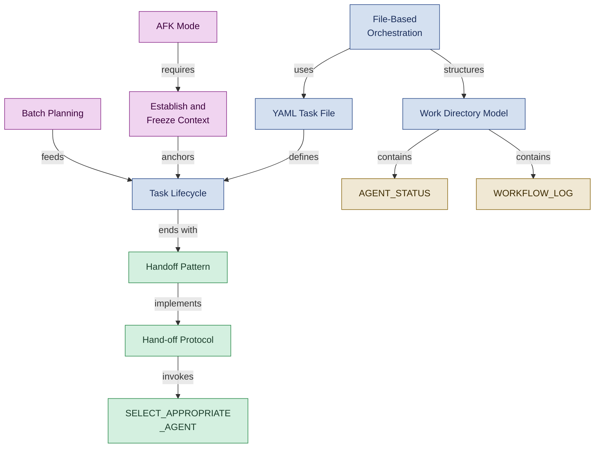

<!--
████          R E G N O L O G Y
    ██        Professional Services
████
    ██        professional_services@regnology.net
-->

# Orchestration & Planning

**Domain:** `orchestration`
**Version:** 0.1.0
**Status:** candidate — pending HiC review
**Term Count:** 54 (37 existing + 17 new candidates)
**Last Updated:** 2026-03-05

---

## Overview

Multi-agent task coordination, file-based collaboration, task lifecycle management, planning cycles, workflow execution, autonomous operation protocols, and cross-agent handoffs. Covers HOW work flows between agents and how tasks are tracked from assignment to completion.

> How file-based orchestration coordinates task lifecycle from planning through handoff, with AFK Mode and coordination artifacts enabling asynchronous multi-agent work.

---

## Terms

### AFK Mode

Autonomous operation protocol where agents work independently when human is away from keyboard, with clear decision boundaries and commit frequency expectations

**Context:** Agent autonomy
**Source:** autonomous-operation-protocol.tactic.md
**Related:** Decision Boundary, Commit Checkpoint, Escalation Protocol
**Status:** canonical

---

### Agent Assignment

Process of selecting and routing specific tasks to the most appropriate specialized agent based on task type, required capabilities, and phase authority

**Context:** Orchestration - Task Routing
**Source:** manager.agent.md
**Related:** Manager Mike, Hand-off Protocol, Phase Authority, AGENT_STATUS
**Status:** canonical

---

### Agent Profile Handoff Patterns

Documentation in agent profiles of common handoff patterns observed in practice (outgoing, incoming, special cases) providing guidance without prescriptive rules

**Context:** Orchestration / Agent Coordination
**Source:** agent-profile-handoff-patterns.md
**Related:** Handoff Pattern, Organic Emergence
**Status:** canonical

---

### AGENT_STATUS

Coordination artifact maintained by Manager Mike documenting which agent did what, when, and current workflow state

**Context:** Artifacts - Orchestration
**Source:** manager.agent.md
**Related:** Manager Mike, WORKFLOW_LOG, HANDOFFS, Agent Assignment
**Status:** canonical

---

### AGENT_TASKS

A planning artifact file at `${DOC_ROOT}/planning/AGENT_TASKS.md` maintained by Planning Petra that records which specialist agent is responsible for which artifacts and tasks in the current planning batch. Provides at-a-glance assignment visibility distinct from the task-level YAML files.

**Context:** orchestration
**Source:** `doctrine/agents/project-planner.agent.md`
**Related:** PLAN_OVERVIEW, NEXT_BATCH, AGENT_STATUS, Planning Petra
**Status:** candidate

---

### Batch Planning

Planning approach that breaks work into small, time-boxed batches (typically 1-2 weeks) rather than fixed-date commitments, enabling adaptive execution

**Context:** Planning - Execution Strategy
**Source:** project-planner.agent.md
**Related:** Planning Petra, NEXT_BATCH, Milestone Definition
**Status:** canonical

---

### Blocker

An external impediment that prevents an agent from making forward progress on a task and requires human action to resolve — such as missing credentials, pending PR reviews, or external system downtime. Agents create a structured blocker file in `work/human-in-charge/blockers/` and set the related task to `status: frozen`.

**Context:** orchestration
**Source:** `doctrine/directives/040_human_in_charge_escalation_protocol.md`
**Related:** Frozen Task, Escalation, Human in Charge, Decision Request, Fridge Directory
**Status:** candidate

---

### Circular Delegation

An anti-pattern in which a task is delegated from Agent A to Agent B, which then delegates back to Agent A (or through a chain that eventually returns to the originator), causing the task to loop without completion. The SELECT_APPROPRIATE_AGENT tactic prevents this by tracking the delegation chain in task metadata and rejecting cycles.

**Context:** orchestration
**Source:** `doctrine/tactics/SELECT_APPROPRIATE_AGENT.tactic.md`
**Related:** Delegation Chain, Agent Specialization Hierarchy, SELECT_APPROPRIATE_AGENT, Manager Mike
**Status:** candidate

---

### Context Carry-over

Undesired influence of previous iteration results on subsequent runs, introducing bias

**Context:** Execution quality issue
**Source:** execution-fresh-context-iteration.tactic.md
**Related:** Fresh Context Iteration
**Status:** canonical

---

### Context Drift

Unacknowledged change in task goals, constraints, or assumptions during execution leading to scope creep

**Context:** Scope violation
**Source:** context-establish-and-freeze.tactic.md
**Related:** Frozen Context, Scope Creep
**Status:** canonical

---

### Decision Request

A structured escalation artifact placed by an agent in `work/human-in-charge/decision_requests/` when a task requires a human architectural or strategic choice beyond the agent's authority — such as technology selection, breaking API changes, or ambiguous requirements. The agent documents context, options, and a recommendation; the Human in Charge fills in the resolution section.

**Context:** orchestration
**Source:** `doctrine/directives/040_human_in_charge_escalation_protocol.md`
**Related:** Human in Charge, Blocker, Escalation Protocol, Escalation, YAML Task File
**Status:** candidate

---

### Delegation Chain

A metadata field in task YAML that records the sequence of agents through which a task has been routed (e.g., `[manager-mike, backend-benny, python-pedro]`). Used by the SELECT_APPROPRIATE_AGENT tactic to detect and prevent Circular Delegation.

**Context:** orchestration
**Source:** `doctrine/tactics/SELECT_APPROPRIATE_AGENT.tactic.md`
**Related:** Circular Delegation, YAML Task File, Routing Priority, Agent Specialization Hierarchy
**Status:** candidate

---

### DEPENDENCIES

A planning artifact file at `${DOC_ROOT}/planning/DEPENDENCIES.md` maintained by Planning Petra that records which tasks or milestones must complete before others can begin, providing sequencing and dependency visibility across a planning batch.

**Context:** orchestration
**Source:** `doctrine/agents/project-planner.agent.md`
**Related:** PLAN_OVERVIEW, NEXT_BATCH, AGENT_TASKS, Batch Planning, Planning Petra
**Status:** candidate

---

### Dependency Mapping

Process of identifying and documenting prerequisite relationships between tasks, ensuring correct execution sequence and preventing blockers

**Context:** Planning - Work Sequencing
**Source:** project-planner.agent.md
**Related:** Planning Petra, Task Breakdown, DEPENDENCIES
**Status:** canonical

---

### Establish and Freeze Context

Tactic requiring explicit context clarification before work begins, then freezing that context for task duration to prevent scope drift

**Context:** Work initiation discipline
**Source:** context-establish-and-freeze.tactic.md
**Related:** Frozen Context, Context Drift, Goals and Non-Goals
**Status:** canonical

---

### External Aggregation

Result consolidation performed outside execution loop to maintain iteration independence

**Context:** Data processing pattern
**Source:** execution-fresh-context-iteration.tactic.md
**Related:** Fresh Context Iteration
**Status:** canonical

---

### File-Based Orchestration

Coordination pattern using YAML task files and Git commits to enable asynchronous multi-agent workflows without queues, servers, or network dependencies

**Context:** Orchestration / Coordination Pattern
**Source:** file-based-orchestration.md, work-directory-orchestration.md
**Related:** Task Lifecycle, Work Directory Model, Asynchronous Coordination
**Status:** canonical

---

### Fresh Context Iteration

Execution pattern running single instruction repeatedly in fresh context with no memory between runs

**Context:** Deterministic execution
**Source:** execution-fresh-context-iteration.tactic.md
**Related:** Context Carry-over, External Aggregation
**Status:** canonical

---

### Fridge Directory

The `work/collaboration/fridge/` subdirectory where frozen (blocked) task files are stored pending human resolution. Named for the analogy of putting tasks 'in the fridge' to be retrieved later when the blocker is resolved.

**Context:** orchestration
**Source:** `doctrine/approaches/work-directory-orchestration.md`
**Related:** Frozen Task, Blocker, Task Lifecycle, Work Directory Model
**Status:** candidate

---

### Frozen Context

Agreed-upon goals, constraints, and assumptions that remain fixed during task execution unless explicitly renegotiated

**Context:** Scope management
**Source:** context-establish-and-freeze.tactic.md
**Related:** Establish and Freeze Context, Context Drift
**Status:** canonical

---

### Frozen Task

A task file that has been moved to the `fridge/` directory with `status: frozen` and a `blocker_ref` field pointing to a Human-in-Charge escalation artifact. The task is suspended awaiting human resolution; agents should continue with other available work rather than waiting idle.

**Context:** orchestration
**Source:** `doctrine/approaches/work-directory-orchestration.md`, `doctrine/directives/040_human_in_charge_escalation_protocol.md`
**Related:** Blocker, Fridge Directory, Task Lifecycle, YAML Task File, AFK Mode
**Status:** candidate

---

### Goals and Non-Goals

Explicit declaration of what a task is expected to achieve AND what is deliberately out of scope

**Context:** Task scoping
**Source:** context-establish-and-freeze.tactic.md
**Related:** Establish and Freeze Context
**Status:** canonical

---

### Hand-off

Explicit transfer of responsibility from one agent to another at phase boundaries, documented in commit messages

**Context:** Regnology workflow coordination
**Source:** 6-phase-spec-driven-implementation-flow.md
**Related:** Phase Checkpoint Protocol, Phase Declaration
**Status:** canonical

---

### Hand-off Protocol

Structured process for transferring work between agents in a multi-agent workflow, specifying what artifacts are ready, which agent receives them, and validation criteria

**Context:** Agent Collaboration
**Source:** analyst-annie.agent.md, architect.agent.md, project-planner.agent.md
**Related:** Phase Authority, Spec-Driven Development, Agent Assignment, HANDOFFS.md
**Status:** canonical

---

### Handoff Pattern

Workflow where completing agent encodes follow-up work via result.next_agent block, orchestrator creates new task, copies context/artefacts for seamless continuation

**Context:** Orchestration / Workflow
**Source:** work-directory-orchestration.md, agent-profile-handoff-patterns.md
**Related:** File-Based Orchestration, Agent Coordination, Task Chain
**Status:** canonical

---

### HANDOFFS

Coordination artifact documenting which work products are ready for which next agent in the workflow

**Context:** Artifacts - Orchestration
**Source:** manager.agent.md
**Related:** Manager Mike, Hand-off Protocol, Agent Assignment
**Status:** canonical

---

### Hard Limit

Concrete resource boundary (financial, time, physical, mental, moral, social) triggering immediate stop

**Context:** Boundary enforcement
**Source:** stopping-conditions.tactic.md
**Related:** Stopping Condition, Trigger Declaration
**Status:** canonical

---

### HiC Executive Summary

A structured artifact created in `work/human-in-charge/executive_summaries/` by Manager Mike (or another agent) upon completion of a major multi-agent initiative phase. It consolidates work logs, key decisions, modules affected, and next steps into a single reviewable document for the Human in Charge.

**Context:** orchestration
**Source:** `doctrine/directives/040_human_in_charge_escalation_protocol.md`, `doctrine/agents/manager.agent.md`
**Related:** Human in Charge, Manager Mike, WORKFLOW_LOG, Escalation Protocol
**Status:** candidate

---

### Iteration

A planning cycle encompassing a discrete set of phases, batches, and milestones — as defined by Planning Petra — with explicit assumptions, owners, and re-planning triggers. Distinct from a 'Cycle' (the repeating six-phase spec→implementation pattern) and a 'Batch' (a small group of concrete tasks).

**Context:** orchestration
**Source:** `doctrine/agents/manager.agent.md`, `doctrine/agents/project-planner.agent.md`
**Related:** Batch Planning, Six-Phase Cycle, PLAN_OVERVIEW, Re-planning Trigger, Planning Petra
**Status:** candidate

---

### Match Score

A numeric score (0.0–1.0) calculated during agent selection that quantifies how well a candidate agent's specialization context matches a task's inferred context. Composed of weighted sub-scores for language match (40%), framework match (20%), file pattern match (20%), domain keyword match (10%), and exact match bonus (10%). Cross-domain: primarily `orchestration`, relevant to `agent-framework`.

**Context:** orchestration
**Source:** `doctrine/tactics/SELECT_APPROPRIATE_AGENT.tactic.md`
**Related:** SELECT_APPROPRIATE_AGENT, Workload Penalty, Routing Priority, Specialization Context
**Status:** candidate

---

### Micro-Increment

A small, verifiable unit of work (approximately 5–15 minutes) executed during an AFK mode session. Each micro-increment culminates in a commit checkpoint, enabling frequent, atomic progress tracking while the human is away.

**Context:** orchestration
**Source:** `doctrine/tactics/autonomous-operation-protocol.tactic.md`
**Related:** AFK Mode, Commit Checkpoint, Self-Observation Checkpoint, Stopping Condition
**Status:** candidate

---

### Milestone Definition

Planning artifact that establishes significant checkpoints with goals, themes, decision gates, and validation hooks while remaining resilient to change

**Context:** Planning - Goal Setting
**Source:** project-planner.agent.md
**Related:** Planning Petra, PLAN_OVERVIEW, Batch Planning
**Status:** canonical

---

### NEXT_BATCH

Planning artifact containing small batch of concrete, ready-to-run tasks for immediate execution (typically 1-2 weeks of work)

**Context:** Artifacts - Planning
**Source:** project-planner.agent.md
**Related:** Planning Petra, PLAN_OVERVIEW, Batch Planning, Task Breakdown
**Status:** canonical

---

### PLAN_OVERVIEW

Planning artifact documenting current goals, themes, and focus areas for project execution

**Context:** Artifacts - Planning
**Source:** project-planner.agent.md
**Related:** Planning Petra, NEXT_BATCH, Milestone Definition
**Status:** canonical

---

### Problem Report

A structured escalation artifact placed in `work/human-in-charge/problems/` when an agent discovers an internal problem requiring human judgment — such as contradictory requirements, unexpected test outcomes, or discovered constraints not covered in specifications. Distinct from a Blocker (which is external) and a Decision Request (which is architectural).

**Context:** orchestration
**Source:** `doctrine/directives/040_human_in_charge_escalation_protocol.md`
**Related:** Blocker, Decision Request, Human in Charge, Escalation
**Status:** candidate

---

### Re-planning Trigger

An explicit assumption or condition documented in a plan that, when met, signals that the current plan must be reassessed before continuing — such as a milestone missed, a blocker unresolved, or a strategic priority change.

**Context:** orchestration
**Source:** `doctrine/agents/project-planner.agent.md`
**Related:** Iteration, Milestone Definition, Stopping Condition, Planning Petra
**Status:** candidate

---

### Reassignment Pass

Manager Mike process that reviews existing task assignments and updates them to use more specific specialist agents when available. Used for backward compatibility and after new specialists are introduced.

**Context:** Agent Collaboration - Orchestration Migration
**Source:** DDR-011
**Related:** SELECT_APPROPRIATE_AGENT, Agent Specialization Hierarchy
**Status:** canonical

---

### Routing Priority

Numeric specificity score (0-100) for specialist agents. Higher priority agents preferred when multiple match context. Parent agents default to 50, specialists typically 60-90, local specialists receive +20 boost.

**Context:** Agent Collaboration - Orchestration
**Source:** DDR-011
**Related:** Agent Specialization Hierarchy, SELECT_APPROPRIATE_AGENT, Specialization Context
**Status:** canonical

---

### Schema Validation

Automated verification that YAML task files comply with defined structure before marking tasks complete

**Context:** File-based orchestration quality
**Source:** task-completion-validation.tactic.md
**Related:** Task Schema, Validation Gate
**Status:** canonical

---

### SELECT_APPROPRIATE_AGENT

Orchestration tactic that determines most appropriate agent for a task considering specialization hierarchy, context matching, workload, and complexity. Invoked by Manager Mike during task assignment, handoff processing, and reassignment passes.

**Context:** Agent Collaboration - Orchestration
**Source:** DDR-011, SELECT_APPROPRIATE_AGENT.tactic.md
**Related:** Agent Specialization Hierarchy, Routing Priority, Reassignment Pass
**Status:** canonical

---

### Stopping Condition

Clear, measurable threshold defining when to stop pursuing a goal based on acceptable loss limits

**Context:** Commitment management
**Source:** stopping-conditions.tactic.md
**Related:** Hard Limit, Warning Signal, Trigger Declaration
**Status:** canonical

---

### Sunk-Cost Fallacy Override

Continuing past stopping conditions by rationalizing invested effort rather than acknowledging limits

**Context:** Decision bias
**Source:** stopping-conditions.tactic.md
**Related:** Stopping Condition, Hard Limit
**Status:** canonical

---

### Task Artifact Declaration

Explicit listing of files a task will modify in YAML artefacts field, enabling pre-commit conflict detection and coordination between agents

**Context:** Orchestration / Conflict Avoidance
**Source:** work-directory-orchestration.md, trunk-based-development.md
**Related:** File-Based Orchestration, Artifact Conflict Detection
**Status:** canonical

---

### Task Breakdown

Process of decomposing specifications into concrete, executable tasks with clear dependencies, acceptance criteria, and agent assignments

**Context:** Planning - Work Decomposition
**Source:** project-planner.agent.md
**Related:** Planning Petra, Phase 3 (Planning), YAML Task File, Dependency Mapping
**Status:** canonical

---

### Task Lifecycle

The standardized progression of orchestrated tasks through states: **new** (unassigned work), **assigned** (routed to specific agent), **in_progress
** (actively being worked), **done** (completed with results), **archive
** (historical record). Task state transitions are tracked through file-based coordination.

**Reference:** Directive 019 (File-Based Collaboration)

**Context:** 
**Source:** 
**Related:** Orchestration, Work Log
**Status:** canonical

---

### Tiebreaker Hierarchy

The ordered set of rules applied when two or more candidate agents have equal adjusted scores during agent selection: (1) highest final score, (2) language match preference for programming tasks, (3) highest routing priority, (4) Manager Mike free choice with logged rationale.

**Context:** orchestration
**Source:** `doctrine/tactics/SELECT_APPROPRIATE_AGENT.tactic.md`
**Related:** Match Score, Routing Priority, SELECT_APPROPRIATE_AGENT, Manager Mike
**Status:** candidate

---

### Trigger Declaration

Pre-commitment statement in 'When X happens, then I will stop' format conditioning behavior

**Context:** Behavioral conditioning
**Source:** stopping-conditions.tactic.md
**Related:** Stopping Condition, Hard Limit
**Status:** canonical

---

### Warning Signal

Observable red flag indicating trouble requiring attention or reassessment

**Context:** Early detection
**Source:** stopping-conditions.tactic.md
**Related:** Stopping Condition, Hard Limit
**Status:** canonical

---

### Work Directory Model

Directory structure encoding orchestration state: collaboration/ (routing), reports/ (logs, metrics), external_memory/ (scratch), notes/ (ideation), planning/ (aids), schemas/ (validators)

**Context:** Orchestration / Structure
**Source:** work-directory-orchestration.md
**Related:** File-Based Orchestration, Task Lifecycle
**Status:** canonical

---

### WORKFLOW_LOG

Chronological log of multi-agent workflow execution maintained by Manager Mike for traceability and coordination

**Context:** Artifacts - Orchestration
**Source:** manager.agent.md
**Related:** Manager Mike, AGENT_STATUS, Hand-off Tracking
**Status:** canonical

---

### Workload Penalty

A score reduction applied to a candidate agent's Match Score during agent selection when that agent has a high number of active tasks (3–4 tasks → 15% penalty; 5+ tasks → 30% penalty). Prevents routing tasks to already-overloaded specialists.

**Context:** orchestration
**Source:** `doctrine/tactics/SELECT_APPROPRIATE_AGENT.tactic.md`
**Related:** Match Score, SELECT_APPROPRIATE_AGENT, Agent Specialization Hierarchy, Routing Priority
**Status:** candidate

---

### Workstream Sequencing

The activity of ordering parallel or dependent workstreams within a planning cycle to minimize blocking dependencies while maximizing concurrent agent utilization. A core Planning Petra activity during batch definition.

**Context:** orchestration
**Source:** `doctrine/agents/project-planner.agent.md`
**Related:** Iteration, DEPENDENCIES, Batch Planning, Planning Petra
**Status:** candidate

---

### YAML Task File

Structured task definition file used in file-based orchestration containing task metadata, dependencies, acceptance criteria, and agent assignment

**Context:** Orchestration - Task Definition
**Source:** project-planner.agent.md, manager.agent.md
**Related:** Planning Petra, Manager Mike, File-Based Orchestration, Task Breakdown
**Status:** canonical

---

## Cross-Domain References

- **AFK Mode** → [`agent-framework`](../agent-framework/README.md): Autonomous operation involves both agent behavior and workflow protocol
- **Agent Assignment** → [`agent-framework`](../agent-framework/README.md): Orchestration process that selects agents
- **Commit Checkpoint** → [`tooling`](../tooling/README.md): Version control cadence for autonomous operation
- **Human in Charge** → [`doctrine-governance`](../doctrine-governance/README.md): Governance principle applied in workflow escalation decisions
- **Ralph Wiggum Loop** → [`agent-framework`](../agent-framework/README.md): Agent behavior pattern applied during task execution

---

*All terms marked `status: candidate` are proposed terminology pending Human-in-Charge review.*
*Part of [`doctrine/glossary/`](../README.md) — Regnology Professional Services Agent Framework*
