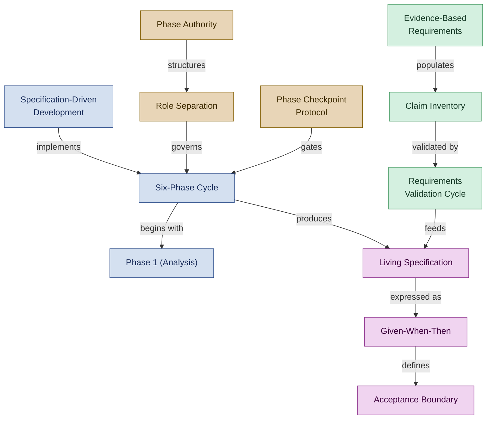

<!--
████          R E G N O L O G Y
    ██        Professional Services
████
    ██        professional_services@regnology.net
-->

# Specification & Requirements

**Domain:** `specification`
**Version:** 0.1.0
**Status:** candidate — pending HiC review
**Term Count:** 47 (38 existing + 9 new candidates)
**Last Updated:** 2026-03-05

---

## Overview

Specification-driven development, requirements engineering, acceptance criteria, the six-phase spec-driven cycle, phase protocols, evidence-based requirements methodology, and functional specification patterns. Covers both the Regnology-specific methodology and the underlying requirements science.

> The six-phase spec-driven cycle, governed by phase authority and role separation, producing living specifications grounded in evidence-based requirements.

---

## Terms

### 6-Phase Spec-Driven Implementation Flow

Complete workflow sequence through all six phases of Spec-Driven Development from analysis through review with explicit phase authority and handoff protocols

**Context:** Workflows - Spec-Driven Development
**Source:** analyst-annie.agent.md, architect.agent.md, project-planner.agent.md
**Related:** Spec-Driven Development, Phase Authority, Hand-off Protocol, Phase Checkpoint Protocol
**Status:** canonical

---

### Acceptance Boundary

Explicit specification of when a system refuses, constrains, or safely degrades rather than accepting input

**Context:** System behavior specification
**Source:** ATDD_adversarial-acceptance.tactic.md
**Related:** Adversarial Acceptance Testing, Contract Decision
**Status:** canonical

---

### Analysis Paralysis

Endless validation or research without delivery due to perfectionism or risk aversion

**Context:** Process anti-pattern
**Source:** requirements-validation-workflow.tactic.md
**Related:** Time-boxing, Evidence-Based Requirements
**Status:** canonical

---

### Cherry-Picking Evidence

Ignoring claims that contradict preferences, undermining intellectual honesty

**Context:** Research anti-pattern
**Source:** requirements-validation-workflow.tactic.md
**Related:** Claim Inventory, Confirmation Bias
**Status:** canonical

---

### Claim Classification

System for categorizing requirement claims by evidence type: Empirical (quantitative data), Observational (qualitative patterns), Theoretical (conceptual models), Prescriptive (best practices)

**Context:** Requirements Engineering
**Source:** evidence-based-requirements.md
**Related:** Evidence-Based Requirements, Testability Assessment
**Status:** canonical

---

### Claim Inventory

Systematic catalog of verifiable assertions from research sources with evidence classification enabling testable requirements

**Context:** Evidence-based requirements
**Source:** claim-inventory-development.tactic.md
**Related:** Evidence Type, Testability Assessment, Traceability Chain
**Status:** canonical

---

### Claim Relationship

Connections between claims: Supporting, Contradicting, Prerequisite, or Alternative explanations

**Context:** Knowledge modeling
**Source:** claim-inventory-development.tactic.md
**Related:** Claim Inventory, Claim Map
**Status:** canonical

---

### Clarification Request

A structured communication from an agent to a human that pauses task execution and requests resolution of a specific ambiguity — including current understanding, targeted questions, proposed assumptions, and the risk of proceeding without clarification. Defined in Directive 023.

**Context:** specification
**Source:** `doctrine/directives/023_clarification_before_execution.md`
**Related:** Escalation, Human in Charge, Stopping Condition, AFK Mode
**Status:** candidate

---

### Confounding Variable

Alternative explanation for observed results that must be controlled in validation experiments

**Context:** Experimental design
**Source:** requirements-validation-workflow.tactic.md
**Related:** Validation Experiment, Multivariate Analysis
**Status:** canonical

---

### Contract Decision

Explicit determination of intended outcome for a failure scenario: prevent, reject, degrade, or tolerate

**Context:** Requirements specification
**Source:** ATDD_adversarial-acceptance.tactic.md
**Related:** Acceptance Boundary, Failure Scenario
**Status:** canonical

---

### Evidence Theater

Collecting evidence to justify pre-decided requirements rather than genuinely testing hypotheses

**Context:** Research anti-pattern
**Source:** requirements-validation-workflow.tactic.md
**Related:** Claim Inventory, Intellectual Honesty
**Status:** canonical

---

### Evidence Type

Classification of claim support: Empirical (quantitative), Observational (qualitative), Theoretical (conceptual), or Prescriptive (best practices)

**Context:** Research methodology
**Source:** claim-inventory-development.tactic.md
**Related:** Claim Inventory, Confidence Level
**Status:** canonical

---

### Evidence-Based Requirements

Requirements analysis approach grounding all claims in verifiable evidence with classified evidence types (Empirical, Observational, Theoretical, Prescriptive)

**Context:** Requirements Engineering / Research Method
**Source:** evidence-based-requirements.md
**Related:** Claim Classification, Testability Assessment, Requirements Validation
**Status:** canonical

---

### Falsifiable Hypothesis

Testable prediction restated from a claim in If-Then-Because format with measurable outcomes

**Context:** Scientific method application
**Source:** requirements-validation-workflow.tactic.md
**Related:** Validation Experiment, Success Criteria
**Status:** canonical

---

### Feature ID

A unique identifier for a feature within a specification, following the pattern `FEAT-{INITIATIVE_CODE}-{SPEC_NUM}-{FEAT_NUM}` (e.g., `FEAT-DASH-001-02`). Used in specification frontmatter to link tasks to specific features for dashboard portfolio tracking.

**Context:** specification
**Source:** `doctrine/directives/035_specification_frontmatter_standards.md`
**Related:** Specification Frontmatter, Initiative, Orphan Task, Portfolio View, YAML Task File
**Status:** candidate

---

### Given-When-Then

BDD scenario structure: Given (context), When (action), Then (expected outcome)

**Context:** Specification format
**Source:** development-bdd.tactic.md
**Related:** BDD Scenario, Observable Behavior
**Status:** canonical

---

### Initiative

A named logical grouping of related specifications under a shared `initiative-slug/` subdirectory in `${SPEC_ROOT}/`. Provides the top-level portfolio hierarchy; all progress rollup calculations aggregate at the initiative level. The term is also used informally for any large project effort — domain assignment here is `specification` for the technical definition.

**Context:** specification
**Source:** `doctrine/directives/035_specification_frontmatter_standards.md`
**Related:** Specification Frontmatter, Feature ID, Initiative Rollup, Portfolio View
**Status:** candidate

---

### Initiative Rollup

A computed completion percentage aggregated from all specification progress values within an initiative, where specification progress is itself averaged from individual feature task statuses. Used in the Portfolio View to give a single high-level completion signal per initiative. Cross-domain: also relevant to `orchestration` (tracking mechanism).

**Context:** specification
**Source:** `doctrine/directives/035_specification_frontmatter_standards.md`
**Related:** Portfolio View, Specification Frontmatter, Initiative, Feature ID
**Status:** candidate

---

### Living Specification

Specification that evolves during development as understanding grows, then freezes when feature complete to become reference documentation

**Context:** Development Methodology - Regnology
**Source:** spec-driven-development.md
**Related:** Specification-Driven Development, Specification Lifecycle
**Status:** canonical

---

### Momentum Bias

Failure mode where agents skip phases or roles blur due to pressure to keep moving forward without proper validation or hand-off

**Context:** Development Methodology - Anti-Pattern
**Source:** spec-driven-6-phase-cycle.md
**Related:** Six-Phase Cycle, Role Confusion
**Status:** canonical

---

### Momentum Bias Trap

Tendency to continue work into next phase without proper checkpoint due to task momentum

**Context:** Workflow violation
**Source:** phase-checkpoint-protocol.md
**Related:** Phase Skipping, Phase Checkpoint Protocol
**Status:** canonical

---

### Orphan Task

A task YAML file that lacks a valid `specification:` field linking it to a specification in `${SPEC_ROOT}/`, or whose linked specification path does not resolve. Orphan tasks appear in the dashboard outside any portfolio hierarchy and should be assigned to a specification by Planning Petra or Manager Mike. Cross-domain: also relevant to `orchestration`.

**Context:** specification
**Source:** `doctrine/directives/035_specification_frontmatter_standards.md`
**Related:** Specification Frontmatter, Portfolio View, Feature ID, YAML Task File
**Status:** candidate

---

### Phase 1 (Analysis)

First phase of Spec-Driven Development where requirements are elicited, specifications are authored, and acceptance criteria are defined; Analyst Annie has PRIMARY authority

**Context:** Spec-Driven Development Phases
**Source:** analyst-annie.agent.md
**Related:** Analyst Annie, Phase Authority, Specification, Acceptance Criteria
**Status:** canonical

---

### Phase 2 (Architecture)

Second phase of Spec-Driven Development where solutions are evaluated, trade-off analysis performed, and architectural design approved; Architect Alphonso has PRIMARY authority

**Context:** Spec-Driven Development Phases
**Source:** architect.agent.md
**Related:** Architect Alphonso, Phase Authority, Trade-off Analysis, ADR
**Status:** canonical

---

### Phase 3 (Planning)

Third phase of Spec-Driven Development where task breakdown, dependency analysis, and agent assignment occur; Planning Petra has PRIMARY authority

**Context:** Spec-Driven Development Phases
**Source:** project-planner.agent.md
**Related:** Planning Petra, Phase Authority, Task Breakdown, Dependency Mapping, YAML Task File
**Status:** canonical

---

### Phase 4 (Acceptance Tests)

Fourth phase of Spec-Driven Development where acceptance criteria are implemented as executable tests before code implementation begins

**Context:** Spec-Driven Development Phases
**Source:** analyst-annie.agent.md, backend-dev.agent.md
**Related:** ATDD, Acceptance Criteria, Executable Test, Phase Authority
**Status:** canonical

---

### Phase 5 (Implementation)

Fifth phase of Spec-Driven Development where production code is written to satisfy acceptance tests using TDD cycle

**Context:** Spec-Driven Development Phases
**Source:** backend-dev.agent.md, python-pedro.agent.md
**Related:** TDD, RED-GREEN-REFACTOR, Phase Authority
**Status:** canonical

---

### Phase 6 (Review)

Sixth phase of Spec-Driven Development where multiple review types occur - architecture compliance (Architect), acceptance criteria validation (Analyst), code quality (Reviewer)

**Context:** Spec-Driven Development Phases
**Source:** analyst-annie.agent.md, architect.agent.md, reviewer.agent.md
**Related:** Review, Architecture Compliance, Acceptance Criteria, Code Quality
**Status:** canonical

---

### Phase Authority

Designation of which agent has PRIMARY, CONSULT, or NO authority during each phase of the Spec-Driven Development workflow

**Context:** Agent Collaboration - Spec-Driven Development
**Source:** analyst-annie.agent.md, architect.agent.md, project-planner.agent.md
**Related:** Spec-Driven Development, Phase Checkpoint Protocol, Hand-off Protocol, Phase 1 (Analysis), Phase 2 (Architecture), Phase 3 (Planning)
**Status:** canonical

---

### Phase Checkpoint Protocol

Self-observation procedure executed at the end of each phase to verify completion, assess authority for next phase, and ensure proper hand-off

**Context:** Development Methodology - Regnology
**Source:** spec-driven-6-phase-cycle.md
**Related:** Six-Phase Cycle, Ralph Wiggum Loop
**Status:** canonical

---

### Phase Declaration

Commit message annotation indicating which phase of the 6-phase cycle a commit belongs to

**Context:** Regnology commit practices
**Source:** 6-phase-spec-driven-implementation-flow.md
**Related:** Hand-off, Phase Checkpoint Protocol
**Status:** canonical

---

### Phase Skipping

Workflow violation where an agent bypasses required intermediate phases (e.g., jumping from Analysis directly to Implementation)

**Context:** Regnology workflow violations
**Source:** phase-checkpoint-protocol.md
**Related:** Phase Checkpoint Protocol, Role Overstepping
**Status:** canonical

---

### Portfolio View

A dashboard view (served by `/api/portfolio`) that displays specifications grouped hierarchically by Initiative → Specification → Feature → Tasks, with completion percentage rollup calculated from linked task statuses. Consumes specification frontmatter as its data source.

**Context:** specification
**Source:** `doctrine/directives/035_specification_frontmatter_standards.md`
**Related:** Specification Frontmatter, Initiative, Feature ID, Initiative Rollup, Orphan Task
**Status:** candidate

---

### Requirements Validation Cycle

Five-phase process (Research & Claim Extraction, Prioritization, Experiment Design, Validation Execution, Requirements Synthesis) transforming assumptions into validated knowledge

**Context:** Requirements Engineering
**Source:** evidence-based-requirements.md
**Related:** Evidence-Based Requirements, Testability Assessment
**Status:** canonical

---

### Role Confusion

Failure mode where specialists perform work outside their authority (e.g., analysts making architectural decisions, architects implementing code)

**Context:** Development Methodology - Anti-Pattern
**Source:** spec-driven-6-phase-cycle.md
**Related:** Momentum Bias, Role Separation
**Status:** canonical

---

### Role Separation

Design principle ensuring each phase has a distinct primary owner with explicit authority boundaries to prevent role confusion and maintain accountability

**Context:** Development Methodology - Regnology
**Source:** spec-driven-6-phase-cycle.md
**Related:** Six-Phase Cycle, Role Confusion
**Status:** canonical

---

### Scenario-Driven Design

Design approach using concrete Given/When/Then scenarios to clarify requirements and drive implementation decisions

**Context:** Development Methodology - Regnology
**Source:** spec-driven-development.md
**Related:** Specification-Driven Development, User Scenario
**Status:** canonical

---

### Six-Phase Cycle

Structured specification-driven workflow with distinct phases (Analysis, Architecture, Planning, Acceptance Test, Implementation, Review), each with a primary owner and explicit hand-offs

**Context:** Development Methodology - Regnology
**Source:** spec-driven-6-phase-cycle.md
**Related:** Phase Checkpoint Protocol, Momentum Bias Prevention, Role Separation
**Status:** canonical

---

### Specification Approval Gate

An explicit status transition checkpoint in the specification lifecycle at which stakeholders (human or agent) review and mark a specification as `Approved`, signalling it is ready for implementation tasking. Without passing this gate, Planning Petra should not create implementation tasks.

**Context:** specification
**Source:** `doctrine/approaches/spec-driven-development.md`, `doctrine/directives/034_spec_driven_development.md`
**Related:** Phase Checkpoint Protocol, Specification Lifecycle, Phase Authority, Phase Declaration
**Status:** candidate

---

### Specification Frontmatter

The mandatory YAML block delimited by `---` at the top of every specification file, containing machine-readable fields (`id`, `title`, `status`, `initiative`, `priority`, `features`, `completion`, `created`, `updated`, `author`) required for portfolio tracking, feature hierarchy definition, and task-to-specification linking as defined by Directive 035.

**Context:** specification
**Source:** `doctrine/directives/035_specification_frontmatter_standards.md`
**Related:** Specification Lifecycle, Feature ID, Initiative, Orphan Task, Portfolio View
**Status:** candidate

---

### Specification Lifecycle

Progression of specification states: DRAFT → APPROVED → IMPLEMENTED, with status changes marking phase transitions

**Context:** Development Methodology - Regnology
**Source:** spec-driven-6-phase-cycle.md
**Related:** Living Specification, Specification Stub
**Status:** canonical

---

### Specification Stub

Initial draft specification with structure and metadata created during analysis phase before detailed requirements are fully documented

**Context:** Development Methodology - Regnology
**Source:** spec-driven-development.md, spec-driven-6-phase-cycle.md
**Related:** Phase 1 Analysis, Specification Lifecycle
**Status:** canonical

---

### Specification-Driven Development

Development methodology where specifications serve as primary artifacts bridging strategic intent and implementation, remaining independent of tests or architectural decisions

**Context:** Development Methodology - Regnology
**Source:** spec-driven-development.md
**Related:** Living Specification, Scenario-Driven Design, Specification Stub
**Status:** canonical

---

### Testability Assessment

Evaluation of whether a requirement claim can be validated: Fully Testable (concrete experiment), Partially Testable (proxy metrics), Not Testable (subjective/unfalsifiable)

**Context:** Requirements Engineering
**Source:** evidence-based-requirements.md
**Related:** Evidence-Based Requirements, Claim Classification
**Status:** canonical

---

### Three Pillars of Documentation

The framework's named decision matrix for choosing which artifact type to create: (1) Specifications (define *what* to build with detailed requirements), (2) Acceptance Tests (define *observable behavior* as executable contracts), and (3) ADRs (record *architectural decisions* with trade-off analysis). Described in the Specification-Driven Development approach. Cross-domain: primarily `specification`, also relevant to `documentation`.

**Context:** specification
**Source:** `doctrine/approaches/spec-driven-development.md`
**Related:** Specification-Driven Development, Acceptance Criteria, ADR Drafting Workflow, Evidence-Based Requirements
**Status:** candidate

---

### Validation Experiment

Rigorous test designed to accept or reject a claim hypothesis with clear success criteria and confound controls

**Context:** Evidence-based validation
**Source:** claim-inventory-development.tactic.md
**Related:** Testability Assessment, Falsifiable Hypothesis
**Status:** canonical

---

### Validation Script

Executable script or SQL query that validates requirements against real production data, capturing pass rates and edge cases for specification quality assurance

**Context:** Artifacts - Requirements Analysis
**Source:** analyst-annie.agent.md
**Related:** Analyst Annie, Data Validation, Specification, Representative Data
**Status:** canonical

---

## Cross-Domain References

- **Evidence-Based Requirements** → [`development-practices`](../development-practices/README.md): Requirements methodology used in testing practices
- **Phase Authority** → [`agent-framework`](../agent-framework/README.md): Spec-driven phase ownership is also an agent collaboration contract
- **Traceability Chain** → [`development-practices`](../development-practices/README.md): Development methodology with strong specification dependency

---

*All terms marked `status: candidate` are proposed terminology pending Human-in-Charge review.*
*Part of [`doctrine/glossary/`](../README.md) — Regnology Professional Services Agent Framework*
