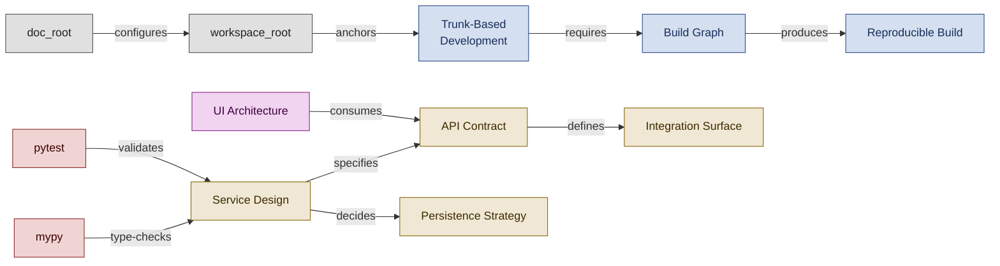

<!--
████          R E G N O L O G Y
    ██        Professional Services
████
    ██        professional_services@regnology.net
-->

# Tooling & Infrastructure

**Domain:** `tooling`
**Version:** 0.1.0
**Status:** candidate — pending HiC review
**Term Count:** 71 (60 existing + 11 new Jira/corporate-tooling candidates)
**Last Updated:** 2026-03-30

---

## Overview

Development environment setup, build automation, language-specific tooling (Python, Java, TypeScript), frontend/backend technology patterns, version control practices, repository structure artifacts, and configuration path variables. Covers the technical infrastructure that agents and humans operate within.

> The technical infrastructure layer — version control practices, build reliability, service/UI architecture, and Python tooling — that agents and humans operate within.

---

## Terms

### API Contract

Explicit specification of API endpoints, request/response formats, error handling, versioning, and behavioral guarantees

**Context:** Backend Architecture - Interface Definition
**Source:** backend-dev.agent.md
**Related:** Backend Benny, Service Design, Integration Surface
**Status:** canonical

---

### Asynchronous Human-Agent Coordination

The operational pattern in which agents and humans collaborate without requiring real-time presence, instead communicating through structured file artifacts in `work/human-in-charge/`. This enables agents to make autonomous progress, escalate blockers via files, and resume work when human responses arrive — suitable for AFK mode, multi-agent initiatives, and async tool environments. Cross-domain: primarily `tooling` (workflow infrastructure), also `doctrine-governance` and `orchestration`.

**Context:** tooling
**Source:** `doctrine/directives/040_human_in_charge_escalation_protocol.md`
**Related:** AFK Mode, Human in Charge, File-Based Orchestration, Frozen Task, Decision Request
**Status:** candidate

---

### black

Opinionated Python code formatter ensuring consistent code style with PEP 8 compliance

**Context:** Python Development - Code Formatting
**Source:** python-pedro.agent.md
**Related:** Python Pedro, ruff, Code Quality
**Status:** canonical

---

### Branch Age Warning

Automated alert when feature branch exceeds age threshold (8h warning, 24h maximum) to enforce short-lived branch discipline

**Context:** Version Control / Automation
**Source:** trunk-based-development.md
**Related:** Short-Lived Branch, Trunk-Based Development
**Status:** canonical

---

### Build Graph

Directed acyclic graph representing build dependencies, execution order, caching boundaries, and artifact relationships in CI/CD pipeline

**Context:** Build Automation - Dependency Management
**Source:** build-automation.agent.md
**Related:** DevOps Danny, CI/CD Pipeline, Reproducible Build
**Status:** canonical

---

### CODEOWNERS

A file placed at `.bitbucket/CODEOWNERS` in Bitbucket Cloud repositories that defines automatic reviewer assignments based on file path patterns, using team references from `.bitbucket/teams.yaml`. Bootstrap Bill configures this file during repository initialization to enforce code ownership for security-sensitive, infrastructure, and doctrine paths.

**Context:** tooling
**Source:** `doctrine/agents/bootstrap-bill.agent.md`, `doctrine/tactics/repository-initialization.tactic.md`
**Related:** Repository Initialization, Bootstrap Bill, Repository Scaffolding
**Status:** candidate

---

### Commit Checkpoint

Regular commit cadence (every 15-30 minutes) in autonomous work to create reversible progress points

**Context:** Version control practice
**Source:** autonomous-operation-protocol.tactic.md
**Related:** AFK Mode, Self-Observation Checkpoint
**Status:** canonical

---

### Compliance Profile

A Maven build profile (`<id>compliance</id>`) configured via the Maven Project Compliance Setup tactic that groups license header management (via `license-maven-plugin`), SBOM generation (via `cyclonedx-maven-plugin`), and coverage reporting (via `jacoco-maven-plugin`) into a single always-active profile for Regnology PS Java projects.

**Context:** tooling
**Source:** `doctrine/tactics/maven-project-compliance-setup.tactic.md`
**Related:** Regnology PS Branding Header, Java Jenny, Build Automation Specialist
**Status:** candidate

---

### Component Patterns

Reusable UI component designs with established structure, behavior, styling, and composition rules for consistent interface development

**Context:** Frontend Architecture - Reusability
**Source:** frontend.agent.md
**Related:** Frontend Freddy, UI Architecture, Design System
**Status:** canonical

---

### Design System

Collection of reusable components, patterns, guidelines, and assets enabling consistent, scalable UI development

**Context:** Frontend Architecture - Consistency
**Source:** frontend.agent.md
**Related:** Frontend Freddy, Component Patterns, UI Architecture
**Status:** canonical

---

### doc_root

Path variable in doctrine configuration pointing to documentation root directory (default 'docs') where architectural docs, guides, and reference materials reside

**Context:** Configuration - Path Variables
**Source:** bootstrap-bill.agent.md
**Related:** Doctrine Configuration, workspace_root, spec_root, output_root
**Status:** canonical

---

### Dual-Level Error Feedback

Error reporting pattern providing generic user-facing messages and detailed internal diagnostic logs

**Context:** Error communication
**Source:** input-validation-fail-fast.tactic.md
**Related:** Fail-Fast Validation, Reference Number
**Status:** canonical

---

### Dual-Trunk Model

Low-trust variant where agents commit to agent-trunk branch, humans review PRs to main, providing safety net during agent adoption phase

**Context:** Version Control / Trust Model
**Source:** trunk-based-development.md
**Related:** Trunk-Based Development, Human Review Gate
**Status:** canonical

---

### Fallback Strategy

Alternative approach when preferred tooling (fd, rg, ast-grep, etc.) is unavailable, using universally available alternatives (find, grep) with equivalent functionality

**Context:** Framework - Tooling
**Source:** Directive 013 (Tooling Setup & Fallbacks)
**Related:** Tool Suite, Escalation
**Status:** canonical

---

### Flaky Terminal Behavior

Unreliable or inconsistent terminal/shell interactions in agent-based workflows that require remediation techniques to ensure reliable command execution

**Context:** Framework - Terminal Operations
**Source:** Directive 001 (CLI and Shell Tooling)
**Related:** Remediation Technique
**Status:** canonical

---

### Graceful Degradation

Principle of providing fallback strategies for every tool to ensure agents can operate even when preferred tools unavailable

**Context:** Development Environment / Resilience
**Source:** tooling-setup-best-practices.md
**Related:** Tool Selection Rigor, Fallback Strategy
**Status:** canonical

---

### Integration Surface

Set of APIs, protocols, data formats, and contracts through which a system interacts with external systems or services

**Context:** Backend Architecture - External Integration
**Source:** backend-dev.agent.md, bootstrap-bill.agent.md
**Related:** Backend Benny, Bootstrap Bill, API Contract, SURFACES
**Status:** canonical

---

### mypy

Static type checker for Python that validates type hints and detects type-related errors before runtime

**Context:** Python Development - Type Safety
**Source:** python-pedro.agent.md
**Related:** Python Pedro, Type Hints, Type Checking
**Status:** canonical

---

### Narrative Architecture

The structural organization of a presentation's content flow — horizontal section transitions (H1 level, using `---`), vertical sub-topic slides (H2 level, using `--`), and information hierarchy — before any content is written. Narrative architecture is Slidedeck Stanislav's primary focus during the outlining phase. Cross-domain: primarily `tooling` (presentations), also relevant to `documentation`.

**Context:** tooling
**Source:** `doctrine/agents/slidedeck-stanislav.agent.md`
**Related:** Slidedeck Stanislav, Audience Persona Calibration, Style Execution Primer
**Status:** candidate

---

### output_root

Path variable in doctrine configuration pointing to generated artifacts directory (default 'output') for build products, reports, and exports

**Context:** Configuration - Path Variables
**Source:** bootstrap-bill.agent.md
**Related:** Doctrine Configuration, workspace_root, doc_root, Build Artifact
**Status:** canonical

---

### Performance Budget

Explicit constraints on response time, throughput, resource usage, or latency that backend services must satisfy

**Context:** Backend Architecture - Quality Attributes
**Source:** backend-dev.agent.md
**Related:** Backend Benny, Persistence Strategy, Service Design
**Status:** canonical

---

### Persistence Strategy

Architectural decision defining how data is stored, retrieved, updated, and maintained including database choice, schema design, and transaction boundaries

**Context:** Backend Architecture - Data Management
**Source:** backend-dev.agent.md
**Related:** Backend Benny, Service Design, Performance Budget
**Status:** canonical

---

### pytest

Python testing framework used for unit tests, integration tests, and acceptance tests with fixtures, parametrization, and coverage reporting

**Context:** Python Development - Testing
**Source:** python-pedro.agent.md
**Related:** Python Pedro, Test-First Development, Coverage Threshold
**Status:** canonical

---

### Regnology Internal License

The proprietary license (`regnology-internal`) applied to all Regnology Professional Services programming projects, defined by templates at `doctrine/templates/license/LICENSE` and `doctrine/templates/license/regnology-internal.properties`. Applied to source files via the Maven compliance profile or equivalent build-tool tactic.

**Context:** tooling
**Source:** `doctrine/directives/041_use_regnology_branding.md`, `doctrine/tactics/maven-project-compliance-setup.tactic.md`
**Related:** Compliance Profile, Regnology PS Branding Header, Version Pinning Strategy
**Status:** candidate

---

### Remediation Technique

Fallback workflow for handling unreliable terminal interactions by creating shell scripts, piping output to files, and capturing results from files instead of direct terminal interaction

**Context:** Framework - Terminal Operations
**Source:** Directive 001 (CLI and Shell Tooling)
**Related:** Bypass Check, Flaky Terminal Behavior
**Status:** canonical

---

### REPO_MAP

Structural artifact generated by Bootstrap Bill that documents repository topology, directory roles, key files, and navigation paths for multi-agent orientation

**Context:** Artifacts - Repository Structure
**Source:** bootstrap-bill.agent.md
**Related:** Bootstrap Bill, Repository Scaffolding, Topology Mapping, SURFACES, WORKFLOWS
**Status:** canonical

---

### Reproducible Build

Build process that produces identical artifacts from the same source inputs across different environments and time periods

**Context:** Build Automation - Reliability
**Source:** build-automation.agent.md
**Related:** DevOps Danny, Build Graph, CI/CD Pipeline
**Status:** canonical

---

### ruff

Fast Python linter replacing flake8, isort, pydocstyle for code quality checks and style enforcement

**Context:** Python Development - Code Quality
**Source:** python-pedro.agent.md
**Related:** Python Pedro, black, Code Quality
**Status:** canonical

---

### Service Design

Architectural process defining service boundaries, API contracts, integration patterns, and failure modes for backend systems

**Context:** Backend Architecture - System Design
**Source:** backend-dev.agent.md
**Related:** Backend Benny, API Contract, Integration Surface, Persistence Strategy
**Status:** canonical

---

### shared_assets

The canonical directory `docs/presentations/shared_assets/` that holds a single shared copy of all Regnology brand assets — CSS theme files, fonts, icons, logos, backgrounds — for all presentations in a repository. Individual presentation directories reference (not copy) these assets via relative import paths.

**Context:** tooling
**Source:** `doctrine/agents/slidedeck-stanislav.agent.md`
**Related:** Thin Shim Pattern, Slidedeck Stanislav, Source vs Distribution
**Status:** candidate

---

### Ship/Show/Ask Pattern

Flexible review pattern for trunk-based development: Ship (commit directly), Show (commit + notify for async review), Ask (branch + pre-merge review)

**Context:** Version Control / Review Pattern
**Source:** trunk-based-development.md
**Related:** Trunk-Based Development, Code Review Discipline
**Status:** canonical

---

### Short-Lived Branch

Feature branch with maximum lifetime of 24 hours (target 4-8h) to minimize integration risk and maintain trunk stability

**Context:** Version Control / Pattern
**Source:** trunk-based-development.md
**Related:** Trunk-Based Development, Branch Age Warning
**Status:** canonical

---

### spec_root

Path variable in doctrine configuration pointing to specification files directory (default 'specifications') where functional and technical specs are stored

**Context:** Configuration - Path Variables
**Source:** bootstrap-bill.agent.md
**Related:** Doctrine Configuration, workspace_root, doc_root, Specification
**Status:** canonical

---

### State Boundaries

Explicit divisions defining where application state is owned, how it flows between components, and mutation responsibilities

**Context:** Frontend Architecture - State Management
**Source:** frontend.agent.md
**Related:** Frontend Freddy, UI Architecture, Data Flow
**Status:** canonical

---

### Structural Artifact

Generated documentation or code that describes repository organization, workflows, or architectural patterns for orientation and navigation

**Context:** Artifacts - Repository Documentation
**Source:** bootstrap-bill.agent.md
**Related:** Bootstrap Bill, REPO_MAP, SURFACES, WORKFLOWS
**Status:** canonical

---

### SURFACES

Artifact documenting integration points, APIs, config files, and external dependencies discovered during repository bootstrapping

**Context:** Artifacts - Repository Structure
**Source:** bootstrap-bill.agent.md
**Related:** Bootstrap Bill, REPO_MAP, Integration Surface, API Contract
**Status:** canonical

---

### Thin Shim Pattern

A CSS architecture pattern for Reveal.js presentations in which each presentation's `theme/regnology.css` file contains only a single `@import` statement pointing to `shared_assets/theme/regnology.css`, with no copied or overridden CSS. This keeps brand changes centralized while each presentation gets automatic updates.

**Context:** tooling
**Source:** `doctrine/agents/slidedeck-stanislav.agent.md`
**Related:** Slidedeck Stanislav, shared_assets, Source vs Distribution
**Status:** candidate

---

### Tool Selection Rigor

Disciplined framework for choosing tools based on measurable criteria (usage frequency, performance improvement, maintenance activity, security posture)

**Context:** Development Environment / Best Practice
**Source:** tooling-setup-best-practices.md
**Related:** Tooling Necessity Check, Tooling Quality Assessment, Graceful Degradation
**Status:** canonical

---

### Trunk Health Dashboard

Monitoring visualization showing key trunk metrics (commit frequency, revert rate, test pass rate, time-to-fix) for stability assessment

**Context:** Version Control / Monitoring
**Source:** trunk-based-development.md
**Related:** Trunk Stability, Trunk-Based Development
**Status:** canonical

---

### Trunk Stability

Measure of main branch health (>95% test pass rate, <5% revert rate, <15 min time-to-fix) indicating system readiness for continuous deployment

**Context:** Version Control / Metrics
**Source:** trunk-based-development.md
**Related:** Trunk-Based Development, Trunk Health Dashboard
**Status:** canonical

---

### Trunk-Based Development

Branching strategy where all developers commit frequently to single shared branch (main), using short-lived feature branches (<24h) only for coordinated changes

**Context:** Version Control / Collaboration Pattern
**Source:** trunk-based-development.md
**Related:** Short-Lived Branch, Trunk Stability, Branch Age Warning
**Status:** canonical

---

### Type Checking

Static analysis validation using mypy (Python) or similar tools to ensure type safety before code acceptance

**Context:** Quality Gates - Code Quality
**Source:** python-pedro.agent.md
**Related:** Self-Review Protocol, mypy, Type Hints, Type Safety
**Status:** canonical

---

### Type Hints

Python 3.9+ annotations specifying expected types for function parameters, return values, and variables to enable static analysis

**Context:** Python Development - Type Safety
**Source:** python-pedro.agent.md
**Related:** Python Pedro, mypy, Type Checking, Type Safety
**Status:** canonical

---

### UI Architecture

Structural design of user interface including component hierarchies, state boundaries, data flow patterns, and interaction flows

**Context:** Frontend Architecture
**Source:** frontend.agent.md
**Related:** Frontend Freddy, Component Patterns, State Boundaries, Design System
**Status:** canonical

---

### Version Pinning Strategy

Tiered approach balancing stability with updates (Pinned Versions for API-sensitive tools, Package Manager for stable tools, Latest Stable for rapidly evolving tools)

**Context:** Development Environment / Configuration
**Source:** tooling-setup-best-practices.md
**Related:** Configuration Consistency, Tool Selection Rigor
**Status:** canonical

---

### WORKFLOWS

Artifact documenting build, test, CI/CD, and deployment workflows discovered during repository bootstrapping

**Context:** Artifacts - Repository Structure
**Source:** bootstrap-bill.agent.md
**Related:** Bootstrap Bill, REPO_MAP, CI/CD Pipeline, Build Graph
**Status:** canonical

---

### workspace_root

Path variable in doctrine configuration pointing to task orchestration workspace directory (default 'work') where agents create work logs, coordination artifacts, and intermediate outputs

**Context:** Configuration - Path Variables
**Source:** bootstrap-bill.agent.md
**Related:** Doctrine Configuration, doc_root, spec_root, output_root
**Status:** canonical

---

### Acunetix

Dynamic application security testing (DAST) tool used by the Regnology AppSec team to scan running applications for vulnerabilities. Complements SAST tools (SonarQube, Fortify) by testing the application at runtime rather than at the source code level.

**Context:** tooling — AppSec
**Source:** Confluence CAS/AppSec — [Application Security & License Compliance](https://confluence.regnology.net/spaces/CAS/pages/221261711)
**Related:** DAST, SonarQube, Fortify, AppSec Compliance
**Status:** candidate

---

### Agile Crypto

Design pattern for cryptographic implementations in which algorithms are encapsulated behind adapters or interfaces, so that when an algorithm becomes cryptographically weak it can be swapped without changing calling code. Mandated by Regnology AppSec as part of the encryption-by-default requirement.

**Context:** tooling — AppSec / Secure Design
**Source:** Confluence CAS/AppSec — [Standard Security Requirements](https://confluence.regnology.net/spaces/CAS/pages/72741821); [Five Golden Rules](https://confluence.regnology.net/spaces/CAS/pages/59083381)
**Related:** Encryption by Default, Secure Design Principles, AppSec Compliance
**Status:** candidate

---

### CycloneDX

Open standard for Software Bill of Materials (SBOM) generation. Used in Regnology PS projects via `cyclonedx-maven-plugin` (Java) and `cyclonedx-py` (Python) to produce machine-readable dependency inventories in JSON and XML formats. Two variants are generated: a full aggregate BOM and a runtime-only `lucy-bom` consumed by the Lucy license compliance tool.

**Context:** tooling — AppSec / Build
**Source:** Confluence CAS/AppSec — [Application Security & License Compliance](https://confluence.regnology.net/spaces/CAS/pages/221261711)
**Related:** SBOM, DependencyTrack, Lucy, Compliance Profile, AppSec Compliance
**Status:** candidate

---

### DependencyTrack

Continuous software composition analysis (SCA) platform used by Regnology AppSec to monitor third-party component vulnerabilities across all products. Receives CycloneDX SBOMs from CI pipelines and enforces a zero-tolerance policy for Critical, High, and Medium CVEs. Integrated into Jenkins pipelines via `dependencyTrackPublisher`.

**Context:** tooling — AppSec / SCA
**Source:** Confluence CAS/AppSec — [Requirements for External Contractors](https://confluence.regnology.net/spaces/CAS/pages/221276347)
**Related:** CycloneDX, SBOM, SCA, CVE, AppSec Compliance
**Status:** candidate

---

### FindSecBugs

SpotBugs plugin providing OWASP-aligned security rules for Java bytecode analysis. Detects injection vulnerabilities, insecure cryptography, path traversal, and other security anti-patterns. Used in Regnology PS Java projects alongside SpotBugs with `effort: Max` and `threshold: Medium`.

**Context:** tooling — AppSec / SAST
**Source:** Confluence CAS/AppSec — [Standard Security Requirements](https://confluence.regnology.net/spaces/CAS/pages/72741821)
**Related:** SpotBugs, SonarQube, SAST, OWASP Top 10, AppSec Compliance
**Status:** candidate

---

### Fortify

Enterprise SAST tool used by the Regnology AppSec team for deep code security analysis, complementing SonarQube. Vulnerabilities raised by Fortify are treated as defects and must be addressed by the responsible development team. Access can be granted to external developers upon request.

**Context:** tooling — AppSec / SAST
**Source:** Confluence CAS/AppSec — [Security Issues Review](https://confluence.regnology.net/spaces/CAS/pages/72742361); [Requirements for External Contractors](https://confluence.regnology.net/spaces/CAS/pages/221276347)
**Related:** SonarQube, SAST, Security Gate, AppSec Compliance
**Status:** candidate

---

### Fossology

Open source license analysis tool used by the Regnology AppSec team for deep license scanning of third-party components, including detection of hidden or embedded licenses. Complements Lucy for license compliance.

**Context:** tooling — AppSec / License Compliance
**Source:** Confluence CAS/AppSec — [Application Security & License Compliance](https://confluence.regnology.net/spaces/CAS/pages/221261711)
**Related:** Lucy, SCA, SBOM, Third Party Software Policy, AppSec Compliance
**Status:** candidate

---

### Lucy

Regnology's OSS license compliance tool. Consumes the runtime-only CycloneDX SBOM variant (`lucy-bom`) — which excludes provided and system scope dependencies — to assess license obligations for shipped software. Part of the mandatory AppSec toolchain.

**Context:** tooling — AppSec / License Compliance
**Source:** Confluence CAS/AppSec — [Application Security & License Compliance](https://confluence.regnology.net/spaces/CAS/pages/221261711)
**Related:** Fossology, CycloneDX, SBOM, Third Party Software Policy, AppSec Compliance
**Status:** candidate

---

### lucy-bom

The runtime-only CycloneDX SBOM variant generated by Regnology PS Java projects. Excludes `provided` and `system` scope dependencies (i.e., only includes what is actually shipped at runtime). Consumed by the Lucy license compliance tool. Distinct from the full aggregate `bom.json` submitted to DependencyTrack.

**Context:** tooling — AppSec / Build
**Source:** Confluence CAS/AppSec — [Application Security & License Compliance](https://confluence.regnology.net/spaces/CAS/pages/221261711)
**Related:** CycloneDX, SBOM, Lucy, DependencyTrack, Compliance Profile
**Status:** candidate

---

### SBOM (Software Bill of Materials)

Machine-readable inventory of all software components, libraries, and dependencies in a project, including version, license, and provenance information. Mandated by Regnology AppSec for all products. Generated in CycloneDX format (JSON + XML) per build and submitted to DependencyTrack for vulnerability monitoring and to Lucy for license compliance.

**Context:** tooling — AppSec / Compliance
**Source:** Confluence CAS/AppSec — [Application Security & License Compliance](https://confluence.regnology.net/spaces/CAS/pages/221261711)
**Related:** CycloneDX, DependencyTrack, Lucy, lucy-bom, SCA, AppSec Compliance
**Status:** candidate

---

### SCA (Software Composition Analysis)

Security practice of identifying and assessing vulnerabilities and license risks in third-party open source components used by a project. At Regnology, SCA is performed by DependencyTrack (vulnerabilities) and Lucy/Fossology (license compliance), fed by CycloneDX SBOMs.

**Context:** tooling — AppSec
**Source:** Confluence CAS/AppSec — [Application Security & License Compliance](https://confluence.regnology.net/spaces/CAS/pages/221261711)
**Related:** DependencyTrack, Lucy, SBOM, CVE, Third Party Software Policy, AppSec Compliance
**Status:** candidate

---

### SonarQube

Primary SAST platform used across Regnology for code quality and security analysis. Integrated into CI pipelines via `sonar-maven-plugin`. Security Gate definition: build fails when Blocker Issues > 0 OR Critical Issues > 0 OR any Vulnerability > 0. Supports branch analysis and pull request decoration. Hosted at `sonar.regnology.net`.

**Context:** tooling — AppSec / SAST
**Source:** Confluence CAS/AppSec — [Security Gate and Issue Severity](https://confluence.regnology.net/spaces/CAS/pages/29789349)
**Related:** SAST, Security Gate, Fortify, FindSecBugs, AppSec Compliance
**Status:** candidate

---

### SpotBugs

Java bytecode static analysis tool that detects bugs and security vulnerabilities. Used in Regnology PS projects with `effort: Max`, `threshold: Medium`, and `failOnError: true`. Extended with the FindSecBugs plugin for OWASP-aligned security rules. Runs at the Maven `verify` phase.

**Context:** tooling — AppSec / SAST
**Source:** Confluence CAS/AppSec — [Standard Security Requirements](https://confluence.regnology.net/spaces/CAS/pages/72741821)
**Related:** FindSecBugs, SonarQube, SAST, OWASP Top 10, AppSec Compliance
**Status:** candidate

---

### Definition of Done (DoD)

The set of conditions that must be satisfied before a Jira Epic or Story is considered complete and eligible for integration into a Delivery Workload. Per the Regnology Development Framework, DoD for an Epic or Story requires: all child items at "Ready for Integration" / "Done" status; a linked Release Note Document issue at "In PO Review" status (or "No Documentation Required" explicitly set); a linked Test Execution with status "PASS" (or "No Test Required" explicitly set); Fix Version/s set; and PO Acceptance granted. DoD is a formal workflow gate — the transition to "Ready for Integration" is blocked until all conditions are met.

**Context:** tooling — Corporate Jira Workflow
**Source:** Confluence PD Development Framework — Issue Type Epic (id: 21571105), Issue Type Story (id: 21571110)
**Related:** Definition of Ready, PO Acceptance, Work Item Type, Jira Workflow Gate, Release Note Document
**Status:** candidate

---

### Definition of Ready (DoR)

The set of conditions that must be satisfied before a Jira Epic or Story can be pulled for implementation (transition from New → Ready). Per the Regnology Development Framework, DoR requires: Description field not empty; Story Points not empty (except Expedite items); Affects Version/s set (Stories: except Defects); Priority set (Stories: except Defects). A ticket that does not meet DoR cannot enter the implementation workflow. The DoR makes the Context, Scope, and Acceptance Criteria sections of ticket templates formally mandatory, not advisory.

**Context:** tooling — Corporate Jira Workflow
**Source:** Confluence PD Development Framework — Issue Type Epic (id: 21571105), Issue Type Story (id: 21571110)
**Related:** Definition of Done, Acceptance Criteria, Jira Workflow Gate, Work Item Type
**Status:** candidate

---

### Epic (Jira)

A Jira issue type representing an increment of work that may span multiple iterations, owned by the Product Owner and Engineering Manager. Epics are broken into Stories. An Epic must pass the Definition of Ready before implementation begins and the Definition of Done before it is Ready for Integration. In the Regnology corporate hierarchy, Epics sit below Work Packages and above Stories. Every Epic carries a mandatory Work Item Type classification.

**Context:** tooling — Corporate Jira Hierarchy
**Source:** Confluence PD Development Framework — Issue Type Epic (id: 21571105)
**Related:** Work Package, Story, Definition of Ready, Definition of Done, Work Item Type, PO Acceptance
**Status:** candidate

---

### Jira Workflow Gate

A formal transition condition in Jira that blocks a status change until all mandatory fields and linked issues satisfy defined requirements. Workflow gates enforce quality standards automatically — they cannot be bypassed without setting explicit exception flags (e.g. "No Documentation Required", "No Test Required", "Expedite"). The two primary gates in the Regnology Development Framework are the Definition of Ready (New → Ready) and the Definition of Done (Implemented → Ready for Integration).

**Context:** tooling — Corporate Jira Workflow
**Source:** Confluence PD Development Framework — Processes & Workflows in JIRA (id: 29800786)
**Related:** Definition of Ready, Definition of Done, PO Acceptance, Expedite
**Status:** candidate

---

### PO Acceptance

A formal sign-off step in the Regnology Jira workflow in which the Product Owner reviews and accepts a completed Epic or Story before it transitions to "Ready for Integration". PO Acceptance is a mandatory DoD condition — it cannot be skipped. It represents the PO's confirmation that the delivered increment meets the acceptance criteria defined at the Definition of Ready stage.

**Context:** tooling — Corporate Jira Workflow
**Source:** Confluence PD Development Framework — Issue Type Epic (id: 21571105), Issue Type Story (id: 21571110)
**Related:** Definition of Done, Definition of Ready, Acceptance Criteria, Jira Workflow Gate
**Status:** candidate

---

### Release Note Document (Jira)

A Jira Document issue of type "Release Note" that must be linked to every Epic and Story before it can progress to "In PO Review" or "Ready for Integration". The Release Note documents the delivered change for customers. Its absence blocks the DoD transition unless "No Documentation Required" is explicitly set. Release Notes are quality-checked by the Documentation team as part of the Quality Gate Rollout.

**Context:** tooling — Corporate Jira Workflow / Documentation
**Source:** Confluence PD Development Framework — Issue Type Epic (id: 21571105), Issue Type Story (id: 21571110)
**Related:** Definition of Done, PO Acceptance, Quality Gate Rollout, Documentation
**Status:** candidate

---

### Story (Jira)

A Jira issue type representing a user-visible feature or behaviour, deliverable within one iteration (e.g. Sprint). Stories are broken from Epics by the Product Owner and refined with the squad. A Story must satisfy the Definition of Ready before implementation and the Definition of Done (including PO Acceptance) before it is Ready for Integration. Stories carry a mandatory Work Item Type classification and follow the User Story format: "As a {role}, I want {action}, so that {outcome}."

**Context:** tooling — Corporate Jira Hierarchy
**Source:** Confluence PD Development Framework — Issue Type Story (id: 21571110), Artefacts (id: 14748284)
**Related:** Epic, Sub-Task, Definition of Ready, Definition of Done, Work Item Type, PO Acceptance
**Status:** candidate

---

### Sub-Task (Jira)

The smallest unit of work in the Regnology Jira hierarchy, broken down from a Story by the development team. Sub-tasks are internal — they are not user-visible deliverables. Per the Regnology Development Framework, a sub-task should take no longer than **half a day (3 hours net)**. Sub-tasks are prefixed with a type tag in their Summary (`[DEV]`, `[TEST]`, `[CONFIG]`, `[DESIGN]`, `[REVIEW]`, `[DOC]`, `[SPIKE]`, `[ALIGN]`) to signal intent at a glance on boards.

**Context:** tooling — Corporate Jira Hierarchy
**Source:** Confluence PD Development Framework (id: 24852036), Artefacts (id: 14748284)
**Related:** Story, Epic, Sub-task Type Prefix
**Status:** candidate

---

### Sub-task Type Prefix

A bracketed tag prepended to a Jira Sub-task Summary to classify the type of work at a glance. Defined values: `[DEV]` (development), `[TEST]` (test creation/execution), `[CONFIG]` (configuration/infrastructure), `[DESIGN]` (design/wireframe), `[REVIEW]` (code or QA review), `[DOC]` (documentation), `[SPIKE]` (time-boxed investigation), `[ALIGN]` (alignment/coordination). Consistent use of prefixes enables board filtering, changelog generation, and effort analysis by work type.

**Context:** tooling — Corporate Jira Conventions
**Source:** doctrine/templates/tickets/SUBTASK_TEMPLATE.md, doctrine/approaches/regnology-jira-approach.md
**Related:** Sub-Task, Spike, Jira Workflow Gate
**Status:** candidate

---

### Ticket as Contract

The principle that a Jira ticket is not a scratchpad but a contract between author and reader — a future team member, stakeholder, or AI agent who must understand the work without a verbal briefing. Every ticket must answer three questions without ambiguity: Why does this work exist? What is in and out of scope? How do we know it is done? This principle is the foundation of the Regnology Jira approach and directly motivates the mandatory Context, Scope, and Acceptance Criteria sections in all ticket templates.

**Context:** tooling — Corporate Jira Conventions
**Source:** doctrine/approaches/regnology-jira-approach.md
**Related:** Definition of Ready, Acceptance Criteria, Traceability Chain, Epic, Story
**Status:** candidate

---

### Work Item Type

A mandatory classification field on every Jira Epic and Story in the Regnology Development Framework. Classifies the nature of the work for portfolio analysis and effort allocation. Values: **Net New Feature** (new customer value), **Regulatory Update / Service** (compliance with regulatory changes under existing contracts), **Keep Lights On — Implementation** (satisfying existing contractual obligations), **Keep Lights On — Testing**, **Keep Lights On — Documentation**, **Defect** (bug fix classified by PO or customer), **Invest to Improve** (internal improvement with no immediate customer-facing value). Omitting this field creates reporting gaps and blocks portfolio-level analysis.

**Context:** tooling — Corporate Jira Fields
**Source:** Confluence PD Development Framework — Work Item Type (id: 209761241)
**Related:** Epic, Story, Definition of Ready, Net New Feature, Defect
**Status:** candidate

---

### Work Package (Jira)

An optional Jira issue type that acts as a container for Epics within an Initiative. A Work Package is a large Epic that may span multiple releases and serves two purposes: structuring large Initiatives into manageable delivery packages for the PM, and bundling activities that stretch across several releases. Work Packages represent a possible hand-over point between PM and PO. In the Regnology corporate hierarchy, Work Packages sit below Initiatives and above Epics.

**Context:** tooling — Corporate Jira Hierarchy
**Source:** Confluence PD Development Framework (id: 24852036), Artefacts (id: 14748284)
**Related:** Initiative, Epic, Story, PO Acceptance
**Status:** candidate

---

## Cross-Domain References

- **Commit Checkpoint** → [`orchestration`](../orchestration/README.md): Version control cadence for autonomous operation
- **AppSec Compliance** → [`development-practices`](../development-practices/README.md): Secure coding standards, design principles, and vulnerability handling processes
- **Security Gate** → [`development-practices`](../development-practices/README.md): Gate definition and severity thresholds
- **OWASP Top 10** → [`development-practices`](../development-practices/README.md): Vulnerability taxonomy used by SAST tools

---

*All terms marked `status: candidate` are proposed terminology pending Human-in-Charge review.*
*Part of [`doctrine/glossary/`](../README.md) — Regnology Professional Services Agent Framework*
