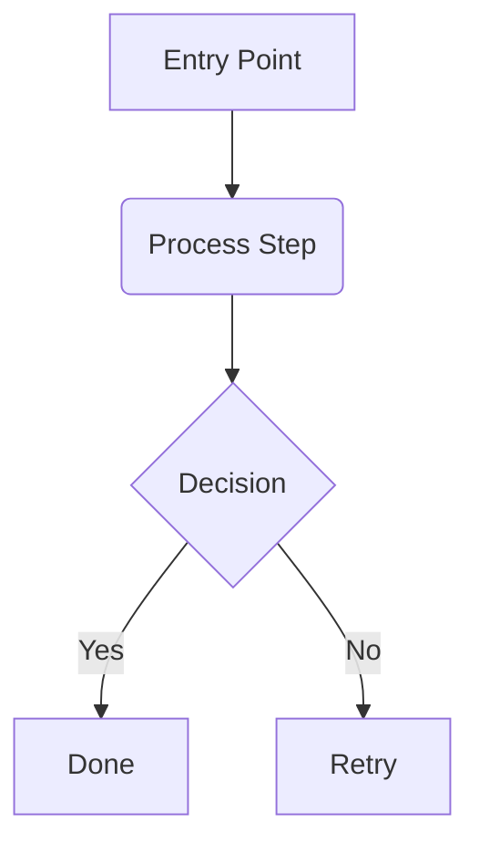

# Mermaid Diagramming Style Guide

**Version:** 1.1.0
**Status:** Active
**Author:** Diagram Daisy
**Last Updated:** 2026-03-17

---

## Purpose

Standards for creating Mermaid diagrams within Regnology Professional Services repositories.
Ensures visual consistency with the Regnology brand palette and structural consistency across diagram types.

## Brand Colour Reference

All colours below are sourced from the official palette (`doctrine/templates/branding/COLOR_PALETTE.md`).

| Token | Name | Hex | Text | Usage |
|---|---|---|---|---|
| `primary` | Petrol blue | `#012D3F` | white | Entry points, main entities, titles |
| `secondary` | Regnology green dark | `#06A74E` | white | Process steps, positive outcomes, PS-owned systems |
| `accent` | Hay yellow | `#EC9D1C` | `#333` | Decisions, warnings, critical highlights |
| `neutral` | Ice grey | `#F5F7F7` | `#333` | Supporting steps, context nodes |
| `muted` | White / Stone text | `#FFFFFF` / `#747A7A` | stone | Optional, inactive, or out-of-scope nodes |
| `external` | Ice blue | `#1788BE` | white | External systems, third-party integrations |

## Required `classDef` Block

Paste this block **verbatim** at the top of every non-C4 Mermaid diagram (flowcharts, sequences, state diagrams, etc.):

```mermaid
%% ── Regnology Brand Styling ──────────────────────────────────────
classDef primary   fill:#012D3F,stroke:#011E2B,stroke-width:2px,color:#fff
classDef secondary fill:#06A74E,stroke:#057A38,stroke-width:1px,color:#fff
classDef accent    fill:#EC9D1C,stroke:#C07B00,stroke-width:2px,color:#333
classDef neutral   fill:#F5F7F7,stroke:#E1E6E6,stroke-width:1px,color:#333
classDef muted     fill:#ffffff,stroke:#747A7A,stroke-width:1px,color:#747A7A
classDef external  fill:#1788BE,stroke:#126E9A,stroke-width:1px,color:#fff
```

Apply classes to nodes using the `:::className` suffix:



## C4 Diagrams — Use PlantUML Instead

**Mermaid's C4 support is experimental and poorly supported.** Known limitations:

- No stable `classDef` styling — C4 elements require a separate `%%init%%` theming mechanism that conflicts with standard Mermaid styling.
- Limited element types — Mermaid C4 lacks support for several C4 model elements (e.g., Component_Db, Deployment nodes).
- Rendering inconsistencies — layout and label placement vary significantly across renderers (mmdc, live editor, VS Code preview).
- No nested boundary support — Mermaid cannot express nested system/container boundaries cleanly.
- Poor tooling integration — many Mermaid renderers do not support the C4 diagram type at all.

**Preferred tool for C4 diagrams: PlantUML** with the [C4-PlantUML](https://github.com/plantuml-stdlib/C4-PlantUML) standard library. See `doctrine/styleguides/diagramming/plantuml.md` for the full style guide and C4 examples.

### Legacy Mermaid C4 (existing diagrams only)

If you encounter existing Mermaid C4 diagrams, the Regnology theme configuration for them is maintained in this directory for rendering purposes:

| File | Role |
|---|---|
| `regnology-c4.config.json` | Mermaid C4 theme config |
| `render-c4.sh` | Render script — injects the theme via `mmdc` |
| `regnology-c4-theme.md` | Full C4 colour-mapping documentation |

Do **not** create new C4 diagrams in Mermaid. Migrate to PlantUML when updating existing ones.

## Diagram Type Guidelines

### Flowcharts (`graph` / `flowchart`)

- Default orientation: **TD** (top-down) for process flows, **LR** (left-right) for pipelines.
- Maximum **10 nodes** per diagram. Split larger flows into linked sub-diagrams.
- Avoid crossing lines — reorder node declarations to minimise visual clutter.
- Use `subgraph` for bounded contexts or system boundaries.

### Sequence Diagrams

- Name participants with meaningful domain terms, not abbreviations.
- Use `activate` / `deactivate` to show lifeline scope.
- Keep interactions sequential and linear; avoid deeply nested alt/opt blocks.

### State Diagrams

- Use `[*]` for start/end states.
- Label transitions with the triggering event or condition.
- Group related states with `state "name" as alias`.

### Class Diagrams

- Prefer domain-driven names (see `doctrine/styleguides/domain-driven-naming.md`).
- Show relationships (inheritance, composition, association) with correct Mermaid arrows.
- Limit to the bounded context relevant to the discussion.

### Entity-Relationship Diagrams

- Use Mermaid ER syntax (`erDiagram`).
- Label relationships with cardinality and verb phrases.
- Keep to one bounded context per diagram.

## General Rules

1. **One idea per diagram.** If you need to explain multiple concepts, use separate diagrams.
2. **Source files use `.mermaid` extension** for standalone diagrams, or embed in Markdown fenced blocks with `mermaid` language tag.
3. **Alt text is mandatory** when embedding rendered diagrams as images.
4. **Avoid inline `%%init%%` blocks** in non-C4 diagrams. Use `classDef` for styling.
5. **Commit source, not screenshots.** Diagrams are code — they belong in version control as text.
6. **Cross-link from documentation.** Every diagram should be referenced from at least one doc in `doctrine/docs/architecture/` or an ADR.

## Rendering

### CLI (mermaid-cli)

```bash
npx -p @mermaid-js/mermaid-cli mmdc -i diagram.mermaid -o diagram.svg
```

### IDE Preview

- **VS Code / Cursor:** Install the [Markdown Preview Mermaid Support](https://marketplace.visualstudio.com/items?itemName=bierner.markdown-mermaid) extension.
- **IntelliJ:** Built-in Mermaid support in Markdown previews (2023.2+).

## Related Resources

| Resource | Location |
|---|---|
| PlantUML style guide | `doctrine/styleguides/diagramming/plantuml.md` |
| C4 theme config | `doctrine/styleguides/diagramming/regnology-c4.config.json` |
| C4 theme documentation | `doctrine/styleguides/diagramming/regnology-c4-theme.md` |
| Mermaid classDef template | `doctrine/templates/diagramming/themes/mermaid-regnology.md` |
| PlantUML templates & examples | `doctrine/templates/diagramming/` |
| Regnology colour palette | `doctrine/templates/branding/COLOR_PALETTE.md` |
| Diagramming approach | `doctrine/approaches/design_diagramming-incremental_detail.md` |
| Directive 041 (Branding) | `doctrine/directives/041_use_regnology_branding.md` |
