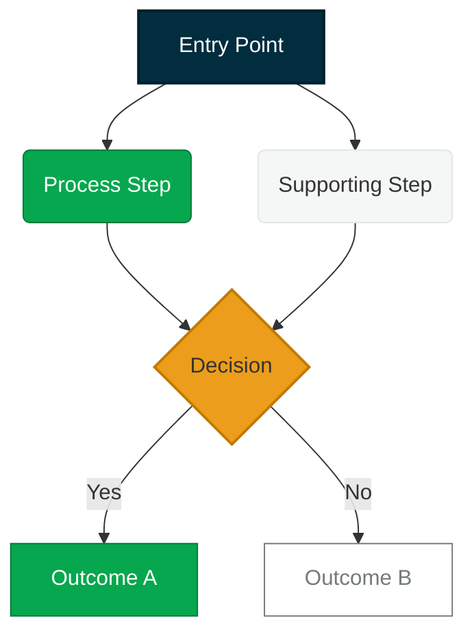

# Mermaid Diagram Theme — Regnology

_Version: 1.0.0_

Regnology brand colors expressed as Mermaid `classDef` declarations. Include this block at the top of every Mermaid diagram to ensure brand-consistent visuals.

## Brand Class Definitions

## Class Reference

| Class | Fill | Usage |
|---|---|---|
| `primary` | Petrol blue `#012D3F` | Entry points, main entities, titles |
| `secondary` | Regnology green `#06A74E` | Process steps, positive outcomes |
| `accent` | Hay yellow `#EC9D1C` | Decisions, critical highlights, warnings |
| `neutral` | Ice grey `#F5F7F7` | Supporting steps, context nodes |
| `muted` | White `#ffffff` / stone text | Optional / inactive / out-of-scope nodes |

## Usage Instructions (for Diagram Daisy)

1. Copy the `classDef` block verbatim into every new diagram.
2. Apply classes using the `:::className` suffix on each node.
3. Keep orientation **TD** (top-down) for flows and **LR** (left-right) for pipelines.
4. Maximum 10 nodes per diagram. If more are needed, split into sub-diagrams.
5. Avoid crossing lines — reorganize node order to keep the layout clean.
6. Do not use Mermaid's built-in themes (`%%{init: ...}%%`) alongside these class definitions; they conflict.

## Handoff Note

When Editor Eddy identifies a slide that needs a diagram, the handoff prompt to Diagram Daisy should include:

> "Follow the Mermaid style guide at `doctrine/styleguides/diagramming/mermaid.md`. Apply the `classDef` block and assign classes to all nodes. For C4 diagrams, use the render script and theme from `doctrine/styleguides/diagramming/`."
