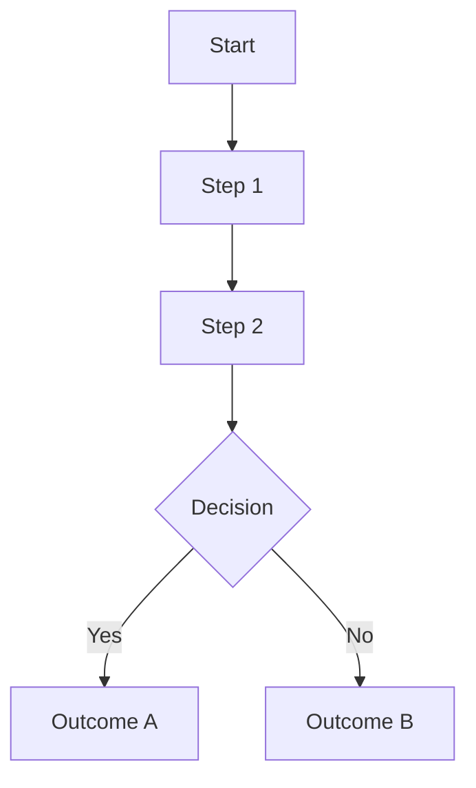

<!--
+----------------------------------------------------+
|████          R E G N O L O G Y                     |
|    ██        Professional Services                 |
|████                                                |
|    ██        professional_services@regnology.net   |
+----------------------------------------------------+

Property of Regnology Group GmbH - All Rights Reserved
              FOR INTERNAL USE ONLY
-->

<!-- SLIDE: Title -->
<!-- .slide: data-background-image="assets/background_main_slide.png" data-background-size="cover" class="regnology-cover-slide" -->
# Presentation Title Here

**Subtitle or tagline**

_Professional Services · 2026_

---

<!-- SLIDE: Agenda -->
## Agenda

1. Section One
2. Section Two
3. Section Three
4. Next Steps

Notes:
Welcome the audience. Briefly introduce what this presentation covers and what they will take away.

---

<!-- SLIDE: Section divider -->
# 1. Section One

_A short supporting line._

--

<!-- SLIDE: Content slide — bullets -->
## Slide Title

- Point 1: clear and concise.
- Point 2: supporting detail.
- Point 3: actionable outcome.

Notes:
Expand on each point here. Add context, examples, and the "why" behind the content on this slide.

--

<!-- SLIDE: Content slide — info boxes (three columns) -->
## Key Themes

  

    <h3>Theme One</h3>
    
Short supporting line.

    <ul>
      <li>Detail A</li>
      <li>Detail B</li>
    </ul>
  

  

    <h3>Theme Two</h3>
    
Short supporting line.

    <ul>
      <li>Detail A</li>
      <li>Detail B</li>
    </ul>
  

  

    <h3>Theme Three</h3>
    
Short supporting line.

    <ul>
      <li>Detail A</li>
      <li>Detail B</li>
    </ul>
  

Notes:
Describe each theme. Highlight the most important of the three if applicable.

--

<!-- SLIDE: Content slide — two columns -->
## Comparison

  

    <h3>Option A</h3>
    <ul class="small-text-list">
      <li>Characteristic 1</li>
      <li>Characteristic 2</li>
      <li>Characteristic 3</li>
    </ul>
  

  

    <h3>Option B</h3>
    <ul class="small-text-list">
      <li>Characteristic 1</li>
      <li>Characteristic 2</li>
      <li>Characteristic 3</li>
    </ul>
  

Notes:
Explain the trade-offs or differences between the two options. Guide the audience toward a conclusion if applicable.

--

<!-- SLIDE: Content slide — blockquote -->
## Key Statement

> "Insert a meaningful, concise quote or statement here."

_— Source or author_

Notes:
Contextualise the quote. Explain why this matters to the audience.

--

<!-- SLIDE: Content slide — diagram (created by Diagram Daisy) -->
## Process / Flow

_[Diagram: replace the placeholder below with the output from Diagram Daisy]_

Notes:
Walk the audience through the diagram step by step. Highlight the decision point and what each outcome means in practice.

---

<!-- SLIDE: Section divider -->
# 2. Section Two

_A short supporting line._

--

<!-- SLIDE: Content slide — table -->
## Summary Table

| Item       | Description                   | Status                                               |
|------------|-------------------------------|------------------------------------------------------|
| **Item 1** | Short description of item 1   | Active |
| **Item 2** | Short description of item 2   | Beta     |
| **Item 3** | Short description of item 3   | WIP       |

Notes:
Walk through the table rows. Focus on the most impactful items and explain the status values.

---

<!-- SLIDE: Section divider -->
# 3. Section Three

_A short supporting line._

--

<!-- SLIDE: Content slide — solution boxes -->
## Our Approach

  

    <h4>Element One</h4>
    
Short description of what this brings.

  

  

    <h4>Element Two</h4>
    
Short description of what this brings.

  

  

    <h4>Element Three</h4>
    
Short description of what this brings.

  

Notes:
Explain why this approach was chosen and how the three elements complement each other.

---

<!-- SLIDE: Next steps -->
# 4. Next Steps

--

## Next Steps

- Action 1: Owner / Team.
- Action 2: Owner / Team.
- Action 3: Owner / Team.

Notes:
Be specific about who owns each next step and what the expected timeline is.

---

<!-- SLIDE: Closing / Thank you -->
<!-- .slide: data-background-image="assets/background_main_slide.png" data-background-size="cover" class="regnology-cover-slide" -->
# Thank You

Questions?

_professional_services@regnology.net_
