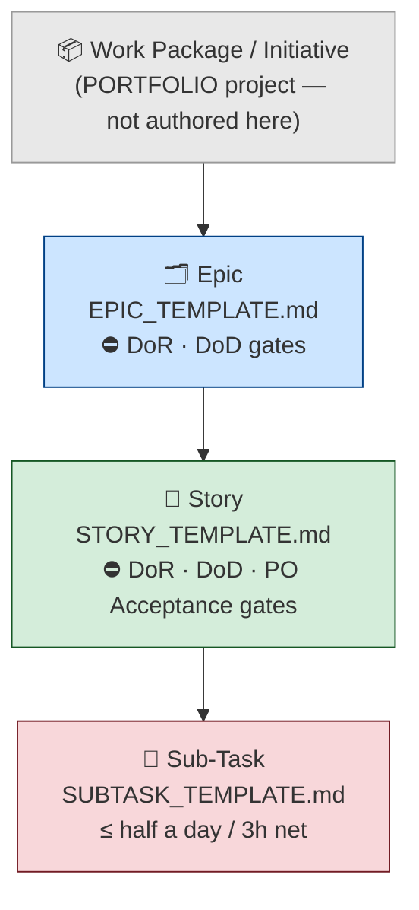

# Ticket Templates

**Version:** 1.2.0
**Last Updated:** 2026-03-30
**Governed by:** [Approach: Structured Issue Tracking with Jira](../../approaches/regnology-jira-approach.md), [Directive 043: Use Corporate Tooling](../../directives/043_use_corporate_tooling.md)

---

## Purpose

These templates standardise how work is described in Jira across Regnology PS projects. They enforce traceability, explicit scope, and binary acceptance criteria at each level of the issue hierarchy.

---

## Hierarchy

The templates map to the canonical Regnology corporate hierarchy:



| Level | Template | Audience | Grain |
|---|---|---|---|
| Epic (Deliverable) | [EPIC_TEMPLATE.md](EPIC_TEMPLATE.md) | Leadership, Stakeholders, Initiative Owners | Why, What, How (strategic) |
| Story (Work Item) | [STORY_TEMPLATE.md](STORY_TEMPLATE.md) | Initiative Owners, Developers, Analysts | What (user-facing), Acceptance Criteria |
| Sub-Task (Step) | [SUBTASK_TEMPLATE.md](SUBTASK_TEMPLATE.md) | Developers, QA | How (implementation), Done When |
| Transition gate | [DOD_DOR_CHECKLIST.md](DOD_DOR_CHECKLIST.md) | All — used at status transition time | DoR (New→Ready) · DoD (→Ready for Integration) |

Each description template is provided in two formats:
- **Markdown** — for local documentation, review, and version control
- **Jira wiki markup** — for direct paste into Jira Description fields

---

## Quality Gates

The Regnology Development Framework enforces two mandatory transition gates on Epics and Stories. Templates are structured to satisfy them:

### Definition of Ready (DoR) — New → Ready

| Requirement | Template section |
|---|---|
| Description not empty | All sections — minimum: Context + Scope + Acceptance Criteria |
| Story Points set | Set before transitioning to Ready |
| Affects Version/s set | Set before transitioning to Ready (Stories: except Defects) |
| Priority set | Set before transitioning to Ready (Stories: except Defects) |

### Definition of Done (DoD) — → Ready for Integration

| Requirement | Notes |
|---|---|
| All child items at "Ready for Integration" / "Done" | |
| Linked Release Note Document at "In PO Review" status | Unless "No Documentation Required" explicitly set |
| Linked Test Execution with status "PASS" | Unless "No Test Required" explicitly set |
| Fix Version/s set | |
| PO Acceptance granted | Formal sign-off by Product Owner |

### Work Item Type (Mandatory Field)

Every Epic and Story must carry a **Work Item Type** classification. Choose from:
`Net New Feature` · `Regulatory Update / Service` · `Keep Lights On — Implementation` · `Keep Lights On — Testing` · `Keep Lights On — Documentation` · `Defect` · `Invest to Improve`

---

## Governing Principles

### Traceability Chain

Every ticket must be traceable forward and backward:

```
Corporate Goal → Strategic Principle → Business Capability → Deliverable → Work Item → Step
                                                                    ↕
                                                           External documentation
```

### Evidence-Based Requirements

Claims without evidence are assumptions. Acceptance criteria must be binary (pass/fail). Success metrics require a baseline and a target.

### Scope Discipline

Every Deliverable must carry explicit In Scope and Out of Scope sections. Out-of-scope items should name where that work lives instead.

---

## Link Convention

All links in Jira ticket descriptions must be **absolute URLs**. Tickets are read outside the repository — in browsers, email, and board views. Relative paths will not resolve.

Use Jira wiki link syntax: `[display text|https://...]`

---

## Markup Reference

These templates use Atlassian Jira wiki markup. Key syntax:

| Effect | Syntax |
|---|---|
| Heading 2 | `h2. Heading` |
| Heading 3 | `h3. Heading` |
| Bold | `*bold*` |
| Bulleted list | `* item` |
| Numbered list | `# item` |
| Table header | `\|\|header\|\|header\|\|` |
| Table data | `\|cell\|cell\|` |
| Link | `[display text\|https://url]` |
| Code block | `{code}...{code}` |
| Monospace inline | `{{text}}` |
| Panel | `{panel:title=Title}...{panel}` |

---

## Sub-task Type Prefixes

Prefix sub-task summaries to signal type at a glance:

| Prefix | Meaning |
|---|---|
| `[DEV]` | Development / coding work |
| `[TEST]` | Test creation or execution |
| `[CONFIG]` | Configuration, infrastructure, environment |
| `[DESIGN]` | Design, wireframe, UX |
| `[REVIEW]` | Code review, QA review, sign-off |
| `[DOC]` | Documentation, runbook, user guide |
| `[SPIKE]` | Time-boxed investigation |
| `[ALIGN]` | Alignment, communication, coordination |

---

## How to Use

### Creating a Deliverable (Epic)

1. Copy the content between `--- BEGIN ---` and `--- END ---` in [EPIC_TEMPLATE.md](EPIC_TEMPLATE.md).
2. Paste into the Jira Description field.
3. Replace all `{placeholder}` tokens.
4. Delete sections that genuinely do not apply — but preserve the minimum set: **Context**, **Scope**, **Acceptance Criteria**.

### Breaking a Deliverable into Work Items (Stories)

1. Read the Deliverable's **In Scope** list. Each bullet is a candidate Work Item.
2. For each item, ask: "Can a user or operator observe the result?" If yes → Story. If no → it is probably a Sub-task.
3. Copy the template from [STORY_TEMPLATE.md](STORY_TEMPLATE.md).
4. Write the User Story statement first. If you cannot name the role, action, and outcome, the Story is not yet well-defined.
5. Write Acceptance Criteria before any implementation begins.

### Breaking a Work Item into Steps (Sub-tasks)

1. Read the Work Item's Acceptance Criteria. Each criterion suggests one or more Sub-tasks.
2. Use [SUBTASK_TEMPLATE.md](SUBTASK_TEMPLATE.md) for each.
3. Prefix the Summary with a type tag.
4. For spikes, use the Spike variant and enforce the time box.

---

## Maintenance

These templates should evolve with the programme. If a section is consistently deleted or left empty, reconsider it. If a section is consistently added ad-hoc, formalise it.

Review cadence: quarterly, or when the Jira project structure changes.
